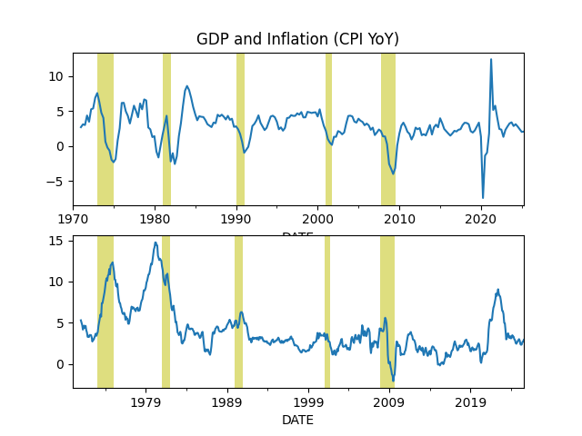
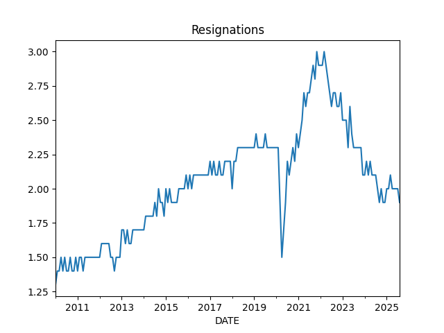
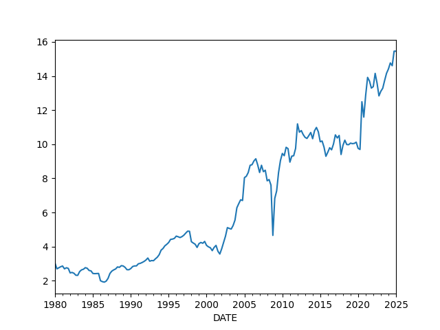
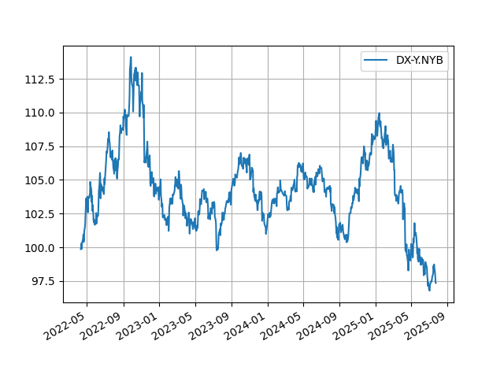
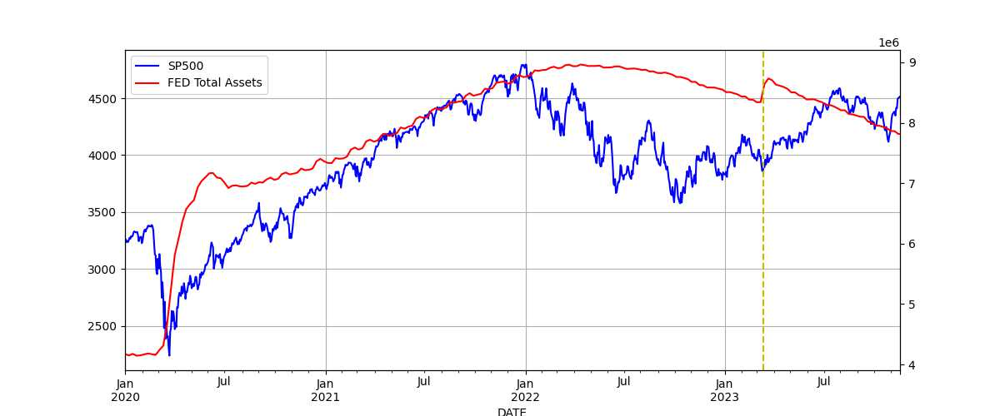
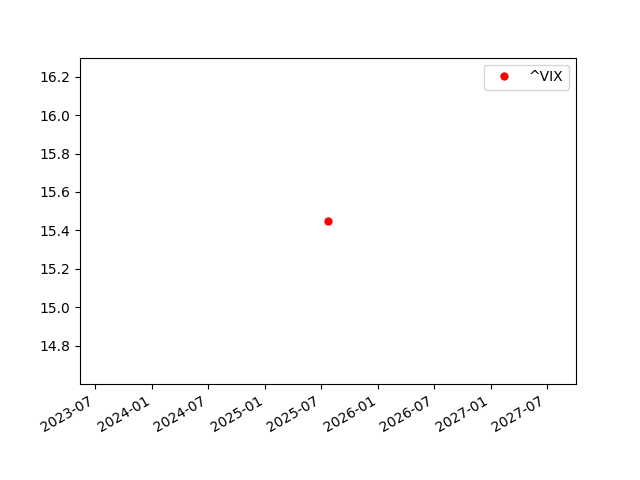
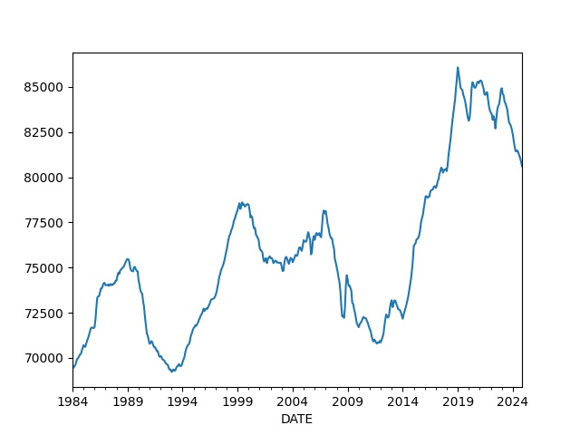
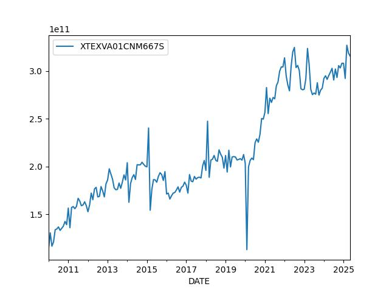

# Economy, Calculations, Data

```python
import impl as u
import pandas as pd
pd.set_option('display.max_columns', None)
```

<a name='gdp'></a>

## GDP

GDP calc seen below is computed as annualized quarterly growth rate,
quarter growth compared to previous quarter,
[annualized](https://www.fool.com/knowledge-center/how-to-calculate-the-annual-growth-rate-for-real-g.aspx).


```python
df = u.get_fred(1945,'GDPC1')
df['growann'] = (  (  (1+df.pct_change())**4  )-1.0  )*100.0
print (df['growann'].tail(5))
```

```text
DATE
2022-10-01    2.566018
2023-01-01    2.244165
2023-04-01    2.060217
2023-07-01    4.861686
2023-10-01    3.208889
Name: growann, dtype: float64
```

## The Cycle

<a name="cycle"></a>



```python
df = u.get_fred(1970,'GDPC1')

fig, axs = plt.subplots(2)

df['gdpyoy'] = (df.GDPC1 - df.GDPC1.shift(4)) / df.GDPC1.shift(4) * 100.0
df['gdpyoy'].plot(ax=axs[0],title="GDP and Inflation (CPI YoY)")
axs[0].axvspan('01-11-1973', '01-03-1975', color='y', alpha=0.5, lw=0)
axs[0].axvspan('01-07-1981', '01-11-1982', color='y', alpha=0.5, lw=0)
axs[0].axvspan('01-09-1990', '01-07-1991', color='y', alpha=0.5, lw=0)
axs[0].axvspan('01-03-2001', '27-10-2001', color='y', alpha=0.5, lw=0)
axs[0].axvspan('22-12-2007', '09-05-2009', color='y', alpha=0.5, lw=0)
print (df[['gdpyoy']].tail(6))

df = u.get_fred(1970,'CPIAUCNS')
df['inf'] = (df.CPIAUCNS - df.CPIAUCNS.shift(12)) / df.CPIAUCNS.shift(12) * 100.0
df['inf'].plot(ax=axs[1])
axs[1].axvspan('01-11-1973', '01-03-1975', color='y', alpha=0.5, lw=0)
axs[1].axvspan('01-07-1981', '01-11-1982', color='y', alpha=0.5, lw=0)
axs[1].axvspan('01-09-1990', '01-07-1991', color='y', alpha=0.5, lw=0)
axs[1].axvspan('01-03-2001', '27-10-2001', color='y', alpha=0.5, lw=0)
axs[1].axvspan('22-12-2007', '09-05-2009', color='y', alpha=0.5, lw=0)
print (df[['inf']].tail(6))
            
plt.savefig('cycle.png')
```

```text
              gdpyoy
DATE                
2022-10-01  0.651692
2023-01-01  1.717927
2023-04-01  2.382468
2023-07-01  2.926887
2023-10-01  3.134491
2024-01-01  2.969099
                 inf
DATE                
2023-11-01  3.137271
2023-12-01  3.352123
2024-01-01  3.090885
2024-02-01  3.153171
2024-03-01  3.477385
2024-04-01  3.357364
```

<a name='taylor'></a>

The Taylor Rule

```python
df = u.get_fred(1970,['GDPC1','GDPPOT','PCEPI','FEDFUNDS'])

df = df.interpolate().resample('AS').mean()
longrun = 2.0
df['Gap'] = 100 * (df.GDPC1 / df.GDPPOT - 1.0)
df['Curr'] = df.PCEPI.pct_change()*100.
df['Taylor'] = (longrun + df.Curr + 0.5*(df.Curr - longrun) + 0.5*df.Gap)
print (df.Taylor.tail(4))
df[['FEDFUNDS','Taylor']].plot()
plt.savefig('taylor.jpg',quality=40)
```

```text
DATE
2020-01-01     4.624963
2021-01-01    11.363714
2022-01-01    14.706453
2023-01-01    10.870215
Freq: AS-JAN, Name: Taylor, dtype: float64
```


## Wages and Unemployment

<a name='quits'></a>

Job Quits, Resignations

```python
df = u.get_fred(1986,['JTSQUR'])
print (df.JTSQUR.tail(5))
df.JTSQUR.plot()
plt.axvspan('01-09-1990', '01-07-1991', color='y', alpha=0.5, lw=0)
plt.axvspan('01-03-2001', '27-10-2001', color='y', alpha=0.5, lw=0)
plt.axvspan('22-12-2007', '09-05-2009', color='y', alpha=0.5, lw=0)
plt.title('Resignations')
plt.savefig('quits.png')
```

```text
DATE
2023-09-01    2.3
2023-10-01    2.3
2023-11-01    2.2
2023-12-01    2.2
2024-01-01    2.1
Name: JTSQUR, dtype: float64
```



<a name='wages'></a>

Wages

```python
df3 = u.get_fred(1950,['ECIWAG'])
df3 = df3.dropna()
df3['ECIWAG2'] = df3.shift(4).ECIWAG
df3['wagegrowth'] = (df3.ECIWAG-df3.ECIWAG2) / df3.ECIWAG2 * 100.
print (df3['wagegrowth'].tail(4))
df3['wagegrowth'].plot(title='Wage Growth')
plt.savefig('wages.png')
```

```text
DATE
2023-04-01    4.610390
2023-07-01    4.428755
2023-10-01    4.314721
2024-01-01    4.265997
Name: wagegrowth, dtype: float64
```


<a name='wagepayroll'></a>

Difference Between Wage Growth YoY and Total Payrolls, see [5]

```python
df = u.get_fred(1986,['PAYEMS','AHETPI'])
df['nfpyoy'] = (df.PAYEMS - df.PAYEMS.shift(12)) / df.PAYEMS.shift(12) * 100.0
df['wageyoy'] = (df.AHETPI - df.AHETPI.shift(12)) / df.AHETPI.shift(12) * 100.0
df[['wageyoy','nfpyoy']].plot()
plt.axvspan('01-09-1990', '01-07-1991', color='y', alpha=0.5, lw=0)
plt.axvspan('01-03-2001', '27-10-2001', color='y', alpha=0.5, lw=0)
plt.axvspan('22-12-2007', '09-05-2009', color='y', alpha=0.5, lw=0)
print (df['wageyoy'].tail(5))
print (df['nfpyoy'].tail(5))
plt.savefig('pay-wage.png')
```

```text
DATE
2022-05-01    6.427737
2022-06-01    6.354126
2022-07-01    6.201849
2022-08-01    6.015326
2022-09-01    5.750190
Name: wageyoy, dtype: float64
DATE
2022-05-01    4.457045
2022-06-01    4.258809
2022-07-01    4.134930
2022-08-01    3.982873
2022-09-01    3.862131
Name: nfpyoy, dtype: float64
```


<a name='compprof'></a>

Compensation and Profits Comparison [5]

1) US Employee Compensation as a % of GVA of Domestic Corporations 

2) US Corporate Profits as a % of GDP

```python
df = u.get_fred(1965, ['A442RC1A027NBEA','A451RC1Q027SBEA','CP','GDP']).interpolate()
df['profgdp'] = (df.CP / df.GDP)*100.0
df['compgva'] = (df.A442RC1A027NBEA / df.A451RC1Q027SBEA)*100.0
u.two_plot(df, 'profgdp','compgva')
print (df[['profgdp','compgva']].tail(5))
plt.axvspan('01-12-1969', '01-11-1970', color='y', alpha=0.5, lw=0)
plt.axvspan('01-11-1973', '01-03-1975', color='y', alpha=0.5, lw=0)
plt.axvspan('01-01-1980', '01-11-1982', color='y', alpha=0.5, lw=0)
plt.axvspan('01-09-1990', '01-07-1991', color='y', alpha=0.5, lw=0)
plt.axvspan('01-03-2001', '27-10-2001', color='y', alpha=0.5, lw=0)
plt.axvspan('22-12-2007', '09-05-2009', color='y', alpha=0.5, lw=0)
plt.savefig('compprof.png')
```

```text
              profgdp    compgva
DATE                            
2022-10-01  10.792341  57.942092
2023-01-01  10.744704  58.173127
2023-04-01  10.726301  57.747825
2023-07-01  10.930065  56.907920
2023-10-01  11.075291  55.864246
```


<a name='unempl'></a>

Unemployment

Calculation is based on [2]

```python
cols = ['LNS12032194','UNEMPLOY','NILFWJN','LNS12600000','CLF16OV','UNRATE','U6RATE']
df = u.get_fred(1986,cols)
df['REAL_UNEMP_LEVEL'] = df.LNS12032194*0.5 + df.UNEMPLOY + df.NILFWJN
df['REAL_UNRATE'] = (df.REAL_UNEMP_LEVEL / df.CLF16OV) * 100.0
pd.set_option('display.max_columns', None)
df1 = df.loc[df.index > '2005-01-01']
df1[['UNRATE','U6RATE','REAL_UNRATE']].plot()
plt.title('Unemployment Rate')
print (df1[['UNRATE','U6RATE','REAL_UNRATE','REAL_UNEMP_LEVEL']].tail(5))
plt.savefig('unemploy.png')
```

```text
            UNRATE  U6RATE  REAL_UNRATE  REAL_UNEMP_LEVEL
DATE                                                     
2023-10-01     3.8     7.2     8.323843           13961.0
2023-11-01     3.7     7.0     8.090313           13602.0
2023-12-01     3.7     7.1     8.387230           14044.5
2024-01-01     3.7     7.2     8.445922           14128.0
2024-02-01     3.9     7.3     8.551838           14318.0
```


<a name='vacrate'></a>

Vacancy rate, job openings divided by unemployed people

```python
df = u.get_fred(2000, ['JTSJOL','UNEMPLOY'])
df = df.dropna()
df['VRATE'] = df.JTSJOL / df.UNEMPLOY
df.VRATE.plot()
print (df.VRATE.tail(3))
plt.savefig('vrate.png')
```

```text
DATE
2023-11-01    1.426222
2023-12-01    1.418156
2024-01-01    1.447257
Freq: MS, Name: VRATE, dtype: float64
```


## Companies

<a name='pm'></a>

Profit Margins

Divide (1) by (2) as suggested in [4],

(1) Corporate Profits After Tax (without IVA and CCAdj) (CP)

(2) Real Final Sales of Domestic Product (FINSLC1)


```python
df = u.get_fred(1980, ['CP','FINSLC1']); df = df.interpolate()
df = df.dropna()
df['PM'] = df['CP'] / df['FINSLC1'] * 100.0
df.PM.plot()
print (df.tail(4))
plt.savefig('profitmargin.png')
```

```text
                  CP    FINSLC1         PM
DATE                                      
2023-01-01  2881.042  22054.259  13.063427
2023-04-01  2902.860  22167.124  13.095339
2023-07-01  3017.805  22362.503  13.494934
2023-10-01  3096.319  22577.456  13.714207
```




## Finance

Dollar

<a name='dollar'></a>

```python
df = u.get_yahoofin(1980, "DX-Y.NYB").interpolate()
print (df.tail(4))
m,s = df.mean(),df.std()
print (np.array([m-s,m+s]).T)
df.tail(1000).plot()
plt.grid(True)
plt.savefig('dollar.png')
```

```text
Date
2024-03-26    104.290001
2024-03-27    104.349998
2024-03-28    104.550003
2024-03-29    104.487000
Name: Close, dtype: float64
[ 81.36293117 111.560877  ]
```



<a name='wilshire'></a>

Total Market Cap / GDP

```python
df = u.get_fred(1995,['WILL5000IND'])
print (df.tail(4))
df.plot()
plt.axvspan('01-03-2001', '27-10-2001', color='y', alpha=0.5, lw=0)
plt.axvspan('22-12-2007', '09-05-2009', color='y', alpha=0.5, lw=0)
plt.savefig('wilshire.png')
```

```text
            WILL5000IND
DATE                   
2023-11-27       226.59
2023-11-28       226.75
2023-11-29       226.87
2023-11-30       227.81
```


<a name='junkbond'></a>

Junk Bond Yields

```python
df = u.get_fred(1980,['BAMLH0A2HYBEY'])
print (df.tail(6))
df.plot()
plt.axvspan('2001-03-03', '2001-10-27', color='y', alpha=0.5, lw=0)
plt.axvspan('2007-12-22', '2009-05-09', color='y', alpha=0.5, lw=0)
df.BAMLH0A2HYBEY.tail(1).plot(style='r.',markersize=10)
plt.savefig('junkbond.png')
```

```text
            BAMLH0A2HYBEY
DATE                     
2023-07-13           8.30
2023-07-14           8.33
2023-07-17           8.40
2023-07-18           8.32
2023-07-19           8.27
2023-07-20           8.38
```


<a name='treas'></a>

3 Month, 2 and 10 Year Treasury Rates

```python
df = u.get_fred(1980,['DGS3MO','DGS2','DGS10','FEDFUNDS'])
df = df.interpolate()
df.plot()
plt.axvspan('01-09-1990', '01-07-1991', color='y', alpha=0.5, lw=0)
plt.axvspan('01-03-2001', '27-10-2001', color='y', alpha=0.5, lw=0)
plt.axvspan('22-12-2007', '09-05-2009', color='y', alpha=0.5, lw=0)
print (df.tail(3))
plt.savefig('treasuries.png')
```

```text
            DGS3MO  DGS2  DGS10  FEDFUNDS
DATE                                     
2024-03-26    5.46  4.56   4.24      5.33
2024-03-27    5.45  4.54   4.20      5.33
2024-03-28    5.46  4.59   4.20      5.33
```


<a name='tcurve'></a>

Treasury Curve

```python
df = u.get_fred(2021,['DGS3MO','DGS6MO','DGS1','DGS2','DGS3','DGS5','DGS7','DGS10','DGS20','DGS30'])
inv = df.tail(1).T
inv.columns = ['Treasury Curve']
inv.plot()
plt.ylim(0,6)
plt.savefig('tcurve.jpg',quality=50)
```


<a name='fedbalance'></a>

The FED Balance Sheet and SP500

```python
df = u.get_fred(2020,['SP500','WALCL'])
df.columns = ['SP500','FED Total Assets']
df = df.interpolate()
u.two_plot(df, df.columns[0],df.columns[1])
plt.axvline(x='13-03-2023',color='y',linestyle='dashed')
plt.savefig('fedbalance.jpg',quality=50)
```



<a name='vix'></a>

VIX

```python
df = u.get_yahoofin(2000,"^VIX")
df.plot()
plt.axvspan('22-12-2007', '09-05-2009', color='y', alpha=0.5, lw=0)
print (df.tail(7))
df.tail(1).plot(style='r.',markersize=10)
plt.savefig('vix.png')
```

```text
Date
2023-07-13    13.61
2023-07-14    13.34
2023-07-17    13.48
2023-07-18    13.30
2023-07-19    13.76
2023-07-20    13.99
2023-07-21    13.60
Name: Close, dtype: float64
```



## Wealth, Debt

<a name='credit'></a>

Private Debt to GDP Ratio

```python
df = u.get_fred(1960,['GDPC1','QUSPAMUSDA'])
df = df.interpolate()
df['Credit to GDP'] = (df.QUSPAMUSDA / df.GDPC1)*100.0
df['Credit to GDP'].plot()
plt.axvspan('01-09-1990', '01-07-1991', color='y', alpha=0.5, lw=0)
plt.axvspan('01-03-2001', '27-10-2001', color='y', alpha=0.5, lw=0)
plt.axvspan('22-12-2007', '09-05-2009', color='y', alpha=0.5, lw=0)
plt.axvspan('2020-02-01', '2020-05-01', color='y', alpha=0.5, lw=0)
plt.savefig('creditgdp.png')
print (df['Credit to GDP'].tail(4))
```

```text
DATE
2022-07-01    191.770916
2022-10-01    192.405169
2023-01-01    191.454003
2023-04-01    190.315568
Freq: QS-OCT, Name: Credit to GDP, dtype: float64
```


<a name='debt'></a>

Total Consumer Credit Outstanding as % of GDP

```python
df = u.get_fred(1980,['TOTALSL','GDP'])
df = df.interpolate(method='linear')
df['debt'] =   df.TOTALSL / df.GDP * 100.0
print (df.debt.tail(4))
df.debt.plot()
plt.axvspan('01-09-1990', '01-07-1991', color='y', alpha=0.5, lw=0)
plt.axvspan('01-03-2001', '27-10-2001', color='y', alpha=0.5, lw=0)
plt.axvspan('22-12-2007', '09-05-2009', color='y', alpha=0.5, lw=0)
plt.axvspan('2020-02-01', '2020-05-01', color='y', alpha=0.5, lw=0)
plt.savefig('debt.png')
```

```text
DATE
2023-04-01    18.509597
2023-05-01    18.509499
2023-06-01    18.561801
2023-07-01    18.600604
Freq: MS, Name: debt, dtype: float64
```


<a name='gini'></a>

Wealth Inequality - GINI Index

Code taken from [3]

```python
def gini(pop,val):
    pop = list(pop); pop.insert(0,0.0)
    val = list(val); val.insert(0,0.0)        
    poparg = np.array(pop)
    valarg = np.array(val)
    z = valarg * poparg;
    ord = np.argsort(val)
    poparg    = poparg[ord]
    z = z[ord]
    poparg    = np.cumsum(poparg)
    z    = np.cumsum(z)
    relpop = poparg/poparg[-1]
    relz = z/z[-1]    
    g = 1 - np.sum((relz[0:-1]+relz[1:]) * np.diff(relpop))
    return np.round(g,3)

cols = ['WFRBLT01026', 'WFRBLN09053','WFRBLN40080','WFRBLB50107']
df = u.get_fred(1989,cols)
df = df.interpolate()
p = [0.01, 0.09, 0.40, 0.50]
g = df.apply(lambda x: gini(p,x),axis=1)
print (g.tail(4))
g.plot()
plt.xlim('1990-01-01','2023-01-01')
plt.axvspan('1993-01-01','1993-01-01',color='y')
plt.axvspan('2001-01-01','2001-01-01',color='y')
plt.axvspan('2009-01-01','2009-01-01',color='y')
plt.axvspan('2017-01-01','2017-01-01',color='y')

plt.axvspan('2020-12-01','2020-12-01',color='y')
plt.text('1990-07-01',0.44,'HW')
plt.text('1994-10-01',0.46,'Clinton')
plt.text('2003-12-01',0.47,'W')
plt.text('2011-01-01',0.44,'Obama')
plt.text('2018-01-01',0.42,'DJT')
plt.text('2020-03-01',0.48,'Biden')
plt.savefig('gini.png')
```

```text
DATE
2023-01-01    0.438
2023-04-01    0.438
2023-07-01    0.438
2023-10-01    0.440
dtype: float64
```


<a name='top10'></a>

Percentage of Wealth Held by Top 10%

```python
cols = ['WFRBLT01026', 'WFRBLN09053','WFRBLN40080','WFRBLB50107']
df = u.get_fred(1970,cols)
df = df.interpolate()

df['Total'] =  df['WFRBLT01026'] + df['WFRBLN09053'] + df['WFRBLB50107'] + df['WFRBLN40080']
df['Top 10%'] = (df['WFRBLT01026'] + df['WFRBLN09053']) * 100 / df.Total 
df['Bottom 50%'] = (df['WFRBLB50107'] * 100) / df.Total 

print (df[['Top 10%','Bottom 50%']].tail(4))
df[['Top 10%']].plot()
plt.ylim(50,100)
plt.savefig('top10-2.jpg')
```

```text
              Top 10%  Bottom 50%
DATE                             
2023-01-01  66.557696    2.569562
2023-04-01  66.512291    2.555786
2023-07-01  66.297166    2.547747
2023-10-01  66.927900    2.485612
```


<a name='household'></a>

## Household Income

```python
df = u.get_fred(1980, ['MEHOINUSA646N','TDSP','CPIAUCSL'])
df = df.interpolate()
df = df.dropna()

cpi = float(df.tail(1).CPIAUCSL)
df['cpi2'] = cpi / df.CPIAUCSL 
df['household income'] = df.MEHOINUSA646N * df.cpi2 
df['household income'].plot()
t1 = float(df.head(1)['household income'])
t2 = float(df.tail(1)['household income'])
print ("Perc change since the 80s = %0.2f" % ((t2-t1) / t2 * 100))
plt.savefig('household.jpg')
```

```text
Perc change since the 80s = 7.78
```



## Real Estate

<a name='medhouse'></a>

Median house prices

```python
df = u.get_fred(1992,"MSPUS")
df.plot()
plt.savefig('medhouse.jpg')
```


<a name='chex'></a>

## Foreign

Chinese Exports

```python
df = u.get_fred(2010,['XTEXVA01CNM667S']); df.plot()
plt.savefig('exchina.jpg',quality=50)
print (df.tail(5))
```

```text
            XTEXVA01CNM667S
DATE                       
2023-12-01     2.814782e+11
2024-01-01     2.960003e+11
2024-02-01     2.980984e+11
2024-03-01     2.939816e+11
2024-04-01     2.980429e+11
```



---

References, Notes

[1] Note: for Quandl retrieval get the API key from Quandl, and place the
key in a `.quandl` file in the same directory as this file.

[2] [Komlos](https://www.longfinance.net/news/pamphleteers/true-us-unemployment-rate-march-2019/)

[3] [Mathworks](https://www.mathworks.com/matlabcentral/mlc-downloads/downloads/submissions/28080/versions/1/previews/gini.m/index.html)

[4] [Philosophical Economics](https://www.philosophicaleconomics.com/2014/03/foreignpm/)

[5] [Hedgeeye](https://app.hedgeye.com/mu/he_qio_4q19_10-3-2019?encoded_data=ft9F,6yjgJ3+iFdaasKwdMTJVgzgnZlI=,)

