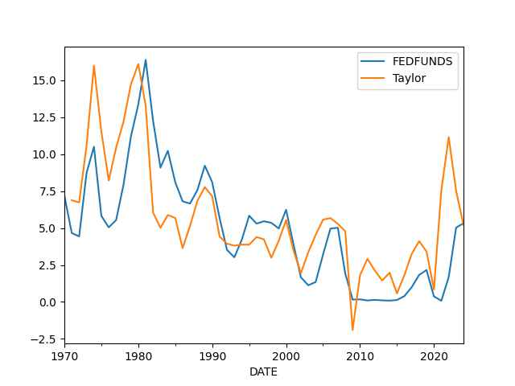
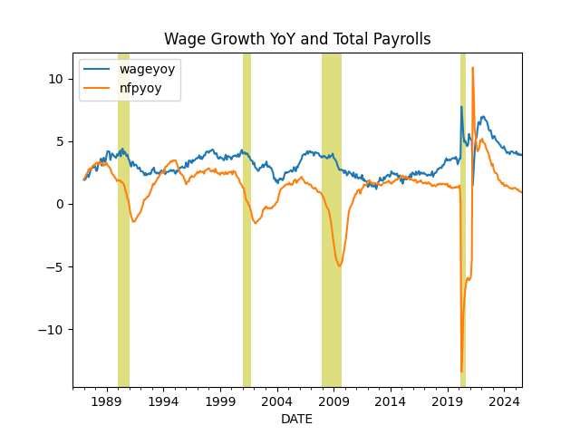
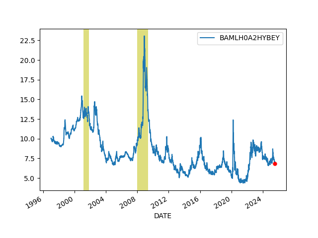
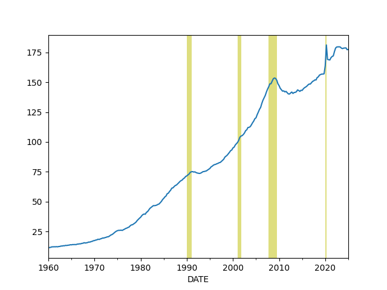
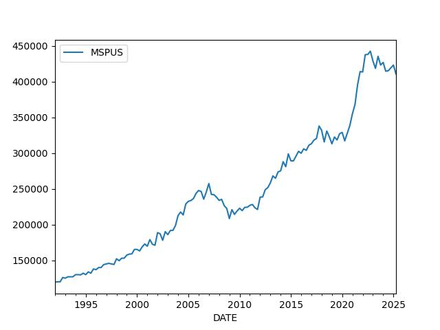

# Economy, Calculations, Data

```python
import impl as u
import pandas as pd
pd.set_option('display.max_columns', None)
```

<a name='gdp'></a>

## GDP

GDP calc seen below is computed as annualized quarterly growth rate,
quarter growth compared to previous quarter,
[annualized](https://www.fool.com/knowledge-center/how-to-calculate-the-annual-growth-rate-for-real-g.aspx).


```python
df = u.get_fred(1945,'GDPC1')
df['growann'] = (  (  (1+df.pct_change())**4  )-1.0  )*100.0
print (df['growann'].tail(5))
```

```text
DATE
2024-04-01    2.988846
2024-07-01    3.072829
2024-10-01    2.450461
2025-01-01   -0.502517
2025-04-01    2.968252
Name: growann, dtype: float64
```

## The Cycle

<a name="cycle"></a>


```python
df = u.get_fred(1970,'GDPC1')

fig, axs = plt.subplots(2)

df['gdpyoy'] = (df.GDPC1 - df.GDPC1.shift(4)) / df.GDPC1.shift(4) * 100.0
df['gdpyoy'].plot(ax=axs[0],title="GDP and Inflation (CPI YoY)")
axs[0].axvspan('01-11-1973', '01-03-1975', color='y', alpha=0.5, lw=0)
axs[0].axvspan('01-07-1981', '01-11-1982', color='y', alpha=0.5, lw=0)
axs[0].axvspan('01-09-1990', '01-07-1991', color='y', alpha=0.5, lw=0)
axs[0].axvspan('01-03-2001', '27-10-2001', color='y', alpha=0.5, lw=0)
axs[0].axvspan('22-12-2007', '09-05-2009', color='y', alpha=0.5, lw=0)
print (df[['gdpyoy']].tail(6))

df = u.get_fred(1970,'CPIAUCNS')
df['inf'] = (df.CPIAUCNS - df.CPIAUCNS.shift(12)) / df.CPIAUCNS.shift(12) * 100.0
df['inf'].plot(ax=axs[1])
axs[1].axvspan('01-11-1973', '01-03-1975', color='y', alpha=0.5, lw=0)
axs[1].axvspan('01-07-1981', '01-11-1982', color='y', alpha=0.5, lw=0)
axs[1].axvspan('01-09-1990', '01-07-1991', color='y', alpha=0.5, lw=0)
axs[1].axvspan('01-03-2001', '27-10-2001', color='y', alpha=0.5, lw=0)
axs[1].axvspan('22-12-2007', '09-05-2009', color='y', alpha=0.5, lw=0)
print (df[['inf']].tail(6))
            
plt.savefig('cycle.png')
```

```text
              gdpyoy
DATE                
2024-01-01  2.901832
2024-04-01  3.036849
2024-07-01  2.718769
2024-10-01  2.533684
2025-01-01  1.991763
2025-04-01  1.986664
                 inf
DATE                
2025-01-01  3.000483
2025-02-01  2.821549
2025-03-01  2.390725
2025-04-01  2.311289
2025-05-01  2.354897
2025-06-01  2.669213
```

<a name='taylor'></a>

The Taylor Rule

```python
df = u.get_fred(1970,['GDPC1','GDPPOT','PCEPI','FEDFUNDS'])

df = df.interpolate().resample('AS').mean()
longrun = 2.0
df['Gap'] = 100 * (df.GDPC1 / df.GDPPOT - 1.0)
df['Curr'] = df.PCEPI.pct_change()*100.
df['Taylor'] = (longrun + df.Curr + 0.5*(df.Curr - longrun) + 0.5*df.Gap)
print (df.Taylor.tail(4))
df[['FEDFUNDS','Taylor']].plot()
plt.savefig('taylor.jpg',quality=40)
```

```text
DATE
2021-01-01     7.548193
2022-01-01    11.153139
2023-01-01     7.511558
2024-01-01     5.216667
Freq: AS-JAN, Name: Taylor, dtype: float64
```



## Wages and Unemployment

<a name='quits'></a>

Job Quits, Resignations

```python
df = u.get_fred(2010,['JTSQUR'])
print (df.JTSQUR.tail(5))
df.JTSQUR.plot()
plt.axvspan('01-09-1990', '01-07-1991', color='y', alpha=0.5, lw=0)
plt.axvspan('01-03-2001', '27-10-2001', color='y', alpha=0.5, lw=0)
plt.axvspan('22-12-2007', '09-05-2009', color='y', alpha=0.5, lw=0)
plt.title('Resignations')
plt.savefig('quits.png')
```

```text
DATE
2025-02-01    2.0
2025-03-01    2.1
2025-04-01    2.0
2025-05-01    2.0
2025-06-01    2.0
Name: JTSQUR, dtype: float64
```


<a name='wages'></a>

Wages

```python
df3 = u.get_fred(1950,['ECIWAG'])
df3 = df3.dropna()
df3['ECIWAG2'] = df3.shift(4).ECIWAG
df3['wagegrowth'] = (df3.ECIWAG-df3.ECIWAG2) / df3.ECIWAG2 * 100.
print (df3['wagegrowth'].tail(4))
df3['wagegrowth'].plot(title='Wage Growth')
plt.savefig('wages.png')
```

```text
DATE
2024-07-01    3.746929
2024-10-01    3.710462
2025-01-01    3.369434
2025-04-01    3.559666
Name: wagegrowth, dtype: float64
```


<a name='wagepayroll'></a>

Difference Between Wage Growth YoY and Total Payrolls, see [5]

```python
df = u.get_fred(1986,['PAYEMS','AHETPI'])
df['nfpyoy'] = (df.PAYEMS - df.PAYEMS.shift(12)) / df.PAYEMS.shift(12) * 100.0
df['wageyoy'] = (df.AHETPI - df.AHETPI.shift(12)) / df.AHETPI.shift(12) * 100.0
df[['wageyoy','nfpyoy']].plot()
plt.axvspan('01-09-1990', '01-07-1991', color='y', alpha=0.5, lw=0)
plt.axvspan('01-03-2001', '27-10-2001', color='y', alpha=0.5, lw=0)
plt.axvspan('22-12-2007', '09-05-2009', color='y', alpha=0.5, lw=0)
print (df['wageyoy'].tail(5))
print (df['nfpyoy'].tail(5))
plt.savefig('pay-wage.png')
```

```text
DATE
2025-02-01    4.179306
2025-03-01    3.926174
2025-04-01    4.020101
2025-05-01    3.937271
2025-06-01    3.890921
Name: wageyoy, dtype: float64
DATE
2025-02-01    1.197932
2025-03-01    1.116070
2025-04-01    1.140610
2025-05-01    1.108168
2025-06-01    1.145553
Name: nfpyoy, dtype: float64
```



<a name='compprof'></a>

Compensation and Profits Comparison [5]

1) US Employee Compensation as a % of GVA of Domestic Corporations 

2) US Corporate Profits as a % of GDP

```python
df = u.get_fred(1965, ['A442RC1A027NBEA','A451RC1Q027SBEA','CP','GDP']).interpolate()
df['profgdp'] = (df.CP / df.GDP)*100.0
df['compgva'] = (df.A442RC1A027NBEA / df.A451RC1Q027SBEA)*100.0
u.two_plot(df, 'profgdp','compgva')
print (df[['profgdp','compgva']].tail(5))
plt.axvspan('01-12-1969', '01-11-1970', color='y', alpha=0.5, lw=0)
plt.axvspan('01-11-1973', '01-03-1975', color='y', alpha=0.5, lw=0)
plt.axvspan('01-01-1980', '01-11-1982', color='y', alpha=0.5, lw=0)
plt.axvspan('01-09-1990', '01-07-1991', color='y', alpha=0.5, lw=0)
plt.axvspan('01-03-2001', '27-10-2001', color='y', alpha=0.5, lw=0)
plt.axvspan('22-12-2007', '09-05-2009', color='y', alpha=0.5, lw=0)
plt.savefig('compprof.png')
```

```text
              profgdp    compgva
DATE                            
2024-01-01  11.580971  56.593605
2024-04-01  11.762248  55.894482
2024-07-01  11.584653  55.388395
2024-10-01  12.217062  54.354292
2025-01-01  12.023715  53.982527
```


<a name='unempl'></a>

Unemployment

Calculation is based on [2]

```python
cols = ['LNS12032194','UNEMPLOY','NILFWJN','LNS12600000','CLF16OV','UNRATE','U6RATE']
df = u.get_fred(1986,cols)
df['REAL_UNEMP_LEVEL'] = df.LNS12032194*0.5 + df.UNEMPLOY + df.NILFWJN
df['REAL_UNRATE'] = (df.REAL_UNEMP_LEVEL / df.CLF16OV) * 100.0
pd.set_option('display.max_columns', None)
df1 = df.loc[df.index > '2005-01-01']
df1[['UNRATE','U6RATE','REAL_UNRATE']].plot()
plt.title('Unemployment Rate')
print (df1[['UNRATE','U6RATE','REAL_UNRATE','REAL_UNEMP_LEVEL']].tail(5))
plt.savefig('unemploy.png')
```

```text
            UNRATE  U6RATE  REAL_UNRATE  REAL_UNEMP_LEVEL
DATE                                                     
2025-02-01     4.1     8.0     9.047658           15413.5
2025-03-01     4.2     7.9     9.020406           15388.0
2025-04-01     4.2     7.8     8.871943           15183.0
2025-05-01     4.2     7.8     9.113835           15540.0
2025-06-01     4.1     7.7     8.966721           15277.5
```


<a name='vacrate'></a>

Vacancy rate, job openings divided by unemployed people

```python
df = u.get_fred(2000, ['JTSJOL','UNEMPLOY'])
df = df.dropna()
df['VRATE'] = df.JTSJOL / df.UNEMPLOY
df.VRATE.plot()
print (df.VRATE.tail(3))
plt.savefig('vrate.png')
```

```text
DATE
2025-03-01    1.016518
2025-04-01    1.031956
2025-05-01    1.073511
Freq: MS, Name: VRATE, dtype: float64
```


## Companies

<a name='pm'></a>

Profit Margins

Divide (1) by (2) as suggested in [4],

(1) Corporate Profits After Tax (without IVA and CCAdj) (CP)

(2) Real Final Sales of Domestic Product (FINSLC1)


```python
df = u.get_fred(1980, ['CP','FINSLC1']); df = df.interpolate()
df = df.dropna()
df['PM'] = df['CP'] / df['FINSLC1'] * 100.0
df.PM.plot()
print (df.tail(4))
plt.savefig('profitmargin.png')
```

```text
                  CP    FINSLC1         PM
DATE                                      
2024-04-01  3413.018  23113.092  14.766601
2024-07-01  3402.982  23302.413  14.603561
2024-10-01  3631.383  23493.422  15.457020
2025-01-01  3602.551  23311.569  15.453919
```


## Finance

Dollar

<a name='dollar'></a>

```python
df = u.get_yahoo_ticker2(1980, "DX-Y.NYB").interpolate()
print (df.tail(4))
m,s = df.mean(),df.std()
print (np.array([m-s,m+s]).T)
df.tail(1000).plot()
plt.grid(True)
plt.savefig('dollar.png')
```

```text
             DX-Y.NYB
2025-07-20  98.165001
2025-07-21  97.849998
2025-07-22  97.389999
2025-07-23  97.356003
[[ 81.72515996 111.60423874]]
```


Schiller P/E

Overlay Schiller's P/E ratio on top SP 500 10-year returns [6] since
1920s. Lows and highs arrive 10 years after the market is most
expensive and cheapest, respectively. The two graphs should show
perfect reverse correlation. 

```python
df = pd.read_csv('../../mbl/2024/sp500.csv',index_col='Date',parse_dates=True)
df['schiller'] = pd.read_csv('../../mbl/2024/schiller.csv',index_col='Date',parse_dates=True)['Schiller']
df = df[df.index > '1940-01-01']
df['SPY10'] = df.SPY.shift(-12*10)
df['chg'] = ((df.SPY10 - df.SPY) / df.SPY)*100
u.two_plot2(df.chg, 'spy', df['schiller'], 'schiller')
plt.savefig('schiller.jpg')
```


<a name='junkbond'></a>

Junk Bond Yields

```python
df = u.get_fred(1980,['BAMLH0A2HYBEY'])
print (df.tail(6))
df.plot()
plt.axvspan('2001-03-03', '2001-10-27', color='y', alpha=0.5, lw=0)
plt.axvspan('2007-12-22', '2009-05-09', color='y', alpha=0.5, lw=0)
df.BAMLH0A2HYBEY.tail(1).plot(style='r.',markersize=10)
plt.savefig('junkbond.png')
```

```text
            BAMLH0A2HYBEY
DATE                     
2025-07-15           7.08
2025-07-16           7.07
2025-07-17           6.98
2025-07-18           6.96
2025-07-21           6.87
2025-07-22           6.86
```



<a name='treas'></a>

3 Month, 2 and 10 Year Treasury Rates

```python
df = u.get_fred(2020,['DGS3MO','DGS2','DGS10','FEDFUNDS'])
df = df.interpolate()
df.plot()
#plt.axvspan('01-09-1990', '01-07-1991', color='y', alpha=0.5, lw=0)
#plt.axvspan('01-03-2001', '27-10-2001', color='y', alpha=0.5, lw=0)
#plt.axvspan('22-12-2007', '09-05-2009', color='y', alpha=0.5, lw=0)
print (df.tail(3))
plt.savefig('treasuries.png')
```

```text
            DGS3MO  DGS2  DGS10  FEDFUNDS
DATE                                     
2025-07-18    4.40  3.88   4.44      4.33
2025-07-21    4.41  3.85   4.38      4.33
2025-07-22    4.41  3.83   4.35      4.33
```


<a name='tcurve'></a>

Treasury Curve

```python
df = u.get_fred(1980,['DGS2','DGS10'])
df = df.interpolate()
df['inv'] = df.DGS10 - df.DGS2
df['inv'].plot(grid=True)
print (df['inv'].tail(4))
plt.axvspan('01-09-1990', '01-07-1991', color='y', alpha=0.5, lw=0)
plt.axvspan('01-03-2001', '27-10-2001', color='y', alpha=0.5, lw=0)
plt.axvspan('22-12-2007', '09-05-2009', color='y', alpha=0.5, lw=0)
plt.savefig('tcurve.jpg')
```

```text
DATE
2025-07-16    0.58
2025-07-17    0.56
2025-07-18    0.56
2025-07-21    0.53
Name: inv, dtype: float64
```


```python
df = u.get_fred(2008,['DGS2','DGS10'])
df = df.interpolate()
df['inv'] = df.DGS10 - df.DGS2
df['inv'].plot(grid=True)
print (df.inv.tail(4))
plt.savefig('tcurve2.jpg')
```

```text
DATE
2025-07-16    0.58
2025-07-17    0.56
2025-07-18    0.56
2025-07-21    0.53
Name: inv, dtype: float64
```


<a name='vix'></a>

VIX

```python
df = u.get_yahoo_ticker2(2000,"^VIX")
df.plot()
plt.axvspan('22-12-2007', '09-05-2009', color='y', alpha=0.5, lw=0)
print (df.tail(7))
df.tail(1).plot(style='r.',markersize=10)
plt.savefig('vix.png')
```

```text
                 ^VIX
2025-07-15  17.379999
2025-07-16  17.160000
2025-07-17  16.520000
2025-07-18  16.410000
2025-07-21  16.650000
2025-07-22  16.500000
2025-07-23  15.450000
```


## Wealth, Debt

<a name='credit'></a>

Private Debt to GDP Ratio

```python
df = u.get_fred(1960,['GDPC1','QUSPAMUSDA'])
df = df.interpolate()
df['Credit to GDP'] = (df.QUSPAMUSDA / df.GDPC1)*100.0
df['Credit to GDP'].plot()
plt.axvspan('01-09-1990', '01-07-1991', color='y', alpha=0.5, lw=0)
plt.axvspan('01-03-2001', '27-10-2001', color='y', alpha=0.5, lw=0)
plt.axvspan('22-12-2007', '09-05-2009', color='y', alpha=0.5, lw=0)
plt.axvspan('2020-02-01', '2020-05-01', color='y', alpha=0.5, lw=0)
plt.savefig('creditgdp.png')
print (df['Credit to GDP'].tail(4))
```

```text
DATE
2024-04-01    178.778165
2024-07-01    178.824467
2024-10-01    177.332861
2025-01-01    177.556345
Freq: QS-OCT, Name: Credit to GDP, dtype: float64
```



<a name='debt'></a>

Total Consumer Credit Outstanding as % of GDP

```python
df = u.get_fred(1980,['TOTALSL','GDP'])
df = df.interpolate(method='linear')
df['debt'] =   df.TOTALSL / df.GDP * 100.0
print (df.debt.tail(4))
df.debt.plot()
plt.axvspan('01-09-1990', '01-07-1991', color='y', alpha=0.5, lw=0)
plt.axvspan('01-03-2001', '27-10-2001', color='y', alpha=0.5, lw=0)
plt.axvspan('22-12-2007', '09-05-2009', color='y', alpha=0.5, lw=0)
plt.axvspan('2020-02-01', '2020-05-01', color='y', alpha=0.5, lw=0)
plt.savefig('debt.png')
```

```text
DATE
2024-08-01    17.326423
2024-09-01    17.336602
2024-10-01    17.395557
2024-11-01    17.370063
Freq: MS, Name: debt, dtype: float64
```


<a name='gini'></a>

Wealth Inequality - GINI Index

Code taken from [3]

```python
def gini(pop,val):
    pop = list(pop); pop.insert(0,0.0)
    val = list(val); val.insert(0,0.0)        
    poparg = np.array(pop)
    valarg = np.array(val)
    z = valarg * poparg;
    ord = np.argsort(val)
    poparg    = poparg[ord]
    z = z[ord]
    poparg    = np.cumsum(poparg)
    z    = np.cumsum(z)
    relpop = poparg/poparg[-1]
    relz = z/z[-1]    
    g = 1 - np.sum((relz[0:-1]+relz[1:]) * np.diff(relpop))
    return np.round(g,3)

cols = ['WFRBLT01026', 'WFRBLN09053','WFRBLN40080','WFRBLB50107']
df = u.get_fred(1989,cols)
df = df.interpolate()
p = [0.01, 0.09, 0.40, 0.50]
g = df.apply(lambda x: gini(p,x),axis=1)
print (g.tail(4))
g.plot()
plt.xlim('1990-01-01','2023-01-01')
plt.axvspan('1993-01-01','1993-01-01',color='y')
plt.axvspan('2001-01-01','2001-01-01',color='y')
plt.axvspan('2009-01-01','2009-01-01',color='y')
plt.axvspan('2017-01-01','2017-01-01',color='y')
plt.axvspan('2021-01-01','2021-01-01',color='y')
plt.axvspan('2025-01-01','2025-01-01',color='y')
plt.text('1990-07-01',0.44,'HW')
plt.text('1994-10-01',0.46,'Clinton')
plt.text('2003-12-01',0.47,'W')
plt.text('2011-01-01',0.44,'Obama')
plt.text('2018-01-01',0.42,'DJT')
plt.text('2020-03-01',0.48,'Biden')
plt.savefig('gini.png')
```

```text
DATE
2024-04-01    0.440
2024-07-01    0.442
2024-10-01    0.441
2025-01-01    0.440
dtype: float64
```


<a name='top10'></a>

Percentage of Wealth Held by Top 10%

```python
cols = ['WFRBLT01026', 'WFRBLN09053','WFRBLN40080','WFRBLB50107']
df = u.get_fred(1970,cols)
df = df.interpolate()

df['Total'] =  df['WFRBLT01026'] + df['WFRBLN09053'] + df['WFRBLB50107'] + df['WFRBLN40080']
df['Top 10%'] = (df['WFRBLT01026'] + df['WFRBLN09053']) * 100 / df.Total 
df['Bottom 50%'] = (df['WFRBLB50107'] * 100) / df.Total 

print (df[['Top 10%','Bottom 50%']].tail(4))
df[['Top 10%']].plot()
plt.ylim(50,100)
plt.savefig('top10-2.jpg')
```

```text
              Top 10%  Bottom 50%
DATE                             
2024-04-01  66.935229    2.463536
2024-07-01  67.378997    2.419540
2024-10-01  67.424465    2.472927
2025-01-01  67.244837    2.498183
```


<a name='household'></a>

## Household Income

```python
df = u.get_fred(1980, ['MEHOINUSA646N','TDSP','CPIAUCSL'])
df = df.interpolate()
df = df.dropna()

cpi = float(df.tail(1).CPIAUCSL)
df['cpi2'] = cpi / df.CPIAUCSL 
df['household income'] = df.MEHOINUSA646N * df.cpi2 
df['household income'].plot()
t1 = float(df.head(1)['household income'])
t2 = float(df.tail(1)['household income'])
print ("Perc change since the 80s = %0.2f" % ((t2-t1) / t2 * 100))
plt.savefig('household.jpg')
```

```text
Perc change since the 80s = 13.80
```


## Real Estate

<a name='medhouse'></a>

Median house prices

```python
df = u.get_fred(1992,"MSPUS")
df.plot()
print (df.tail(3))
plt.savefig('medhouse.jpg')
```

```text
             MSPUS
DATE              
2024-10-01  419300
2025-01-01  423100
2025-04-01  410800
```



<a name='chex'></a>

## Foreign

Chinese Exports

```python
df = u.get_fred(2010,['XTEXVA01CNM667S']); df.plot()
plt.savefig('exchina.jpg')
print (df.tail(5))
```

```text
            XTEXVA01CNM667S
DATE                       
2025-01-01     3.082494e+11
2025-02-01     2.923886e+11
2025-03-01     3.271552e+11
2025-04-01     3.189337e+11
2025-05-01     3.159533e+11
```


---

References, Notes

[1] Note: for Quandl retrieval get the API key from Quandl, and place the
key in a `.quandl` file in the same directory as this file.

[2] [Komlos](https://www.longfinance.net/news/pamphleteers/true-us-unemployment-rate-march-2019/)

[3] [Mathworks](https://www.mathworks.com/matlabcentral/mlc-downloads/downloads/submissions/28080/versions/1/previews/gini.m/index.html)

[4] [Philosophical Economics](https://www.philosophicaleconomics.com/2014/03/foreignpm/)

[5] [Hedgeeye](https://app.hedgeye.com/mu/he_qio_4q19_10-3-2019?encoded_data=ft9F,6yjgJ3+iFdaasKwdMTJVgzgnZlI=,)

[6] [Schiller](http://www.econ.yale.edu/~shiller/data.htm)


