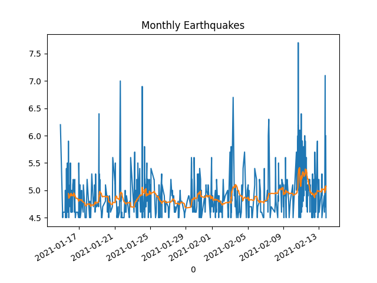

# Earthquakes


```python
from quakefeeds import QuakeFeed
import pandas as pd, datetime

feed = QuakeFeed("4.5", "month")
res = []
for i in range(len(feed)):
    d = datetime.datetime.fromtimestamp(feed[i]['properties']['time']/1000.0)
    s = feed[i]['properties']['mag']
    res.append([d,s])

df = pd.DataFrame(res).sort_values(by=0)
df = df.set_index(0)
df.columns = ['Magnitude']
print (df.tail(5))
df.Magnitude.plot()
df.Magnitude.rolling(window=20).mean().plot()
plt.title('Monthly Earthquakes')
plt.savefig('quake.png')
```

```text
                         Magnitude
0                                 
2021-02-13 17:36:42.950        4.9
2021-02-13 17:51:42.118        5.3
2021-02-13 18:19:14.287        4.7
2021-02-13 18:33:57.936        6.0
2021-02-13 19:26:43.076        4.5
```




