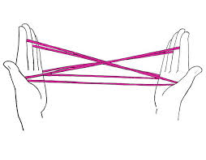

# Computing AI

The problem with today's neural net heavy approaches to "AI" is that
they are too dependent on computation of decisions, but not on any
underlying model of intelligence. They are two different things.

What is a model? In math teaching models, functions, are confused,
some call math "the study of patterns" but that's not enough
either. There is an aspect of *relations* that are glossed over. Imagine
the cat's cradle game,

This is a web of relations. It doesn't necessarily compute anything.
I can [transform](https://drive.google.com/uc?export=view&id=18Y1ZXPzI2nRrYyvjYNHiw7xG8cpWQNAU)
the model into something else, maybe something simpler, play with it etc.
This is a model. I can utilize differential calculus, all kinds of odd algebras,
the whole nine.

We can get a *function* out of the model, "the function of going from
one middle to the other middle finger, while always remaining in the
middle" perhaps. So I specified initial and boundary conditions, and I
received a function, something computable. $f(x)=2x$ is a function. I
plug in $x=2$, it gives me 4.

Now real math, in physics, Laplace Equation in 2D is

$$
\frac{\partial^2 p}{\partial x} + \frac{\partial^2 p}{\partial y}  = 0
$$

Very simple, neat right? A model, a relation. Such relations can be
used to represent heat conduction, fluid dynamics,
electrostatics.. many areas.

And here is a solution based on certain initial and boundary conditions.

$$
p(x,y) =
\frac{\sinh \left( \frac{3/2 \pi y}{L_y}  \right)}
     {\sinh \left( \frac{3/2 \pi L_y}{L_x} \right)}
\sin \left( \frac{3/2 \pi x}{L_x}  \right)     
$$

A bloddy mess. It is of course computable.

Then, a relation, a model is much more fundamental, essential
construct. A function, as a solution, can be complicated. When we
model the world, we need to work with the essentials, they are much
more powerful. We invented entire areas of math so we can do this. And
it worked brilliantly so far.

Now, current approaches of AI, neural nets, can only work with
computable stuff. There is more, they cant even get the analytical
mess correctly, they have to approximate it. Both of these problems
now lead us to a dead-end; what you reverse-engineer from data is not
intelligence, only one *solution* to an underlying model we know
nothing about, under certain conditions. That's why these NNs, deep or
otherwise, tied so much to data, and fragile, too tied their
surrounding conditions, and fail to generalize.

Question

In computational science (for physics), we also approximate the
functions generated from the true model

Answer

Yes but in that case you are going forward from a known model, not
going backward, blindly from data with nothing known. Going forward
with a clean model has its challanges too, but you always have a
basis, you make use of its presence. Plug something into it, might get
certain functions that might be easier etc. We can always see the
trade-offs clearly as the true relations are captured in a visible
model.

Question

What is the current state of AI research?

Answer

There are currently no reputable, major work going on for modeling
intelligence. I don't want to say 'we barely scratched the surface'
because noone is even scrathing the surface. All the energy is around
the monkey shit, NNs, data, etc. If you asked me 18th century, 'whats
going on in physics?' I'd have said yeah they are modeling some shit'.
We cant say the same for intelligence.

