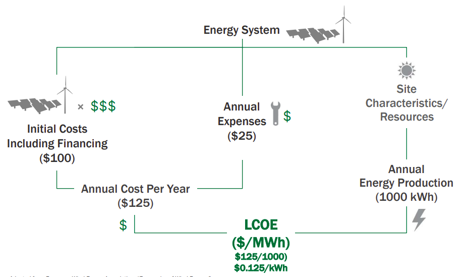

# Energy Production Costs, LCOH, LCOE

Levelized Cost of Energy (LCOE)

LCOE measures lifetime costs divided by energy production. Calculates
present value of the total cost of building and operating a power
plant over an assumed lifetime. Allows the comparison of different
technologies (e.g., wind, solar, natural gas) of unequal life spans,
project size, different capital cost, risk, return, and capacities
([DOE](https://www.energy.gov/sites/prod/files/2015/08/f25/LCOE.pdf)).

Levelized Cost of Hydrogen (LCOH)

Similar to LCOE but for pure hydrogen generation. There are multiple
routes to H2 generation other than electrolysis (using electricity) a
cost calculation of the final product can be beneficial.

Simple LCOE Concept

Calculating and comparing LCOE can: Measure value across the longer
term, showing projected life-cycle costs.. Highlight opportunities for
Tribes to develop different scales of projects (facility, community,
or commercial).. Inform decisions to pursue projects on an economic
basis, compared to utility rates.

Overnight cost

Overnight cost is the cost of a construction project if no interest
was incurred during construction, as if the project was completed
"overnight". The overnight cost is a part of the capital cost. It
includes construction, system cost, procurement cost, engineering
cost, cost of equipment, frst fuel load, and other costs. For quick
comparisons, firms will look at what the cost of building a plant
overnight would be or the overnight cost of capital. This is a
hypothetical scenario because a plant cannot be constructed in one
night, but it evaluates the cost of a plant if it were built right
away, with current prices.

Some Data Points

* Avi Shultz (DOE) on CSP: "Our benchmark is based on a plant of
approximately 100 MW with 14 hours of thermal energy storage. We model
that plant would have an LCOE of 9.5 cents/kWh (with no incentives) if
built in the US today"

* Conversion Factors, H2 has 0.143 GJ/kg

LCOH

|Source         |Overn Cost          |LCOH ($/GJ)|Reference| 
|---------------|--------------------|------------|----------|
|Natgas, CCS    |                    | 13.98      | [Paper](https://www.linkedin.com/pulse/what-levelized-cost-clean-hydrogen-production-greg-perkins/)  |
|Nuclear HTGR   |                    | 17.55      | [Book](https://books.google.com.tr/books?id=BpZ7DwAAQBAJ)  |
|Coal IGCC, CC  |                    | 21.25      | [IEAGHG](https://ieaghg.org/docs/General_Docs/Reports/2014-03.pdf)  |
|PV             |                    | 26.00      | [Paper](https://www.cell.com/cell-reports-physical-science/pdfExtended/S2666-3864(20)30224-1)  |
|CSP Thermochem |                    | 42.08      | [Paper](https://www.mdpi.com/1996-1073/12/3/352/pdf-vor)  |

LCOE

|Source         |Overn Cost ($/KW)   |LCOE ($/MWh)|Reference| 
|---------------|--------------------|------------|----------|
|Biomass        | 4524               | 53.4       |[Paper](https://link.springer.com/content/pdf/10.1007/s11356-021-18129-3.pdf/)|
|Nuclear        | 7030               | 53.4       |[Paper](https://link.springer.com/content/pdf/10.1007/s11356-021-18129-3.pdf/)|
|Wind, Onshore  | 1718               | 50.0       |[IEA](https://www.iea.org/reports/projected-costs-of-generating-electricity-2020)
|Wind, Offshore | 4833               | 88.0       |[EIA](https://www.eia.gov/outlooks/aeo/assumptions/pdf/table_8.2.pdf),[IEA](https://www.iea.org/reports/projected-costs-of-generating-electricity-2020)
|Coal Wout CCS  | 4074               | 68.64      |[EIA](https://www.eia.gov/outlooks/aeo/assumptions/pdf/table_8.2.pdf)|
|CSP (100 MW)   | 7895               | 95.0       |[EIA](https://www.eia.gov/outlooks/aeo/assumptions/pdf/table_8.2.pdf),DOE (see above)|
|Batteries      |                    | 121.84     |[EIA](https://www.eia.gov/outlooks/aeo/pdf/electricity_generation.pdf)|
|Coal Comb CCS  |                    | 122.7      |[IEAGHG](https://ieaghg.org/docs/General_Docs/Reports/2014-03.pdf)|
|Coal IGCC CCS  |                    | 151.8      |[IEAGHG](https://ieaghg.org/docs/General_Docs/Reports/2014-03.pdf)|

