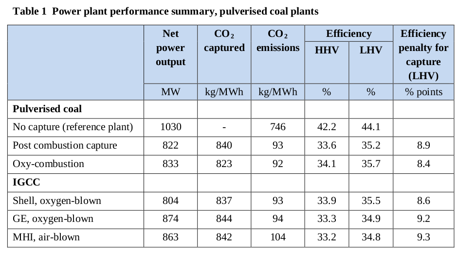

# H2 Production From Coal / CCS

[PDF](https://ieaghg.org/docs/General_Docs/Reports/2014-03.pdf)

*The IEA Greenhouse Gas R&D Programme (IEAGHG) was formed in 1991,
constitutes an autonomous and independent framework within the
International Energy Agency (IEA) network*

In recent years IEAGHG has undertaken a series of studies on the
performance and costs of plants incorporating the three leading CO 2
capture technologies: post combustion, oxy- combustion and
pre-combustion capture...

The study also assesses the following hydrogen production plants, all
based on GE oxygen blown gasification and Selexol solvent scrubbing:

* Plant with high net electricity co-production, including two 130MW e
E class gas turbines

* Plant with intermediate net electricity co-production, including two
77MW e F class gas turbines

* Plant with low electricity co-production, including a PSA off-gas
fired boiler.  All of these baseline plants have 90% CO2 capture...

This study assessed the technical feasibility and costs of achieving a
higher level of CO 2 capture (around 98%) in oxy-combustion and IGCC
plants. In the oxy- combustion case this was achieved by passing the
vent gas from CO 2 purification through a membrane separation
unit. For gasification based plants an additional MDEA solvent
scrubbing stage was added after the Selexol scrubber.

