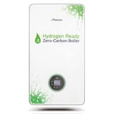
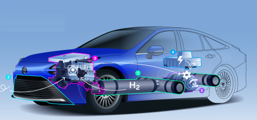

# Application Domains for H2

Along with the ease of storage, transport, and generation, clean fuels
enjoy, they are also attractive due to the fact they can be applied
anywhere, e.g. in combustion engines for motor vehicles, creating
power in turbines or fuel-cells, heating, or making steel.

<a name='steel'/>

### Steel Production

For steel production there is already no other way other than hydrogen
to make the process carbon free. In traditional steel making,
reduction of iron ore is done by heating it together with coal,
utilizing a chemical reaction that separates the oxygen from the iron,
forming and emitting CO2. In H2 based production, hydrogen reacts with
iron ore similarly to carbon, resulting in the extraction of
oxygen. But instead of creating CO2, the main by-product is H2O [1].

Euractiv: "Industry sectors like steelmaking traditionally rely on
fossil fuels to produce the intense heat and feed the chemical process
needed to smelt iron ore. But switching from coking coal to a cleaner
feedstock like hydrogen offers a solution that produces only harmless
steam emissions"

<a name='heating'/>

### Heating

Wherever natural gas is fed into homes and buildings for heating
purposes, H2 can replace it, sometimes even through dual-use
boilers. The boiler sold by Worcester Bosch is such a solution [2]

Bosch: "By developing a hydrogen-compatible boiler, the developers at
Bosch Thermotechnology are proving that boilers can be converted
quickly and easily from the currently used natural gas to 100 percent
hydrogen. A first demonstration boiler of the H2-ready boiler with a
rated heat output of 30 kW has been in operation on a test stand since 2017. 
The H2-ready boiler can initially run on conventional natural gas or
a hydrogen admixture of up to 20 percent. As soon as the local network
has been switched over to hydrogen, the boiler can be
converted to full use of the green gas within an hour by making just a
few adjustments...

Most of the existing natural gas pipelines are almost ready to
transport hydrogen, which means that existing infrastructures can be
used when switching to the green gas. The operation of the H2-ready
boiler is similar to that of an ordinary gas condensing boiler. The
important difference lies in the energy source. Hydrogen can be stored
indefinitely, thus ensuring constant availability for users. Green
hydrogen is climate-neutral and therefore has the potential to lead
the heating sector into a green future"

H2 based heating is efficient as H2 high-heatinv value is more than
twice that of natgas.

Boiler Hut: "1kg of hydrogen releases the same energy as 2.8kg of
natural gas." [5]

Heat By-Product from Fuel-Cell

Fuel-cells generate heat as a by-product while they generate
electricity from H2. This heat can be harnessed to heat homes,
businesses, so-called CHP, combined heat and power products essentially
perform this function. From a [product](https://www.inhouse-engineering.de/en/fuel-cell/chp/)
flyer: "[We can] use a combined heat and power unit with a fuel cell
to supply you with electrical and thermal energy. Our combined heat and
power station (CHP) inhouse5000+ based on a PEM fuel cell is such a solution for the
simultaneous supply of buildings with electricity and heat"

Heat By-Product from LOHC Hydrogeneation

The process of generating H2 from LOHC carrier, the so-called
hydrogeneation generates heat as by product. This process can easily
be used to heat homes, in fact a demo in Erlangen Germany shows 55 C
heat is supplied to a nearby school that can heat a swimming pool [4,
pg. 30]

<a name='powerfc'/>

### Power via Fuel-Cells

[DOE](https://www.energy.gov/eere/fuelcells/fuel-cells)

[Fuel-cells] produce electricity and heat as long as fuel is
supplied. A fuel cell consists of two electrodes—a negative electrode
(or anode) and a positive electrode (or cathode)—sandwiched around an
electrolyte. A fuel, such as hydrogen, is fed to the anode, and air is
fed to the cathode. In a hydrogen fuel cell, a catalyst at the anode
separates hydrogen molecules into protons and electrons, which take
different paths to the cathode. The electrons go through an external
circuit, creating a flow of electricity.

As H2 as fuel is weight efficient, we can find application of
fuel-cells anywhere ranging from powering cars to powering freight
ships or trains.

The famous Hyundai Nexo vehicle is powered by 120 KW FC, its fuel is
stored in three high-pressure fuel tanks packaged in the rear, with a
combined 156-litre capacity and the ability to hold up to 6.33kg of
hydrogen at a pressure of 700 bar.

A planned cargo ship [6] will have 2.5 MW fuel-cells supplied by
liquid hydrogen tanks of 70 tons, be able to carry 240 TEUs with
deadweight of 5,000 tons.

Homes can utilize H2 based fuel-cells to power the entire household.
A 2 KW fuel-cell system will use up 80 kg of H2 annually, and is more
than enough to power the household. Note that as a by-product
fuel-cells also generate heat which can be used as winter time
heating. The hydrogen can be suplied as seperate canisters to be
bought regularly, through pipelines. H2 can even be generated from
rooftop solar and be converted into hydrogen. Tanks are compressed H2,
a product by Lavo [7] stores H2 as metallic hydride. 

<a name='powerturbine'/>

### Power via Turbines

TBD

<a name='combust'/>

### Combustion Engines

TBD

References

[1] [H2 Green Steel](https://www.h2greensteel.com/)

[2] [Bosch](https://www.bosch-presse.de/pressportal/de/en/der-energiewende-einen-schritt-naeher-220800.html)

[3] [Euroactive](https://www.euractiv.com/section/energy-environment/infographic/how-hydrogen-can-decarbonize-the-steel-industry-and-what-it-will-take)

[4] [Hydrogenious, PDF](https://arpa-e.energy.gov/sites/default/files/Schneider_HydrogeniousTechnologies_TransportationFuels_Workshop_FINAL.pdf)

[5] [Boiler Hut](https://boilerhut.co.uk/boiler-guides/hydrogen-boiler-explained/)

[6] [Energy Observer 2](https://www.offshore-energy.biz/energy-observer-unveils-lh2-powered-cargo-ship-concept/)

[7] [LAVO](https://www.h2networks.com.au/pdf/Small-Scale-LAVO-Residential-Unit-Brochure.pdf)

