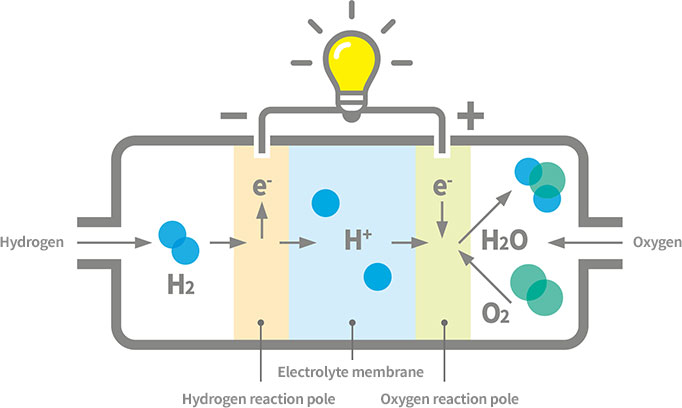

# Application Domains for H2

Along with the ease of storage, transport, and generation, clean fuels
enjoy, they are also attractive due to the fact they can be applied
anywhere, e.g. in combustion engines for motor vehicles, creating
power in turbines or fuel-cells, heating, or making steel.

### Steel Production

For steel production there is already no other way other than hydrogen
to make the process carbon free. In traditional steel making,
reduction of iron ore is done by heating it together with coal,
utilizing a chemical reaction that separates the oxygen from the iron,
forming and emitting CO2. In H2 based production, hydrogen reacts with
iron ore similarly to carbon, resulting in the extraction of
oxygen. But instead of creating CO2, the main by-product is H2O [1].

Euractiv: "Industry sectors like steelmaking traditionally rely on
fossil fuels to produce the intense heat and feed the chemical process
needed to smelt iron ore. But switching from coking coal to a cleaner
feedstock like hydrogen offers a solution that produces only harmless
steam emissions"

### Heating

Wherever natural gas is fed into homes and buildings for heating
purposes, H2 can replace it, sometimes even through dual-use
boilers. The boiler sold by Worcester Bosch is such a solution [2]

Bosch: "By developing a hydrogen-compatible boiler, the developers at
Bosch Thermotechnology are proving that boilers can be converted
quickly and easily from the currently used natural gas to 100 percent
hydrogen. A first demonstration boiler of the H2-ready boiler with a
rated heat output of 30 kW has been in operation on a test stand since
2017. The H2-ready boiler can initially run on conventional natural
gas or a hydrogen admixture of up to 20 percent. As soon as the local
network has been switched over to hydrogen, the boiler can be
converted to full use of the green gas within an hour by making just a
few adjustments...

Most of the existing natural gas pipelines are almost ready to
transport hydrogen, which means that existing infrastructures can be
used when switching to the green gas. The operation of the H2-ready
boiler is similar to that of an ordinary gas condensing boiler. The
important difference lies in the energy source. Hydrogen can be stored
indefinitely, thus ensuring constant availability for users. Green
hydrogen is climate-neutral and therefore has the potential to lead
the heating sector into a green future"

### Power via Fuel-Cells

### Power via H2 Turbines

### Combustion Engines

References

[1] [H2 Green Steel](https://www.h2greensteel.com/)

[2] [Bosch](https://www.bosch-presse.de/pressportal/de/en/der-energiewende-einen-schritt-naeher-220800.html)

[3] [Euroactive](https://www.euractiv.com/section/energy-environment/infographic/how-hydrogen-can-decarbonize-the-steel-industry-and-what-it-will-take)