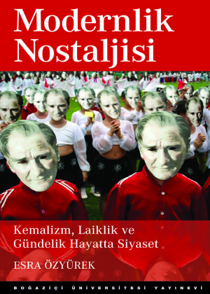

# A Nostalgia for Modernism

The title is taken from a book written about the mood of post 90s
secular citizens of the Turkish Republic. The fascist coup of 80 had
created the Islamoturkist ideology but it also wanted to balance it,
its internal (bizarre) contituents, so the leaders made sure to alert
the followers of the existing pure Turkist followers to be "on guard"
against the new newcomers, just in case they behaved too Islamist for
their own good.. This act ushered in a resurgence of all things
related to Kemal, a remembarence of the man through symbols, displays
of devotion, protests. The author Ozyurek chose one photograph from
such a protest where hard-core adherents put on masks with the
founders face on it, creating an eerie display, likely creating an
effect opposite than was intented.

These riled-up followers, gazing through the dead-looking eyes of the
founder's picture, were clearly trying too hard. This was culture war,
in US it was around useless issues to hide away the abnormalities of
the uniparty that destroyed all ideologies related to economy and
well-being, so did this one, pitting one group against another, while
hiding away its own beastiality, its mindless expansion in econ and
errant nationalism.

The nostalgia was for the 1920s foundational spirit, when the only
ideology was Kemal's, centered around a nomadic pure Turk who was the
bringer of civilization at the same time forgotten (until Kemal
reminded everyone). The ideology, and the nostalgia for it later had
many uses, one of which was to cement relations with the Anglo
alliance, another historical amnesia, yet another to explain away lost
territories with conjured up animosities. But in each incarnation
the remembarences, nostalgia becomes more comical - I almost cannot wait
to see the next one.
