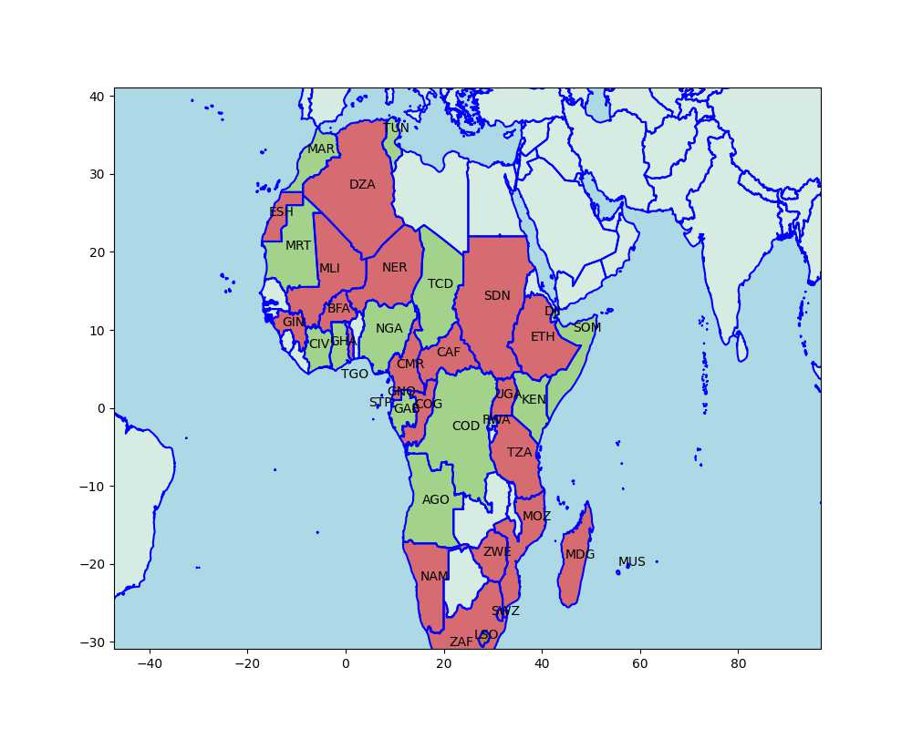

# African Support for Russia

Based on the news items seen below, created a map of pro-Russia,
pro-US countries in Africa. Countries siding with RU are colored in
red, for US green, country codes are iso3, full list is [here](https://www.iban.com/country-codes).

```python
import impl as u

ru = ["Mali","Ethiopia","Congo","South Africa","Madagascar",
      "Sudan","Uganda","Zimbabwe","Burkina Faso","Guinea",
      "Cameroon","Equatorial Guinea","Sao Tome and Principe",
      "Algeria","Togo","Lesotho","Swaziland","Senegal",
      "Namibia","Mozambique","United Republic of Tanzania",
      "Central African Republic","Western Sahara","Central African Republic"] 

us = ["Chad","Gabon","Ghana","Kenya","Rwanda", "Djibouti","Somalia","Niger",
       "Democratic Republic of the Congo", "Mauritania","Lesotho",
       "Mauritius", "Angola","Nigeria","Morocco","Tunisia","Cote d'Ivoire"]

u.plot_africa_ru_us(ru,us)
plt.savefig('af-ru-us.jpg',quality=50)
```



### News

[15/12/22](https://www.africanews.com/2022/12/15/last-french-soldiers-leave-central-african-republic//):
"In 2021, when the presence of the private military company Wagner was increasingly intrusive in the country, France considered that the conditions were no longer met for us to continue working for the Central African armed forces," General François-Xavier Mabin, commander of French forces in Gabon, told AFP.

[13/12/22](https://www.overtdefense.com/2022/12/12/morocco-will-be-the-first-african-country-to-send-aid-to-ukraine/) -
Morocco Will be the First African Country to Send Aid to Ukraine

[11/11/22](https://tfiglobalnews.com/2022/11/11/angola-switched-its-ties-from-russia-to-us-and-now-its-sovereignty-is-in-danger/) -
Angola switched its ties from Russia to US.

[05/11/22](https://tfiglobalnews.com/2022/11/05/biden-confirms-that-burkina-faso-is-now-on-russias-side/) -
Biden confirms that Burkina Faso is now on Russia’s side.

[19/10/22](https://www.reuters.com/world/madagascar-minister-fired-voting-against-russias-ukraine-annexation-2022-10-19/) -
Madagascar minister fired for voting against Russia's Ukraine annexation 

[17/10/22](https://tfiglobalnews.com/2022/10/17/pro-us-chad-has-been-surrounded-by-pro-russia-nations-and-its-surrender-is-inevitable/) -
Pro-US Chad has been surrounded by pro-Russia nations, and its surrender is inevitable.

[13/10/22](https://www.news24.com/news24/africa/news/seven-sadc-countries-including-sa-abstains-in-un-vote-against-russia-annexing-parts-of-ukraine-20221013) -
Seven SADC countries, including SA, abstain in UN vote against Russia annexing parts of Ukraine.

[13/10/22](https://www.moroccoworldnews.com/2022/10/351809/algeria-abstains-from-un-vote-condemning-russias-annexations-in-ukraine) -
Algeria Abstains From UN Vote Condemning Russia

[13/10/22](https://www.premiumtimesng.com/news/headlines/559361-nigeria-joins-us-others-to-condemn-russian-annexation-of-ukrainian-territories.html) -
Nigeria has joined the majority of the countries of the world to condemn the Russian annexation of Ukrainian territories.

[13/10/22](https://www.africanews.com/2022/10/13/african-countries-divided-over-un-vote-against-russia/) -
African countries divided over UN vote against Russia.

[09/10/22](https://www.bbc.com/news/world-africa-63171771) -
Why Russia is cheering on the Burkina Faso coup.

[08/09/22](https://www.africanews.com/2022/09/08/polish-president-visited-ivory-coast-to-discuss-impact-of-war-in-ukraine/) -
Polish president visited Ivory Coast to discuss impact of war in
Ukraine.. During the visit, Ivorian president Alassane Ouattara
reiterated his support for the restoration of borders in Ukraine.

[06/07/22](https://edition.cnn.com/2022/07/06/politics/afghanistan-major-non-nato-ally-designation-biden-rescind/index.html) -
With Afghanistan’s status rescinded, the US will have 18 major
non-NATO allies, according to the State Department. They are:
Argentina, Australia, Bahrain, Brazil, Colombia, Egypt, Israel, Japan,
Jordan, Kuwait, Morocco, New Zealand, Pakistan, the Philippines,
Qatar, South Korea, Thailand and Tunisia.

[01/07/2022](https://www.institutmontaigne.org/en/analysis/senegal-voice-africa-russian-ukrainian-crisis) -
Senegal appears to be taking a neutral position on the conflict between Russia and Ukraine, having chosen to abstain on two consecutive votes at the United Nations following Russia's invasion

[29/06/22](https://intellinews.com/russia-woos-africa-with-arms-grain-and-nuclear-power-252022/) -
Russia woos Africa with arms, grain and nuclear power.

[21/04/22](https://news.yahoo.com/ethiopians-hope-fight-russia-ukraine-161351963.html) -
Ethiopians hope to fight for Russia in Ukraine.

[24/02/22](Kenya, Uganda uphold opposite voting stances on Russia war):
Sudan, Ethiopia, Gabon, Guinea, Mozambique, Namibia, Angola and Algeria
and Burundi abstained too.

[21/02/22](https://www.realcleardefense.com/articles/2022/02/21/russia_and_algeria_team_up_against_morocco_817797.html) -
Russia and Algeria Team Up Against Morocco.. Now Russia is also
assuming a stronger posture regarding the Western Sahara, in apparent
cooperation with Algeria, Morocco’s long-time rival here.

[23/04/18](https://www.defensenews.com/unmanned/2018/04/23/us-builds-drone-base-in-niger-crossroads-of-extremism-fight) -
US builds drone base in Niger.