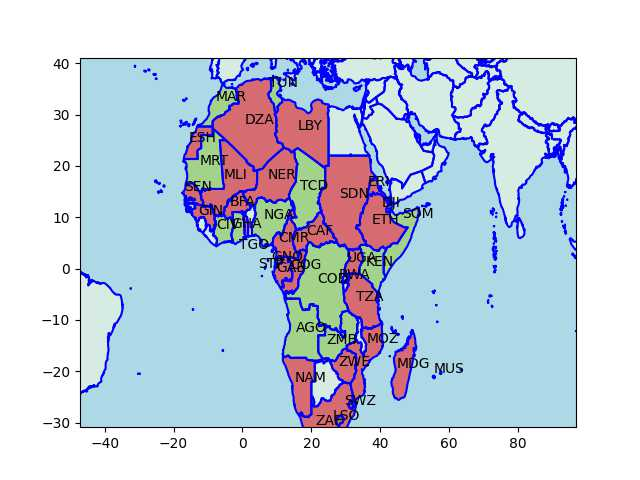

# African Support for Russia

Based on the news items seen below, created a map of pro-Russia,
pro-US countries in Africa. Countries siding with RU are colored in
red, for US green. Country codes are ISO3, the full list is [here](https://www.iban.com/country-codes).

```python
ru = ['Mali','Ethiopia','Congo','South Africa','Sudan','Uganda',
      'Zimbabwe','Burkina Faso','Cameroon','Equatorial Guinea','Sao Tome and Principe',
      'Cameroon','Niger'] 

us = ['Chad','Gabon','Ghana','Kenya','Rwanda','Djibouti','Somalia',
      'Democratic Republic of the Congo', 'Mauritania','Lesotho', 'Mauritius']

u.plot_africa_ru_us(ru,us)
plt.savefig('af-ru-us.jpg')   
```




### News

[13/10](https://www.africanews.com/2022/10/13/african-countries-divided-over-un-vote-against-russia//) -
African countries divided over UN vote against Russia

[5/11](https://tfiglobalnews.com/2022/11/05/biden-confirms-that-burkina-faso-is-now-on-russias-side/) -
Biden confirms that Burkina Faso is now on Russia’s side

[17/10](https://tfiglobalnews.com/2022/10/17/pro-us-chad-has-been-surrounded-by-pro-russia-nations-and-its-surrender-is-inevitable/) -
Pro-US Chad has been surrounded by pro-Russia nations, and its surrender is inevitable

[9/10](https://www.bbc.com/news/world-africa-63171771) -
Why Russia is cheering on the Burkina Faso coup

[21/4](https://news.yahoo.com/ethiopians-hope-fight-russia-ukraine-161351963.html) -
Ethiopians hope to fight for Russia in Ukraine


