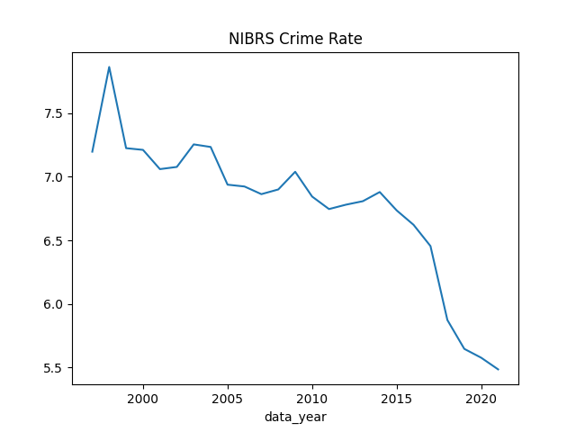

# Crime

```python
import requests, json
key = open("../../2019/05/.key/.datagov").read()
url = "https://api.usa.gov/crime/fbi/sapi/api/participation/national?api_key=%s" % key
response = requests.get(url)
res = json.loads(response.text)
```

```python
res['results'][0]
```

```text
Out[1]: 
{'data_year': 2021,
 'population': 331900098,
 'total_agency_count': 18810,
 'published_agency_count': 11799,
 'active_agency_count': 21477,
 'covered_agency_count': 9,
 'population_covered': 12334,
 'agency_count_nibrs_submitting': 11799,
 'agency_count_leoka_submitting': 12112,
 'agency_count_pe_submitting': 11872,
 'agency_count_srs_submitting': 0,
 'agency_count_asr_submitting': 9112,
 'agency_count_hc_submitting': 18810,
 'agency_count_supp_submitting': 11799,
 'nibrs_population_covered': 215094046,
 'total_population': 337953968,
 'csv_header': 'data_year,population,total_agency_count,published_agency_count,active_agency_count,covered_agency_count,population_covered,agency_count_nibrs_submitting,agency_count_leoka_submitting,agency_count_pe_submitting,agency_count_srs_submitting,agency_count_supp_submitting,nibrs_population_covered',
 'nibrs_population_percentage_covered': 63.645958}
```


```python
import pandas as pd
pd.set_option('display.max_columns', None)
cols = ['data_year','population','agency_count_nibrs_submitting','nibrs_population_covered']
x = [ [res['results'][i][col] for col in cols] for i in range(25)]
df = pd.DataFrame(x)
df.columns = cols
per_people = 100000 
df['nibrs_rate'] = df.agency_count_nibrs_submitting / df.nibrs_population_covered * per_people
df.set_index('data_year')['nibrs_rate'].plot(title='NIBRS Crime Rate')
plt.savefig('rate1.png')
```




National Incident-Based Reporting System (NIBRS)

Law Enforcement Officers Killed and Assaulted (LEOKA)

Summary Reporting System (SRS)

Hate Crime Statistics

### FBI UCR

Annual summaries, URL as below

https://ucr.fbi.gov/crime-in-the-u.s/[year]/crime-in-the-u.s.-[year]/tables/table-8/table-8.xls

Replace [year] with particular year.

```python
import urllib.request as urllib2
from io import BytesIO
import pandas as pd

hdr = {'User-Agent':'Mozilla/5.0'}
year = 2019
url = "https://ucr.fbi.gov/crime-in-the-u.s/%d/crime-in-the-u.s.-%d/tables/table-8/table-8.xls" % (year,year)
req = urllib2.Request(url,headers=hdr)
file = BytesIO(urllib2.urlopen(req).read())
cols = ['State','City','Population','Violent crime','Murder and nonnegligent manslaughter','Rape1','Robbery','Aggravated assault','Property crime','Burglary','Larceny-theft','Motor vehicle theft','Arson2']
#df = pd.read_excel('in.xls',skiprows=4,header=None)
df = pd.read_excel(file,skiprows=4,header=None)
df.columns = cols
df.loc[:,'State'] = df.loc[:,'State'].ffill()
```


References

[2] https://api.data.gov/signup/

[3] https://github.com/fbi-cde/crime-data-frontend

[4] https://www.fbi.gov/how-we-can-help-you/more-fbi-services-and-information/ucr/publications

