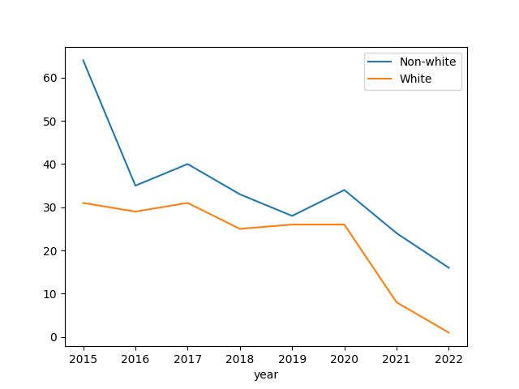
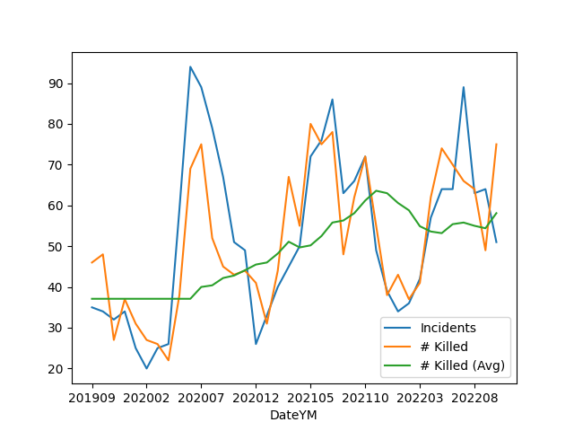

# Police, Crime in US

<a name='allshoot'/>

### People Shot By the Police

Data is from WaPo Github [repo](https://github.com/washingtonpost/data-police-shootings).

All Deaths by Police Shootings, by Race

```python
import pandas as pd

f = 'https://raw.githubusercontent.com/washingtonpost/data-police-shootings/master/fatal-police-shootings-data.csv'
df = pd.read_csv(f)
df['year'] = pd.to_datetime(df['date']).dt.year
df['race'] = df['race'].fillna('O')
g = df.groupby(['year','race']).size().reset_index()
g = g.set_index(['year','race']).unstack(level=1)[0]
g.plot.bar(stacked=True)
plt.savefig('allshoot.png')
```

A: Asian, B: Black, H: Hispanic, N: Native Am, O: Other, W: White


<a name='unarmed'/>

Unarmed People Shot by the Police

```python
df = pd.read_csv(f)
df['year'] = pd.to_datetime(df['date']).dt.year
df1 = df[(df.race != 'W') & (df.armed == 'unarmed')]
df1.groupby('year').size().plot()
df2 = df[(df.race == 'W') & (df.armed == 'unarmed')]
df2.groupby('year').size().plot()
plt.legend(['Non-white','White'])
plt.savefig('unarmed.png')
```



<a name='usgun'/>

### US Gun Violence

Data came from the [Gun Violence Archive](https://www.gunviolencearchive.org/reports),
see data for "mass shootings - all years". Plot is monthly incidents and deaths.


```python
import pandas as pd, zipfile
pd.set_option('display.max_columns', None)
df =  pd.read_csv('us-mass-shootings.csv')
df['Date'] = df.apply(lambda x: pd.to_datetime(x['Incident Date']), axis=1)
df['DateYM'] = df.apply(lambda x: "%d%02d" % (x['Date'].year, x['Date'].month), axis=1)
g = df.groupby('DateYM').agg({'Incident ID':'count', '# Killed': 'sum'})
g['# Killed (Avg)'] = g['# Killed'].rolling(10).mean()
g = g.interpolate(limit_direction='both')
g = g.rename(columns={"Incident ID": "Incidents"})
print (g.tail(5))
g.plot()
plt.savefig('gunvio.png')
```

```text
        Incidents  # Killed  # Killed (Avg)
DateYM                                     
202206         64        70            55.4
202207         89        66            55.8
202208         63        64            55.0
202209         64        49            54.4
202210         51        75            58.1
```



### FBI Crime Data, UCR

The FBI sit [6] and Data.gov API publishes FBI crime data. Data from
the first the so-called "Table 8" was taken until 2019. The rest is
from the API, all in the zip below [5]. The conversion code for xls
to csv is in `util.py`.

To retrieve an entire year from the API must get data from all
agencies (PDs), the master list is in `agencies.csv` in the zip.
To use the API a sign-up and key is required [2]. An example use
is below.


```python
import requests, json

agency = "AL0010100" # Bessemer Police Department
year = 2019

key = open("../../2019/05/.key/.datagov").read()
url = "https://api.usa.gov/crime/fbi/sapi/api/summarized/agencies/%s/offenses/%d/%d?api_key=%s" % (agency,year,year,key)
response = requests.get(url)
res = json.loads(response.text)
res['results'][0]
```

```text
Out[1]: 
{'ori': 'AL0010100',
 'data_year': 2019,
 'offense': 'aggravated-assault',
 'state_abbr': 'AL',
 'cleared': 3,
 'actual': 319,
 'data_range': None}
```

```python
res['results'][1]
```

```text
Out[1]: 
{'ori': 'AL0010100',
 'data_year': 2019,
 'offense': 'arson',
 'state_abbr': 'AL',
 'cleared': 0,
 'actual': 0,
 'data_range': None}
```


References

[1] https://crime-data-explorer.fr.cloud.gov/pages/docApi

[2] [Data.gov Signup](https://api.data.gov/signup/)

[3] https://github.com/fbi-cde/crime-data-frontend

[4] https://www.fbi.gov/how-we-can-help-you/more-fbi-services-and-information/ucr/publications

[5] [Data](https://drive.google.com/uc?export=view&id=1v1oYTeH7wQpnB-Cy1XxEKie72hpqv6GS)

[6] [FBI, Crime in the US](https://ucr.fbi.gov/crime-in-the-u.s/)

