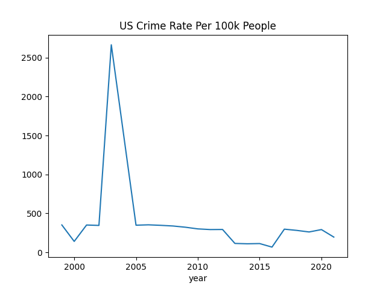

# Crime

### FBI UCR

Annual summaries, URL as below

https://ucr.fbi.gov/crime-in-the-u.s/[year]/crime-in-the-u.s.-[year]/tables/table-8/table-8.xls

Replace [year] with particular year.

```python
import urllib.request as urllib2
from io import BytesIO
import pandas as pd

cols = ['State','City','Population','Violent crime','Murder and nonnegligent manslaughter','Rape1','Robbery','Aggravated assault','Property crime','Burglary','Larceny-theft','Motor vehicle theft','Arson2']
def get_fbi_ucr(year):
   hdr = {'User-Agent':'Mozilla/5.0'}
   url = "https://ucr.fbi.gov/crime-in-the-u.s/%d/crime-in-the-u.s.-%d/tables/table-8/table-8.xls" % (year,year)
   req = urllib2.Request(url,headers=hdr)
   file = BytesIO(urllib2.urlopen(req).read())
   df = pd.read_excel(file,skiprows=4,header=None)
   df.columns = cols
   df.loc[:,'State'] = df.loc[:,'State'].ffill()
   return df
```

```python
df = get_fbi_ucr(2019)
```


```python
pop = df['Population'].sum()
vio = df['Violent crime'].sum()
crime_rate = vio / pop
print (pop,vio)
print (crime_rate * 100000)
```

```text
194512905.0 856781.0
440.4751448239386
```



### API

```python
import requests, json
key = open("../../2019/05/.key/.datagov").read()
#url = "https://api.usa.gov/crime/fbi/sapi/api/participation/national?api_key=%s" % key
url = "https://api.usa.gov/crime/fbi/sapi/api/summarized/state/AL/violent-crime/2020/2020?api_key=%s" % key
response = requests.get(url)
res = json.loads(response.text)
```

```python
print (res['results'][0])
```

```text
{'ori': 'AL0010000', 'data_year': 2020, 'offense': 'violent-crime', 'state_abbr': 'AL', 'cleared': 85, 'actual': 284, 'data_range': None}
```

References

[1] https://crime-data-explorer.fr.cloud.gov/pages/docApi

[2] https://api.data.gov/signup/

[3] https://github.com/fbi-cde/crime-data-frontend

[4] https://www.fbi.gov/how-we-can-help-you/more-fbi-services-and-information/ucr/publications

