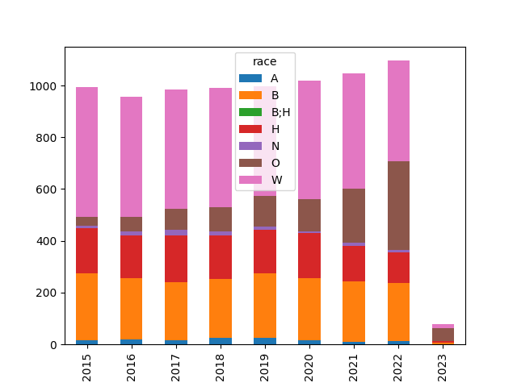
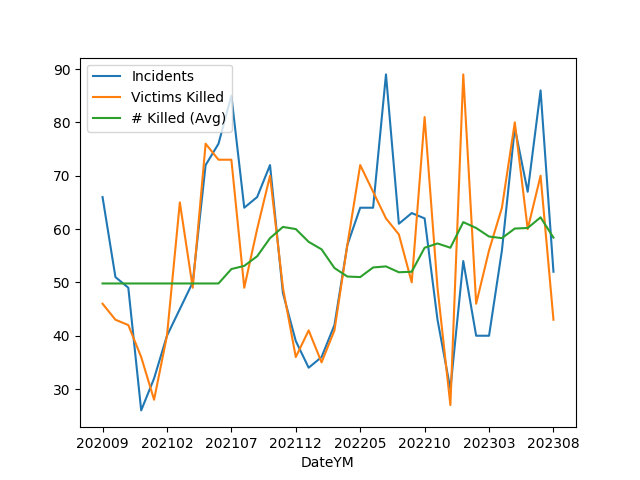

# Police, Crime in US

<a name='allshoot'/>

### People Shot By the Police

Data is from WaPo Github [repo](https://github.com/washingtonpost/data-police-shootings).

All Deaths by Police Shootings, by Race

```python
import pandas as pd

f = 'https://raw.githubusercontent.com/washingtonpost/data-police-shootings/master/fatal-police-shootings-data.csv'
df = pd.read_csv(f)
df['year'] = pd.to_datetime(df['date']).dt.year
df['race'] = df['race'].fillna('O')
g = df.groupby(['year','race']).size().reset_index()
g = g.set_index(['year','race']).unstack(level=1)[0]
g.plot.bar(stacked=True)
plt.savefig('allshoot.png')
```

A: Asian, B: Black, H: Hispanic, N: Native Am, O: Other, W: White



<a name='unarmed'/>

Unarmed People Shot by the Police

```python
df = pd.read_csv(f)
df['year'] = pd.to_datetime(df['date']).dt.year
df1 = df[(df.race != 'W') & (df.armed == 'unarmed')]
df1.groupby('year').size().plot()
df2 = df[(df.race == 'W') & (df.armed == 'unarmed')]
df2.groupby('year').size().plot()
plt.legend(['Non-white','White'])
plt.savefig('unarmed.png')
```


<a name='usgun'/>

### US Gun Violence

Data came from the [Gun Violence Archive](https://www.gunviolencearchive.org/reports),
see data for "mass shootings - all years". Plot is monthly incidents and deaths.


```python
import pandas as pd, zipfile
pd.set_option('display.max_columns', None)
df =  pd.read_csv('us-mass-shootings.csv')
df['Date'] = df.apply(lambda x: pd.to_datetime(x['Incident Date']), axis=1)
df['DateYM'] = df.apply(lambda x: "%d%02d" % (x['Date'].year, x['Date'].month), axis=1)
g = df.groupby('DateYM').agg({'Incident ID':'count', '# Killed': 'sum'})
g['# Killed (Avg)'] = g['# Killed'].rolling(10).mean()
g = g.interpolate(limit_direction='both')
g = g.rename(columns={"Incident ID": "Incidents"})
print (g.tail(5))
g.plot()
plt.savefig('gunvio.png')
```

```text
        Incidents  # Killed  # Killed (Avg)
DateYM                                     
202206         64        70            55.4
202207         89        66            55.8
202208         63        64            55.0
202209         64        49            54.4
202210         51        75            58.1
```



### FBI Crime Data Gov API

```python
import requests, json
key = open("../../2019/05/.key/.datagov").read()
#url = "https://api.usa.gov/crime/fbi/sapi/api/participation/national?api_key=%s" % key
url = "https://api.usa.gov/crime/fbi/sapi/api/summarized/state/AL/violent-crime/2020/2020?api_key=%s" % key
response = requests.get(url)
res = json.loads(response.text)
```

```python
print (res['results'][0])
```

```text
{'ori': 'AL0010000', 'data_year': 2020, 'offense': 'violent-crime', 'state_abbr': 'AL', 'cleared': 85, 'actual': 284, 'data_range': None}
```

### FBI UCR


References

[1] https://crime-data-explorer.fr.cloud.gov/pages/docApi

[2] https://api.data.gov/signup/

[3] https://github.com/fbi-cde/crime-data-frontend

[4] https://www.fbi.gov/how-we-can-help-you/more-fbi-services-and-information/ucr/publications

