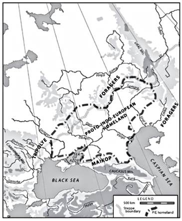

# The Horse, The Wheel, and Language

David Anthony

[A] substantial vocabulary list has been reconstructed for one of the
languages spoken about five thousand years ago. That language is the
ancestor of modern English as well as many other modern and ancient
languages. All the languages that are descended from this same mother
tongue belong to one family, that of the Indo-European
languages. Today Indo-European languages are spoken by about three
billion people—more than speak the languages of any other language
family...

This book argues that it is now possible to solve the central puzzle
surrounding Proto- Indo-European, namely, who spoke it, where was it
spoken, and when. Generations of archaeologists and linguists have
argued bitterly about the “homeland” question...

[A British judge, Jones' 1700s] arrival in Calcutta, a mythically
alien place for an Englishman of his age, was the opening move in the
imposition of royal government over a vital yet irresponsible
merchant’s colony.  Jones was to regulate both the excesses of the
English merchants and the rights and duties of the Indians. But
although the English merchants at least recognized his legal
authority, the Indians obeyed an already functioning and ancient
system of Hindu law, which was regularly cited in court by Hindu legal
scholars, or pandits (the source of our term pundit). English judges
could not determine if the laws the pandits cited really
existed. Sanskrit was the ancient language of the Hindu legal texts,
like Latin was for English law. If the two legal systems were to be
integrated, one of the new Supreme Court justices had to learn
Sanskrit. That was Jones...

As Jones pored over Sanskrit texts his mind made comparisons not just
with Persian and English but also with Latin and Greek, the mainstays
of an eighteenth-century university education; with Gothic, the oldest
literary form of German, which he had also learned; and with Welsh, a
Celtic tongue and his boyhood language which he had not forgotten..

Jones came to a startling conclusion, announced in his third annual
discourse to the Asiatic Society of Bengal, which he had founded when
he first arrived.  The key sentence is now quoted in every
introductory textbook of historical linguistics (punctuation mine):

>The Sanskrit language, whatever be its antiquity, is of a wonderful
>structure: more perfect than the Greek, more copious than the Latin,
>and more exquisitely refined than either; yet bearing to both of them
>a stronger affinity, both in the roots of verbs and in the forms of
>grammar, than could possibly have been produced by accident; so strong
>indeed, that no philologer could examine them all three, without
>believing them to have sprung from some common source, which, perhaps,
>no longer exists.

Jones had concluded that the Sanskrit language originated from the
same source as Greek and Latin, the classical languages of European
civilization...

The Indo-European homeland is like the Lost Dutchman’s Mine, a legend
of the American West, discovered almost everywhere but confirmed
nowhere. Anyone who claims to know its real location is thought to be
just a little odd—or worse. Indo-European homelands have been
identified in India, Pakistan, the Himalayas, the Altai Mountains,
Kazakhstan, Russia, Ukraine, the Balkans, Turkey, Armenia, the North
Caucasus, Syria/Lebanon, Germany, Scandinavia, the North Pole, and (of
course) Atlantis. Some homelands seem to have been advanced just to
provide a historical precedent for nationalist or racist claims to
privileges and territory. Others are enthusiastically zany. The
debate, alternately dryly academic, comically absurd, and brutally
political, has continued for almost two hundred years. 

This chapter lays out the linguistic evidence for the location of the
Proto-Indo-European homeland. The evidence will take us down a
well-worn path to a familiar destination: the grasslands north of the
Black and Caspian Seas in what is today Ukraine and southern Russia,
also known as the Pontic-Caspian steppes..

Knowing that we are looking for a society with a specific list of
material culture items and institutionalized power distinctions is a
great help in locating the Proto-Indo-European homeland. We can
exclude all regions where hunter-gatherer economies survived up to
2500 BCE. That eliminates the northern forest zone of Eurasia and the
Kazakh steppes east of the Ural Mountains. The absence of honeybees
east of the Urals eliminates any part of Siberia. The temperate-zone
flora and fauna in the reconstructed vocabulary, and the absence of
shared roots for Mediterranean or tropical flora and fauna, eliminate
the tropics, the Mediterranean, and the Near East. Proto-Indo-
European exhibits some very ancient links with the Uralic languages,
overlaid by more recent lexical borrowings into Proto-Uralic from
Proto-Indo-European; and it exhibits less clear linkages to some
Pre—or Proto-Kartvelian language of the Caucasus region. All these
requirements would be met by a Proto-Indo-European homeland placed
west of the Ural Mountains, between the Urals and the Caucasus, in the
steppes of eastern Ukraine and Russia.

<a name='stew'/>

Fire-resistant clay pots made it possible to cook stews and soups all
day over a low fire, breaking down complex starches and proteins so
that they were easier to digest for people with delicate
stomachs—babies and elders. Soups that simmered in clay pots helped
infants survive and kept old people alive longer.