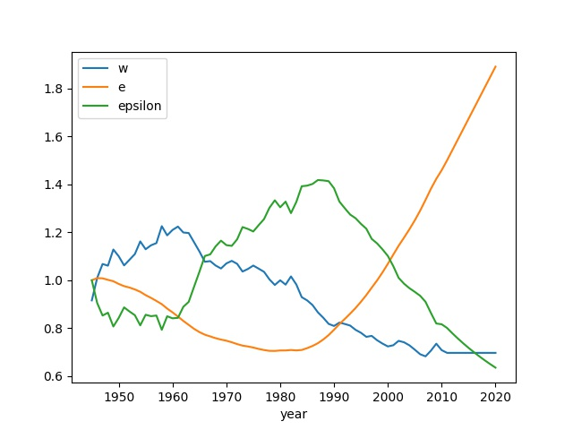
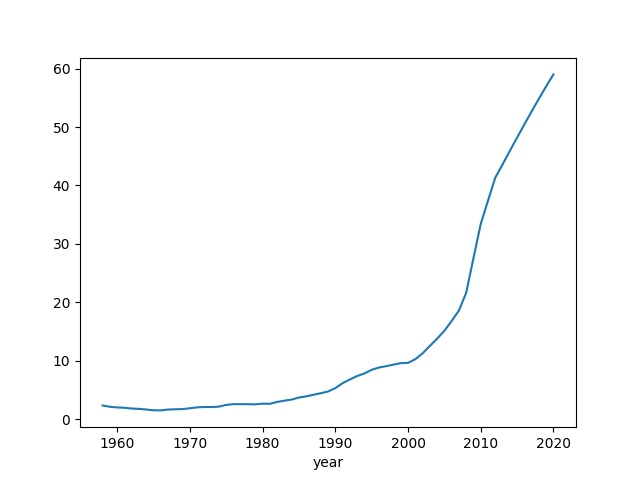

# Age of Discord Math

### Elites

According to [1] elite numbers, $E$ can change according to

$$
\dot{E} = rE + \mu N \qquad \qquad (1)
$$

where $N$ is the general population, $r$ is rate of population growth,
and $\mu$ is the balance of upward and downward social mobility. We
can simplify by focusing on relative elite numbers $e = E/N$, we can
subtitute $E = e N$, before that that derivative

$$
\dot{E} = \dot{e} N + e \dot{N}
$$

Plug into (1) and since population growth is also $r$, meaning
$\dot{N} = r N$

$$
\dot{e} N + e \dot{N} = r e N + \mu N 
$$

$$
\dot{e} N = r e N + \mu N -  e r N
$$

$$
\dot{e} = \mu  \qquad \qquad (2)
$$

The parts above are the logical result of natural growth of population
and elites being the same rate $r$.

Looking at $\mu$, Turchin assumes the upward and downward social
mobility, $\mu$ inversely related to relative wage. Regular people
earning less means elites earning more.

$$
\mu = \mu_0 \left( \frac{w_0}{w} - 1 \right)
$$

where $μ_0$ and $w_0$ are scaling parameters. Therefore (2) becomes

$$
\dot{e} = \mu_0 \frac{w_0 - w}{w}
$$

Computing $w,e,\epsilon$ for US based on 1930-2010 data (below reproduces
the graph 13.1 from AOD),

```python
import pandas as pd

data = pd.read_csv('aod_psi.csv',index_col=0)

w_0 = 1
mu_0 = 0.1
lam = 0.5 

relWage1 = data['ProdWage'] / data['GDPpc']
relWage1 = relWage1/relWage1.loc[1980]
relWage2 = data['UnskillWage'] / data['GDPpc']
relWage2 = relWage2/relWage2.loc[1980]
data['RelWage'] = (relWage1 + relWage2) / 2
cols = ['RelWage','RelDebt','Distrust']
data[cols] = data[cols].interpolate()

data = data[data.index > 1944]

data.loc[1945]['elite'] = 1

for t in range(1946,2021):
    data.loc[t]['elite'] = data.loc[t-1]['elite'] + mu_0*( w_0 - data.loc[t-1]['RelWage'] ) / \
                           data.loc[t-1]['RelWage']

data['epsilon'] = (1 - lam*data['RelWage'])/data['elite']
data['epsilon'] = data['epsilon']/data.iloc[0]['epsilon']    
data['Urbanization'] = data['Urbanization']/100.
data['Age20_29'] = data['Age20_29']/60.
data['RelDebt'] = data['RelDebt']/100.
data['Distrust'] = data['Distrust']/100.
res = data[['RelWage','elite','epsilon']]
res.columns = ['w','e','epsilon']

res.plot()
plt.savefig('psi1.jpg')
```



### Political Stress Indicator

PSI, or $\Psi$, is shown as [1, pg. 237]

$$
\Psi = w^{-1} \frac{N_{urb}}{N} A_{20-29} \frac{\epsilon^{-1}e}{s} \frac{Y}{N} (1-T)
$$

$N_{urb}/N$ is the urbanization rate, $A_{20-29}$ is the youth bulge
index, $\epsilon$ is relative elite income computed previously. $Y/N$
is national debt scaled by GDP. Proportionality constant $s$ is the
number of government employees per total population. Trust in
government institutions is $T$, distrust is computed via $1-T$.

Again using US data,

```python
data['PSI'] = 100*(1/data['RelWage'])*data['Urbanization']*data['Age20_29']*(data['elite']/data['epsilon'])*data['RelDebt']*data['Distrust']
data['PSI'].plot()
plt.savefig('psi2.jpg')
```



Turbulent times are ahead.

*You can follow microblog postings on this and similar subjects on the
[main page](../../index.html) of this site*.

References

[1] Turchin, *Age of Discord*

