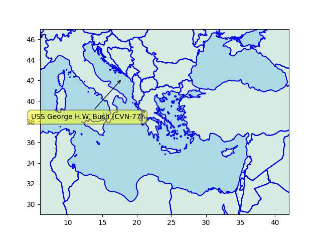

Arab News: "NATO chief sees ‘some signs’ China could back Russia’s war"

---

TechCrunch: "India and Singapore have linked their digital payments systems, UPI
and PayNow, to enable instant and low-cost fund transfers in a major
push to disrupt the cross-border flow of money between the two nations
that amounts to over $1 billion each year"

---

H2 View: "Spanish oil company Cepsa has signed an agreement with
Dutch-based ACE Terminal to create a green hydrogen supply chain
between Spain and the Netherlands"

---

H2 View: "GeoPura receives £36m backing from industrial and financial
majors..UK green hydrogen company GeoPura has today (February 23)
announced it has received £36m ($43m) from an investment round co-led
by the investment arm of General Motors (GM Ventures) and Barclays
Sustainable Impact Capital"

---

F24: "France goes 31 days without rainfall, unprecedented in winter"

---

First Post: "Light of Day: Cambridge study finds four-day week makes
companies more profitable, keeps employees happy"

---

Russia-friendly Burkina Faso gov just recently ended the deployment of
French soldiers on its soil. They resurrected the symbolism, imae of
Thomas Sankara, a Marxist, and former President of BF 1983-87. Sankara
back then was toppled (and killed) by most likely a "outside assisted"
coup involving France and its ally Ivory Coast.

---

Ok.. ok.. you get a little green patch on your side. Updated
[da map](../../2022/12/ru-africa.html).

African News: "[9/2022] Polish president visited Ivory Coast to
discuss impact of war in Ukraine.. During the visit, Ivorian president
Alassane Ouattara reiterated his support for the restoration of
borders in Ukraine"

---

TASS: "Gas supply by Gazprom for Europe through Ukraine up to highest
level since early January"

---

The carrier moved toward the Adriatic.. Conspiracy theorists to the East of
the Aegean can breathe a sigh of relief.

```python
u.sm_plot_list1(38, 24, 2.0, np.array(u.usnavy()[['name','lat','lon']]))
```

 

---

Decentralized social media tech also points the way for proper
anti-trust and breaking up companies; it is possible, it *was*
possible to simply split a social network into two, have half of their
users in one business, the other in the business, communicating
through a common protocol.

---

"@dangillmor@mastodon.social

Social media giants have a new pitch:

'Nice identity you got there -- be a shame if something happened to it.'"

---

Wah wah wah waaaaahh

[[-]](mbl/2023/market1.jpg)

---

Arab News: "Malcolm X’s daughter to sue CIA and FBI for wrongful death"

---

## Reference

[Nations and Nationalism, Culture, Narratives](0119/2013/02/nations-and-nationalism.html)

[The Fundamentals of Industrial Ideologies](0119/2011/04/fundamentals-of-industrial-ideologies.html)

[Education, Workplace](0119/2017/09/education-workplace.html)

[Science and Technology](0119/2018/09/science-technology.html)

[Democracy, Parties](0119/2016/11/democracy.html)

[Economy](2021/01/economy.html)

[Globalization](0119/2018/09/globalization.html)

[Rome, The First Wave, Religion](0119/2017/12/rome.html)

[Human Nature & Health](2020/07/human-nature.html)

[Climate Change](2022/01/climate.html)

[Reports](2021/01/reports.html)

[The Middle East](0119/2019/07/middleeast.html)

[TR](../tr)

## Browse

[Members](2022/08/members.html)

[By Year](years.html)

[Search](search.html)

[Microblog Archive](mbl/index.html)

[PDF](https://drive.google.com/uc?export=view&id=1FSi-1MnqXVq_PVTEXzzflwN8-7h92N_R)
