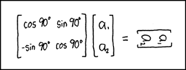

---

<blockquote class="twitter-tweet">
Paving the way for a seamless and carbon-free experience of mobility. NAMX and <a href="https://twitter.com/hashtag/PININFARINA?src=hash&amp;ref_src=twsrc%5Etfw">#PININFARINA</a> unveil the HUV, a hydrogen-powered SUV partially fueled by removable capsules. Know more: <a href="https://t.co/n0LlbwVVzP">https://t.co/n0LlbwVVzP</a> <a href="https://t.co/VPEe3KdNv2">pic.twitter.com/VPEe3KdNv2</a>
&mdash; Pininfarina (@PininfarinaSpA) <a href="https://twitter.com/PininfarinaSpA/status/1524440172095578113?ref_src=twsrc%5Etfw">May 11, 2022</a></blockquote> 

---

The study confirms the optimal transport capability of H2; we can
project that scenario to onshore-onshore as well.. Producing green
fuel in North Africa pipelining it into Europe, or within the states
of US. See [Wires vs Pipes](2019/03/wirespipes.html).

Aquaventus: "In all three dimensions examined, offshore electrolysis
with pipeline connection emerges as the best approach: According to
the study, a pipeline for hydrogen generated offshore can be realized
up to five and a half years faster than submarine cable connections
for offshore electricity.. In addition, the investment would require
up to 6 billion euros less, reducing the production costs for green
hydrogen. From a permitting perspective and with a focus on
environmental protection, 610 kilometres of pipeline versus 3720
kilometres of high-voltage lines as well as the location of
electrolysis on the high seas also mean significant advantages in
terms of environmental impact"

[[-]](https://aquaventus.org/en/press-releases/study-illustrates-clear-advantages-of-hydrogen-production-at-sea/)

---

H2 Fuel News: "Siemens Mobility and Deutsche Bahn (DB) have unveiled
their latest hydrogen train, called the Mireo Plus H... This Siemens
news also included the unveiling of a new H2 storage tank trailer by
DB to accommodate mobile refueling. The components the companies have
unveiled are designed for the H2goesRail hydrogen train project"

---

H2 View: "Fortescue Future Industries (FFI) announced that it will
evaluate the feasibility of converting a former coal mine into a green
hydrogen production facility in Lewis County, Washington, US."

---

H2 View: "NEOM Green Hydrogen Company’s (NGHC) board announced the
appointment of David Edmondson as Chief Executive Officer of the
company... Nadhmi Al-Nasr, CEO at NEOM and Chairman of NEOM Green
Hydrogen Company, said, 'The appointment of David Edmondson as NGHC’s
CEO is a natural follow-up to our recent agreement to build the
world’s largest green hydrogen plant, which will produce 1.2 million
tonnes of hydrogen per year'"

---

The Economic Times: "[PIL] Ltd has signed a pact with state-owned GAIL
for jointly developing a hydrogen-based ecosystem in India... GAIL is
India's largest gas transporting and marketing company. It owns about
two-thirds of truck pipelines... PIL owns and operates a 48-inch
diameter, 1,480 km long Kakinada to Bharuch gas pipeline that connects
major domestic supply hubs on the east to key demand centers in the
west. It is a vital link in India's national gas grid"

---

H2 View: "GAIL (India) Limited has awarded a contract to set up one of
the largest Proton Exchange Membrane electrolyser in India, in line
with the country’s National Hydrogen Mission."

---

Recharge: "'Green hydrogen imports will be cheaper than locally
produced H2 in Europe from 2024': [non-profit RMI] study"

---

"@MoroccoWNews

CEO of Spanish energy company Cepsa Maarten Wetselaar has announced
plans to build a pipeline to export hydrogen to Morocco"

---

That's the H2 molecule with two atoms and the bond.. Nice

<blockquote class="twitter-tweet">
The <a href="https://twitter.com/hashtag/port?src=hash&amp;ref_src=twsrc%5Etfw">#port</a> of <a href="https://twitter.com/hashtag/Rotterdam?src=hash&amp;ref_src=twsrc%5Etfw">#Rotterdam</a> and the cluster of companies operating here can supply north western Europe with 4.6 million tonnes of <a href="https://twitter.com/hashtag/hydrogen?src=hash&amp;ref_src=twsrc%5Etfw">#hydrogen</a> annually by 2030, it has been revealed. <a href="https://twitter.com/hashtag/fluidhandling?src=hash&amp;ref_src=twsrc%5Etfw">#fluidhandling</a> <a href="https://twitter.com/hashtag/pipelines?src=hash&amp;ref_src=twsrc%5Etfw">#pipelines</a> <a href="https://twitter.com/hashtag/pumps?src=hash&amp;ref_src=twsrc%5Etfw">#pumps</a> <a href="https://twitter.com/hashtag/Europe?src=hash&amp;ref_src=twsrc%5Etfw">#Europe</a> <a href="https://twitter.com/hashtag/green?src=hash&amp;ref_src=twsrc%5Etfw">#green</a> <a href="https://twitter.com/hashtag/blue?src=hash&amp;ref_src=twsrc%5Etfw">#blue</a><a href="https://t.co/wN4HBQkZEu">https://t.co/wN4HBQkZEu</a> <a href="https://t.co/V5Vf9N4Coz">pic.twitter.com/V5Vf9N4Coz</a>
&mdash; Fluid Handling International (@FluidHandIntl) <a href="https://twitter.com/FluidHandIntl/status/1525034782010253313?ref_src=twsrc%5Etfw">May 13, 2022</a></blockquote> 

---

You're luggage

---

Nothing can compare to the Ahnuld version

---

Let's see if this *Eraser: Reborn* is any good.. 

---

Google: "[Our company will license] content from news publishers under
the EU Copyright Directive.. [W]e have been negotiating with news
publishers to license content under the European Copyright Directive,
which EU countries are in the process of implementing into national
law... The Directive allows search engines like Google to freely link
to, and use 'very short extracts' of press publishers' content. The
law also creates new rights for publishers when longer previews of
their content are used online"

---

Ineqality measure Gini fall continued for 2021 Q4; could also be due
to ultra-rich becoming less ultra-rich, and that's a good thing too..

[[-]](2019/05/stats.html#gini)

---

Reshare

---

WION: "1995 UFO sighting in US was actually of celestial bodies, claim
astronomers"

---

People use crypto in retirement plans? 

"@Zachary

AARP says it is a 'horrible mistake' to use crypto in retirement
plans. 'The last week to 10 days or so proved that point for us.'"

---

\#crypto \#mcdonalds

[[-]](https://pbs.twimg.com/media/FSoZFGTWAAMjXF_?format=jpg&name=small)

---

Bloomberg: "Novogratz, who has championed TerraUSD, saw his fortune
nosedive to $2.5 billion, from 8.5 billion in early November."

---

"@iamtrask

It just occurred to me - if you zoom out enough - working from home is
the norm - not the exception.

For a bajillion years people worked in the local vicinity of where
they lived. Farming, hunting, and caring for their house and home.

Going to an office to work is weird"

---

"1/3 or 1/4 of workers are now permamently remote working. That
changes consumption patterns. People consume more stuff. Work pattern
change is underestimated". \#JimBianco

[[-]](https://www.pewresearch.org/social-trends/2022/02/16/covid-19-pandemic-continues-to-reshape-work-in-america/)

---

"40% of the American public has less than a thousand dollars of savings
and they rent. Those people are seeing a huge reverse wealth effect
because.. they don't own a home they don't have a stock
portfolio. Because of the inflationary spurt through 2021 their
paycheck bought less and less they had a huge reverse wealth effect. I
think now FED policy is now oriented towards those 40 percent they
need to get inflation down.. Now we've got the politicians demanding
that they raise rates and raise rates aggressively to deal with
inflation because that 40 percent is behind" \#JimBianco

---

"'Tightening financial conditions' is euphemism for lower stock
prices. FED thinks rate hikes will not cause unemployment but rain in
prices" \#JimBianco

---

Huge number. To decrease that, decrease house prices, for that, rates
need to rise - which they are now. By 2024 changes will take effect.

"Tenant and owners' equivalent rent comprise 40% of core CPI"

---

Noble says to look at historical chart of profit margins (income
divided by revenue). Checked, yes there was an uptrend, especially
after 2000.

[[-]](2019/05/stats.html#pm)

---

Investor George Noble (Peter Lynch protege):

"There are stocks that are 20/30 times their revenues..  What happens
when you buy stock 10 times its revenue? Data shows that stock has 55%
of prob of being **delisted**"

"This is the biggest everything bubble I've seen in my career"

"The only way to kill inflation is to have a recession.. [T]his idea
that somehow we're going to have a soft landing.. like a nice airplane
coming in.. Not going to happen. Look throughout history it never
works that way. We file that one away under the heading of
'stockbroker economics'"

"Cathie Wood blew billions of people's money. We've seen this movie
before. There is nothing new under the Sun. 1999-2000 their names were
Wagoner, Kevin Landis, Ryan Jacob, .. same old same old"

"David Portnoy was schooling Warren Buffett [when everything was going
up]. Remember [what] he would do, he had a bunch of dice or whatever
in one of his cups and he shook it up and depending on the letters
that came out that would be the stock that he was buying, and it was
going up. I mean, I wanted to shoot myself... Did DP discover the
secret of investing? No"

---

"@TheRealHoarse

Infant formula is a near monopoly. It is an oligopoly. Two main
producers. They serve a captive market without real alternatives...

People have no idea how many industries have consolidated down to only
a few very large players. The results are anti-competitive. The infant
formula shortage isn’t the crisis. The crisis is the country’s willful
failure to regulate capitalism. A formula shortage because of one
hiccup at one producer is just a symptom.

---

Voltaire Net: "The appointment of Michael Ratney as new US ambassador
to Saudi Arabia has been read by Riyadh as proof of Washington's
disinterest in the Saudi monarchy"

---

Arab News: "India has banned wheat exports that the world was counting
on to alleviate supply disruptions sparked by the war in Ukraine,
saying that its own food security is threatened by a sudden spike in
global prices of the grain"

---

Davis: "In the modern era of warfare, there are a few key factors that
almost always result in victory for the side that best employs
them. In this war, Russia has advantages over the Ukraine armed in
important categories that will be hard for the UAF to overcome. First
is a clear Russian command of the skies. Yes, as many have pointed
out, Russia was unable to completely knock out the Ukrainian air
defenses, but they have badly degraded them such that Russia is
routinely able to fly between 200 to 300 sorties per day.

About a month ago, there was much notoriety that Ukraine had gained
the use of 20 fighter jets owing to supply parts provided by the
West. Yet there has been no apparent increase in the number of
Ukrainian jets attacking Russian positions beyond the five to 10 per
day reported earlier in the war. The reason is clear: Russian air
defense capabilities remain fully in tact and employ modern S-400
systems that makes any attempt to fly by Ukrainian pilots a likely
death sentence. Ukrainian air defenses still exist, but were badly
degraded at the start of the war, and continue to be knocked out by
Russian attacks. These realities underscore how hard it would be for
Ukraine to reverse the momentum in the Donbas"

[[-]](https://www.19fortyfive.com/2022/05/war-in-ukraine-reality-check-combat-fundamentals-still-favor-russia-in-donbas/)

---

Half-admitting I guess border redrawing will happen

Politico: "G7 ‘will never recognize’ redrawn borders in Ukraine"

---

Wiki: "European Russia is the western and most populated part of
Russia, which is geographically situated in Europe. European Russia
accounts for about 75% of Russia's total population"

[[-]](https://pbs.twimg.com/media/FSx4MANXEAEB3LK?format=jpg&name=small)

---

## For Members

[Link](https://thirdwave-members.herokuapp.com)

## Reference

[Nations and Nationalism, Culture, Narratives](/2013/02/nations-and-nationalism.md)

[The Fundamentals of Industrial Ideologies](/2011/04/fundamentals-of-industrial-ideologies.md)

[Education, Workplace](2017/09/education-workplace.md)

[Patents](/2018/09/patents.md)

[Democracy, Parties](/2016/11/democracy.md)

[Economy](/2018/05/economy.md)

[Globalization](/2018/09/globalization.md)

[Rome, The First Wave, Religion](/2017/12/rome.md)

[Human Nature & Health](/2020/07/human-nature.md)

[Climate Change](/2018/12/climate.md)

[Reports](/2019/05/reports.md)

[The Middle East](/2019/07/middleeast.md)

[TR](../tr)

## Browse

[By Year](years.md)

[Search](search.html)

[Tweet Archive](/tweets/README.md)

