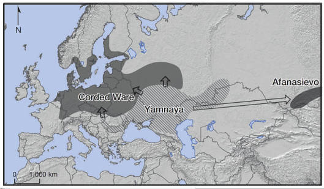

---

INN: "Copper Prices Could See "Astronomical Rise" as Supply Concerns
Increase"

---

The Telegraph: "Antony Blinken 'warns Ukraine' against retaking Crimea"

---

"Matt Gaetz Leads 11 Lawmakers in Introduction of 'Ukraine Fatigue'
Resolution to Halt U.S. Aid to Ukraine.. 'Biden must have forgotten
his prediction from March 2022, suggesting that arming Ukraine with
military equipment will escalate the conflict to ‘World War III.’
America is in a state of managed decline, and it will exacerbate if we
continue to hemorrhage taxpayer dollars toward a foreign war. We must
suspend all foreign aid for the War in Ukraine and demand that all
combatants in this conflict reach a peace agreement immediately,'
Congressman Gaetz said"

---

Info on AFCs

[[-]](2022/02/ammonia.html#afc)

---

If I had to pick one clean tech product to focus on personally, it
would be an ammonia fuel-cell for home/personal use (low temperature
version). Purchase fuel from existing ammonia infrastructure, then use
it to power home and other applications. Once NH3 itself is clean,
"well-to-wheel" becomes clean. 

---

I bet these guys later went to Anatolia as well; they must have
brought yoghurt (a milk product) with them. No wonder Herodotus knew
about it in 800 BC.

---

IMO pastoralists represent a third kind of human organization - other
two are forager, farmer, this is the third way, they did domesticate
animals but do not stay in one place as the static farmer giving them
an advantage. Their main archetype would be the shephard. I see them
closer to foragers than farmers.

---

Steppe Migration Map - pastoralists came from Yamnaya

 

---

Farmers from A. Minor migrated to Europe, later 4800 BC pastoralist
steppe people migrated there. Farmers got wiped out by plague, they
were kinda unhealthy too much grain (lactose intol too, could not
handle milk, cheese). Their death eased steppe migration, pastoralists
attacked them too. In some ways Europeans (esp males) are Russians.

Steppers were pastoralists, had 'free-range' cattle moved a lot, lived
on milk and meat, not grain. Healthier, were physically more fit,
taller on average.

---

Fantastic lecture (1 hour) by Kristian Kristiansen. Summary above.

"Towards a New European prehistory: genes, archaeology and language"

[[-]](https://youtu.be/bxTVSwt-jsU?t=799)

---

Mark Pritchard - The Essence \#music

[[-]](https://youtu.be/h80JaYQvByA)

---

H2 View: "JCB installs hydrogen ICE into 7.5 tonne Mercedes
truck.. British construction and agricultural equipment manufacturer
JCB has installed its hydrogen combustion engine into a 7.5 tonne
Mercedes truck"

---

A season free of Jar Jar Ibrahim and his acolytes.. That would fix
most of the problems.

---

That new Picard episode wasn't half-bad.. Is Trek fixing itself?

---

"@CriticalCupcake@mastodon.lol

Lightning struck Christ the Redeemer in Rio de Janeiro on February 10,
2023"

[[-]](https://media.mastodon.lol/media_attachments/files/109/851/961/551/641/096/original/5063508bff37c9f8.png)

---

WION: "Estimates show between 1mn & 1.5mn died in China since it
rescinded its ‘zero Covid’ policy"

---

Al Jazeera: "Russia surrounds Bakhmut as Ukraine sends in troops"

---

## Reference

[Nations and Nationalism, Culture, Narratives](0119/2013/02/nations-and-nationalism.html)

[The Fundamentals of Industrial Ideologies](0119/2011/04/fundamentals-of-industrial-ideologies.html)

[Education, Workplace](0119/2017/09/education-workplace.html)

[Science and Technology](0119/2018/09/science-technology.html)

[Democracy, Parties](0119/2016/11/democracy.html)

[Economy](0119/2018/05/economy.html)

[Globalization](0119/2018/09/globalization.html)

[Rome, The First Wave, Religion](0119/2017/12/rome.html)

[Human Nature & Health](2020/07/human-nature.html)

[Climate Change](2022/01/climate.html)

[Reports](2021/01/reports.html)

[The Middle East](0119/2019/07/middleeast.html)

[TR](../tr)

## Browse

[Members](2022/08/members.html)

[By Year](years.html)

[Search](search.html)

[Microblog Archive](mbl/index.html)

[PDF](https://drive.google.com/uc?export=view&id=1FSi-1MnqXVq_PVTEXzzflwN8-7h92N_R)
