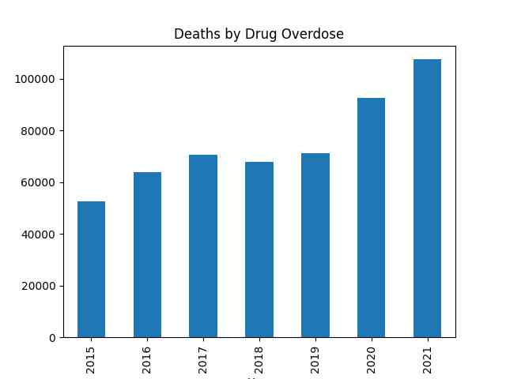

"@TheEuropeanNetwork@mstdn.social

The EU and Japan have registered the largest amounts of
hydrogen-related patents in the past decade, although the US is not
far behind, analysis by the European patent office shows"

---

Bloomberg: "China Has Set It Sights on Cornering Another Green Energy
Market: Hydrogen"

---

December inflation down,

```
2022-11-01  7.110323
2022-12-01  6.454401
```

---

```python
u.drug_overdose_deaths()
```



Data from [CDC](https://www.cdc.gov/nchs/nvss/vsrr/drug-overdose-data.htm)

---

A key founder of a TR nationalist party was of Jewish ancestry, born
in Greece, converted to Islam and considered Turk. This is the "Young
Turks" the Western media publicized back then. And we all now what YT,
later CUP did later. Allegedly.

[[-]](2021/06/eternal-dawn-kemal.html#cavid)

---

Religion-Nationality is hiding deep categorization errors. Past
milenia saw many peoples around Asia Minor converting to Islam
including original Turks.. But 1920s TR nation recategorized all
Muslims as Turks. But then.. not everyone is a real Turk is it, as in
from Central Asia riding a donkey arriving to Anatolia "bringing
civilization" there (basically Greek music, Greek food, Mediterrenian
customs). 10% of Asiatic genes says it all - the *latest* official
identity of Asia Minor is a lie. There is no such thing as a Turk.

---

Notice how religion was used as national identity. Not many realize
but the 20s Turkification also took religion as the basis (but then
deemphasized the religion itself, later reemphasized after 80s
-confused yet?-).

"[T]he 1923 Treaty of Lausanne was drawn up in the peace
settlement.. both Greece and Turkey agreed to a mutual exchange of
populations, irrespective of those populations' wishes.  Greece
expelled approximately 600,000... while [TR..]  expelled about 750,000
Anatolian Greeks... (some were allowed to stay in Istanbul).  These
figures differ, depending on the source. In deciding ethnicity, the
criterion used was religion. A Turkish-speaking Orthodox Christian in
Turkey was thus considered Greek, and expelled to Greece, while a
Greek-speaking Muslim who knew no Turkish was considered Turkish and
expelled to Turkey"

[[-]](2021/07/lycian-history.html)

---

If minority culture does not even last [one generation](2014/06/the-culture-code.html#heritage),
how could it last for millenia, across continents, varied host cultures?
That is the claim of the so-called Turks.

---

FCEVs need less metals, minerals especially rare ones. BEV tech is
suboptimal, unfit for wide adoption.

"@Hypx@mastodon.social

'Looming copper shortage shifts attention to alternative supply
solutions'. BEVs will exacerbate the copper problem"

---

Atlantic Council: "The exact volumes of gas currently lying deep
underneath the Black Sea are not yet known. Rough estimates predict
that the Ukrainian shelf may contain more than two trillion cubic
meters of gas"

---

CEO: "Medium embraces Mastodon.. The fediverse is a breath of fresh
air for writers and social media. Today, Medium is launching a
Mastodon instance at `me.dm` to help our authors, publications and
readers find a home in the fediverse. Mastodon is an emerging force
for good in social media and we are excited to join this community"

---

They are using [compressed](2022/02/h2-compressed.html) H2 cylinders for
storage. Lavo uses [metal hydrides](2022/02/h2-metal-hydrides.html).
There are many options in the H2 world.

PV Europe: "[2018] This March, Home Power Solutions (HPS) from Berlin
is rolling out its new fuel cells for home energy supply.. Picea can
generate both electricity and air heating.. [Their] PEM fuel cell
system runs on hydrogen. The gas is produced in the summer by
electrolysis when excess solar power is available. A certified
hydrogen tank stores the gas for the months when there is only little
sunshine"

---

Home Power Solutions: "Your solar electricity can be used as green
hydrogen all year round.. The energy centre is located in the basement
or utility room. Everything you need to provide a year-round solar
power supply fits into 1.5 m² of space"

---

[Link](https://drive.google.com/uc?export=view&id=1otuHBcDGHQmSAm0DUzDX71v0eNQN85vY)

---

How do I sum up this blog's stance in a single word? Bollocks

---

"@TheBapa@mstdn.social

A story not mine:- 'Last weekend my kids asked me what it was like
growing up in the '80s.  So, I took their phones and tablets off them,
locked them outside and told them not to come back till the street
lamps came on 😂'"

---

## Reference

[Nations and Nationalism, Culture, Narratives](2013/02/nations-and-nationalism.html)

[The Fundamentals of Industrial Ideologies](2011/04/fundamentals-of-industrial-ideologies.html)

[Education, Workplace](2017/09/education-workplace.html)

[Science and Technology](2018/09/science-technology.html)

[Democracy, Parties](2016/11/democracy.html)

[Economy](2018/05/economy.html)

[Globalization](2018/09/globalization.html)

[Rome, The First Wave, Religion](2017/12/rome.html)

[Human Nature & Health](2020/07/human-nature.html)

[Climate Change](2018/12/climate.html)

[Reports](2019/05/reports.html)

[The Middle East](2019/07/middleeast.html)

[TR](../tr)

## Browse

[Members](2022/08/members.html)

[By Year](years.html)

[Search](search.html)

[Microblog Archive](mbl/index.html)

[PDF](https://drive.google.com/uc?export=view&id=1FSi-1MnqXVq_PVTEXzzflwN8-7h92N_R)


