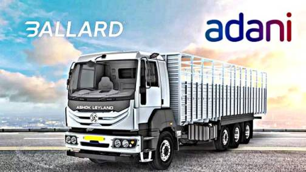

---

The Times of India: "Adani Enterprise Limited led by Gautam Adani [of
India] has signed an agreement with commercial vehicle manufacturer
Ashok Leyland and Canada's Ballard Power to co-develop trucks powered
by hydrogen fuel-cells"

---

Construct the math, formulate concepts and code instead of shoving
data into a black box. This is the way.

TU Munchen: "Researchers.. have developed a model that enables a robot
to serve tea and coffee faster and more safely than humans – with no
sloshing... They based their mathematics on a Moroccan tea tray that
applies the principle of a spherical pendulum.. embed[ding] the
dynamics of a spherical pendulum into the robot’s control
software. That also means that the robot’s movements are limited by
the basic principles of geometry. With his team, he also integrates
the correct angles, speeds and accelerations into the model"

---

"@missy_lynn@mastodon.world

told my daughter to watch her attitude. she said for complaints about
her attitude, contact the manufacturer"

---

"@repepo@mathstodon.xyz

'Nature, to be commanded, must be obeyed.' - Francis Bacon"

---

TASS: "US takes agricultural commodities out of sanctions against
Russia — Treasury"

---

David Gold championed this idea and he was proven right BTW. Another
thing he was against - the Big Bang theory.

---

Calcium carbonate is sedimentary rock, iron oxide is a component of
igneous rock, and water. Water can certainly seep down from ocean
floor, and combine with the rest. 

---

This means there is no need for 'fossils' for the production of
hydrocarbons, simple compounds present in the mantle at high pressure
/ temparature will do.

"[2004] We present in situ observations of hydrocarbon formation via
carbonate reduction at upper mantle pressures and
temperatures. Methane was formed from FeO, CaCO3-calcite, and water at
pressures between 5 and 11 GPa and temperatures ranging from 500°C to
1,500°C... The study demonstrates the existence of abiogenic pathways
for the formation of hydrocarbons in the Earth's interior and suggests
that the hydrocarbon budget of the bulk Earth may be larger than
conventionally assumed"

[[-]](https://www.pnas.org/doi/10.1073/pnas.0405930101)

---

Yonderboi - Mintamokus (Feat. Jazz+Azz) \#music

[[-]](https://youtu.be/JZ9KgJkH0vQ)

---

TASS: "Ukraine redeploying troops from Zaporozhye region to Donbass"

---

"@ShekinahCanCook@universeodon.com

If you live in Kentucky, please send the state legislature a message
of support for House Bill 21, which makes it easier for homeless
people to get state IDs so they can register for the help they qualify
to receive but aren't due to republican hate policies which
purposefully burden the poor and homeless"

---

MLK: "We have fought hard and long for integration.. and I know we
will win, but I have come to believe that we are integrating into a
burning house... I’m afraid that even as we integrate, we are walking
into a place that does not understand that this nation needs to be
deeply concerned with the plight of the poor and disenfranchised"

---

"@TheRaDR@mstdn.social

[MLK] "When machines and computers, profit motives and property rights
are considered more important than people, the giant triplets of
racism, extreme materialism and militarism are incapable of being
conquered'"

---

"@BrentToderian@mastodon.online

'Someone with a 1-hr car commute needs to earn 40% more to be as happy
as someone with a short walk to work'" via Fast Company

---

H2 Central: "The Albanese Government is turbocharging Australia’s
green hydrogen industry, with a $70 million investment to support the
development of a hydrogen"

---

## Reference

[Nations and Nationalism, Culture, Narratives](2013/02/nations-and-nationalism.html)

[The Fundamentals of Industrial Ideologies](2011/04/fundamentals-of-industrial-ideologies.html)

[Education, Workplace](2017/09/education-workplace.html)

[Science and Technology](2018/09/science-technology.html)

[Democracy, Parties](2016/11/democracy.html)

[Economy](2018/05/economy.html)

[Globalization](2018/09/globalization.html)

[Rome, The First Wave, Religion](2017/12/rome.html)

[Human Nature & Health](2020/07/human-nature.html)

[Climate Change](2018/12/climate.html)

[Reports](2019/05/reports.html)

[The Middle East](2019/07/middleeast.html)

[TR](../tr)

## Browse

[Members](2022/08/members.html)

[By Year](years.html)

[Search](search.html)

[Microblog Archive](mbl/index.html)

[PDF](https://drive.google.com/uc?export=view&id=1FSi-1MnqXVq_PVTEXzzflwN8-7h92N_R)
