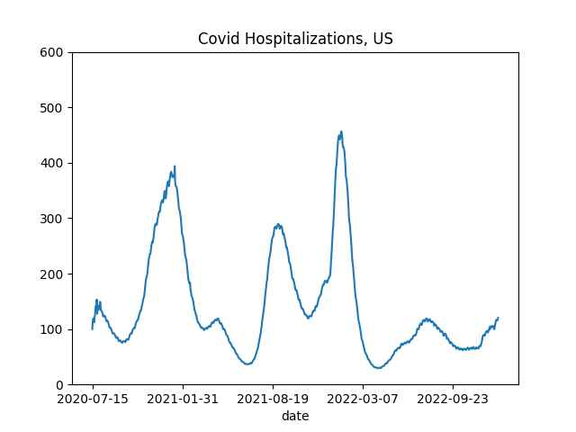
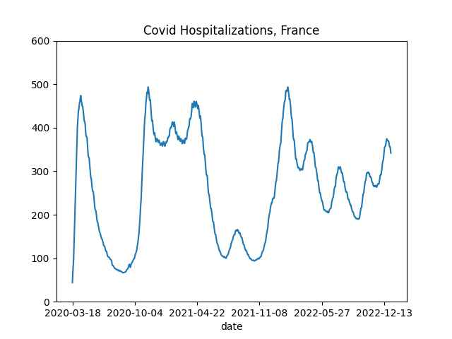

The clapping for Karzai photo shared previously was not a dig in admin
for quitting on an ally. It was about US invading and staying giving
ppl false hope against entrenched forces, and not helping a country
properly when they could.

---

*War Machine* paints the screw up that was the US involvement in AFG
well. The McMahon-Karzai scene; the general is just another US
official meddling.. US did not help the country, institutionally was
not capable. Another scene, general asks someone about growing an
alternate crop to poppy seed, the response was cotton is suitable, but
Congress will not let USAID help grow a product that will compete with
US farmers.

I searched for that exact quote in *The Operators*, movie's source
material, not there, but there is the story around few brave officials
[in this book](2023/01/little-america-chandrasekaran.html#cotton) who
tried to push cotton to supplant poppy in Afghanistan, and failing
thanks to USAID torpedoing the idea.

---

"@suramya@mastodon.social

India Approves $2.3 Billion Plan To Become Global Hub for Green
Hydrogen by 2030" via [TIME](https://time.com/6244782/india-2-billion-green-hydrogen)

---

"@opensciencedaily@mastodon.online

India approves national green hydrogen mission, adding 125GW of
renewables by 2030"

---

"@Hy_Economy@mastodon.social

Big \#hydrogen + ammonia subsides expected in Japan: 'The plan
proposed that the Japanese government would subsidize the difference
in price between the two substances (hydrogen and ammonia) and
existing fuels (fossil fuels) for 15 years'" via The Diplomat

---

```python
df = u.covid_hospitalization() # per million ppl
```

```python
dfu = df[df.country == 'United States']['Daily hospital occupancy per million']
dfu.plot(title='Covid Hospitalizations, US', ylim=[0,600])
```



```python
dff = df[df.country == 'France']['Daily hospital occupancy per million']
dff.plot(title='Covid Hospitalizations, France', ylim=[0,600])
```



---

Did covid hospitalizations in the rest of the world increase due to CH
opening up? Data,

[[-]](https://github.com/owid/covid-19-data/tree/master/public/data/hospitalizations)

---

A German Pope trying to mend relations with Russians (their church)?
No no no.. That is a no-go my friend... Europe had to be *fighting*
Russians, not mend relations. Then Benedict resigned. 🤨

Newsweek: "At the start of Benedict's tenure in 2007, the
newly-installed pope met with Putin for what was considered at the
time to be the highest-level Kremlin-Vatican talks in more than three
years, with the pair focused on easing tension between Roman Catholics
and Orthodox Christians in the country"

---

Zucman: "As Roosevelt’s message to Congress expresses clearly, the
quasi-confiscatory top marginal income tax rates championed by the
United States were designed to reduce inequality, not to collect
revenue"

[[-]](https://forgeorganizing.org/article/triumph-injustice-boston-richmond)

---

All this stuff needs enforcement

[NYT](https://www.nytimes.com/2021/06/12/business/private-equity-taxes.html):
"Private Inequity: How a Powerful Industry Conquered the Tax
System The I.R.S. almost never audits private equity firms, even as
whistle-blowers have filed claims alleging illegal tax avoidance"

[Market Watch](https://www.marketwatch.com/story/irs-misses-substantial-tax-evasion-by-the-wealthiest-americans-this-study-calculates-just-how-much-11616502277):
"IRS misses ‘substantial’ tax evasion by the wealthiest Americans — far
more than the average worker"

[Bloomberg](https://www.bloomberg.com/news/features/2021-09-15/peter-thiel-gamed-silicon-valley-tech-trump-taxes-and-politics):
"According to IRS rules, if a Roth IRA account holder engages in a
prohibited transaction—like using the money to invest in a company you
legally control—then that person loses the tax break for the entirety
of the portfolio’s value. In Thiel’s case that would mean he could be
on the hook for a tax bill in the billions"

---

Not good... The repeal will serve the ultra-rich

McC: "Our very first bill will repeal Biden's 87,000 new IRS agents"

---

McCarthy SOTH speech: the key is what was left out - not a single
mention of Russia, Ukraine, but early mention of competition with
China.

---

TASS: "Ukraine’s economy and military potential are currently fully
dependent on the Western support while time is not on the side of
Ukraine, ex-US Secretary of State Condoleeza Rice.. and former US
Secretary of Defense Robert Gates.. said in a joint opinion piece
published by the Washington Post on its website on Saturday"

---

## Reference

[Nations and Nationalism, Culture, Narratives](2013/02/nations-and-nationalism.html)

[The Fundamentals of Industrial Ideologies](2011/04/fundamentals-of-industrial-ideologies.html)

[Education, Workplace](2017/09/education-workplace.html)

[Science and Technology](2018/09/science-technology.html)

[Democracy, Parties](2016/11/democracy.html)

[Economy](2018/05/economy.html)

[Globalization](2018/09/globalization.html)

[Rome, The First Wave, Religion](2017/12/rome.html)

[Human Nature & Health](2020/07/human-nature.html)

[Climate Change](2018/12/climate.html)

[Reports](2019/05/reports.html)

[The Middle East](2019/07/middleeast.html)

[TR](../tr)

## Browse

[Members](2022/08/members.html)

[By Year](years.html)

[Search](search.html)

[Microblog Archive](mbl/index.html)

[PDF](https://drive.google.com/uc?export=view&id=1FSi-1MnqXVq_PVTEXzzflwN8-7h92N_R)

