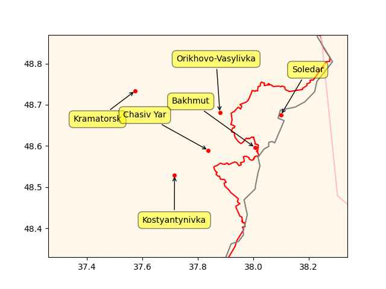

That is right about stews, an efficient way to increase food intake

[[-]](2023/03/the-horse-the-wheel-steppes-anthony.html#stew)

---

@atomicpoet@mastodon.social

Microsoft’s official @dotnet sent its first Mastodon post today.

 

---

\#Covid \#Redfield

[[-]](https://youtu.be/QPEIm4v8QXU?t=4283)

----

Freight Waves: "The first day of the [the annual energy conference]
CERAWeek.. meeting in Houston, which has an attendance of a staggering
7,500 delegates, featured hydrogen talk across numerous
presentations. And the consistent theme throughout the day Monday was
that the Inflation Reduction Act (IRA), signed last August by
President Biden, has placed the hydrogen industry in the U.S. in a
warp speed gear"

---

Lost money bitch - meaning, not so great


```python
u.mov_profit(budget=200, gross=420)
```

```text
Out[1]: -48.0
```
---

```python
u.boxofficemojo("Ant Man 3")
```

```text
Out[1]: 
{'Domestic Opening': '$106,109,650',
 'Domestic': '$187,137,871',
 'International': '$233,123,785',
 'Worldwide Total': '$420,261,656',
 'Release Date': 'February 15, 2023'}
```

---

*Ant Man 3* is great says he

---

Yahoo News: "Zelensky warned in an interview with CNN what could
happen if Bakhmut falls to Russian forces. 'We understand that after
Bakhmut, (Russian forces) could go further' and attack nearby cities
in the Donetsk region. 'They could go to Kramatorsk, they could go to
Sloviansk, it would be an open road for the Russians after Bakhmut to
other towns in Ukraine, in the Donetsk direction,' Zelensky said in an
interview"

---

RU could be aiming for the bigger cauldron, not just the Bakhmut one,
there is movement towards Chasiv Yar, and the claim is
Orikhovo-Vasylivka is also under attack or taken. UA keeps sending
reinforcements to the area so they can end up with a huge number of
people trapped in that larger cauldron.

```
ps = ["Kramatorsk","Bakhmut","Chasiv Yar","Soledar","Kostyantynivka","Orikhovo-Vasylivka"]
u.sm_plot_ukr('ukrdata/fl-0304.csv','ukrdata/fl-221115.csv', ps,clat=48.6,clon=37.8,zoom=0.06)
```

 

---

Al Jazeera: "Russia takes east Bakhmut as Ukraine builds up forces"

---

Yahoo News: "NATO chief warns Bakhmut may fall 'in coming days'"

---

Created a mirror of the blog as a backup. If problems occur here, can
visit there.. Also linked under Browse section below.

[[-]](https://muratk5n.codeberg.page/en/README.html)

---

"Hypx@Hypx@mastodon.social

Hydrogen engines to be mass produced by Hyundai by 2025"

---

17-21GW.. Great news

Hydrogen Insight: "Germany to build 17-21GW of new hydrogen-ready
gas-fired power plants, says Chancellor"

[[-]](https://www.hydrogeninsight.com/power/germany-to-build-17-21gw-of-new-hydrogen-ready-gas-fired-power-plants-says-chancellor/2-1-1415040)

---

Redtenbacher's Funkestra - Busted \#music

[[-]](https://youtu.be/riosln2b-xk)

---

## Reference

[Nations and Nationalism, Culture, Narratives](0119/2013/02/nations-and-nationalism.html)

[The Fundamentals of Industrial Ideologies](0119/2011/04/fundamentals-of-industrial-ideologies.html)

[Education, Workplace](0119/2017/09/education-workplace.html)

[Science and Technology](0119/2018/09/science-technology.html)

[Democracy, Parties](0119/2016/11/democracy.html)

[Economy](2021/01/economy.html)

[Globalization](0119/2018/09/globalization.html)

[Rome, The First Wave, Religion](0119/2017/12/rome.html)

[Human Nature & Health](2020/07/human-nature.html)

[Climate Change](2022/01/climate.html)

[Reports](2021/01/reports.html)

[The Middle East](0119/2019/07/middleeast.html)

[TR](../tr/README.html)

## Browse

[Members, Donations](2022/08/members.html)

[By Year](years.html)

[Search](search.html)

[Microblog Archive](mbl/index.html)

[PDF](https://drive.google.com/uc?export=view&id=1FSi-1MnqXVq_PVTEXzzflwN8-7h92N_R)

Also on 
[Mastodon](https://masto.ai/@muratk3n),
[Codeberg](https://muratk5n.codeberg.page/en/README.html),
[Github Pages](https://muratk5n.github.io/thirdwave/en/)

