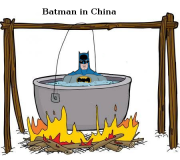

---

H2 Fuel News: "Heliogen to build green hydrogen generation facility in
collaboration with the City of Lancaster"

---

H2 Central: "Hydrogène De France – COP27 – HDF Energy and The European
Investment Bank Partner to Implement Namibia First Green Hydrogen
Power Plant"

---

The name Oz is actually Öz, with two dots on top, meaning "essence" a
name with nationalistic overtones (TR lastnames started in 30s).  Oz
got lucky, in US the dots are dropped so the name sounds like Oz as in
"The Wizard of Oz", plus he looks Vulcan so could rock that image of
wizardy, scifi doctor-bro for many years.. US is a place of
reinvention, right?

---

There .. 

The Independent: "[2018] Japan to bolster military base on island
idyll that could become front line in event of war... [in the]
disputed seas around China.. Japan is building radar, anti-aircraft
guns and missile silos to counter what it sees as Chinese
aggression.. If war is to break out, then Ishigaki would be the front
line. This is the island where Japan feels the most under threat from
China"

---

Maybe CH won't go afyer Taiwan but one of those smaller JP islets in
that chain near TW; Taketomi, Ishigaki... CH needs a deep-sea port for
subs, a smaller islet might do for them.

"Japan is preparing for war with China, say all telltale signs"

---

Tiktok simply suggesting the most popular items besting Facebook's
friends and "AI" recommendations... I worked on recommendation
systems, even the best methods used are not even mildly intelligent
(the "I" of AI) the improvements they offered over simple
recom was very small. Item-item, user-user similarity measures,
dimensionality reduction, later deep nets... all same way.

---

Wales & West Utilities: "[WWU] is announcing plans for a major
hydrogen pipeline in south Wales, to accelerate decarbonisation plans
for industry and gas customers in the region"

---

Alex Cortiz - The Man, The Myth \#music

[[-]](https://youtu.be/0apVn8x3UD8)

---

H2 Fuel News: "[Researchers] created a method of hydrogen fuel
production that derives energy from light while using gold
nanoparticles for the conversion of hydrogen sulfide and sulfur within
a single step"

---

Fake Nobel. Your life was a sham, Edward

"Nobel-Winning Economist Edward C. Prescott Dies at 81"

---

Reshare \#Batman \#2020

Bad covid joke



---

H2 Fuel News: "A research team from King Abdullah University of
Science and Technology (KAUST) has developed a water-splitting clean
hydrogen production method that delivers high-efficiency and stable
hydrogen evolution electrocatalysts to split seawater"

---

H2 View: "Iberdrola has successfully completed the supply of green
hydrogen to CAF in Zaragoza for the on-track dynamic tests of the
hydrogen-powered demonstrator train of the FCH2Rail project"

---

*Quantum Leap* 2022, not bad. 

---

H2 Central: "Newmed Energy and Uniper Sign a Non-Binding MoU to
Explore Collaboration Options for The Delivery of Natural Gas to
Europe and The Development of Blue Hydrogen"

---

WHERE WERE THE RUSSIANS THIS TIME?

"US midterms saw less misinformation, but it was there"

---

They aren't anywhere really.. People vote on their well-being, if that
isn't good, the vote out the incumbent, and can vote in anyone
else... 1933 Germany voted in Nazis.

"Most Americans are in the middle"

---

This is Hydrogenious with its LOHC tech

"@hydrogenLOHC .. [I]n North Rhine-Westphalia at Chempark Dormagen.. a
storage plant with a storage capacity of 1,800 tonnes of #hydrogen
will be built"

---

Waiting for *Orbital* release

---

Its probably had more to do with the pocketbook then culture war. Econ
wasn't doing too bad...

"Abortion rights and Republican tilt to the far right helped Democrats
hold on in key races across the US, analysts say"

---

Inflation down to 7.7%. Rate rises are working.

```
2022-10-01  7.745427
```

---

## Reference

[Nations and Nationalism, Culture, Narratives](2013/02/nations-and-nationalism.html)

[The Fundamentals of Industrial Ideologies](2011/04/fundamentals-of-industrial-ideologies.html)

[Education, Workplace](2017/09/education-workplace.html)

[Science and Technology](2018/09/science-technology.html)

[Democracy, Parties](2016/11/democracy.html)

[Economy](2018/05/economy.html)

[Globalization](2018/09/globalization.html)

[Rome, The First Wave, Religion](2017/12/rome.html)

[Human Nature & Health](2020/07/human-nature.html)

[Climate Change](2018/12/climate.html)

[Reports](2019/05/reports.html)

[The Middle East](2019/07/middleeast.html)

[TR](../tr)

## Browse

[Members](2022/08/members.html)

[By Year](years.html)

[Search](search.html)

[Tweet Archive](tweets/index.html)

[PDF](https://drive.google.com/uc?export=view&id=1FSi-1MnqXVq_PVTEXzzflwN8-7h92N_R)

