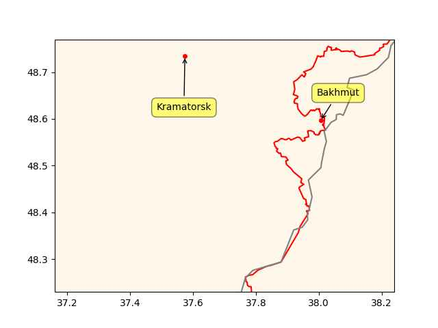

"@VTOLsociety@mastodon.world

Congrats to \#universalhydrogen for flying a 40-passenger regional
airliner on \#hydrogen \#fuelcell propulsion. Hear CEO Paul Eremenko
give a keynote talk at the @VTOLsociety's 2nd Annual #H2aero
Symposium! Check out our amazing program: www.vtol.org/h2symposium"

---

Lou Stein - Running Fire \#music

[[-]](https://youtu.be/vB1ylrtdhhA)

---

Leaving aside the slap stuff imo the crit rating is down bcz CR touched on woke

```python
u.rottentomatoes1("Chris Rock Selective Outrage")
```

```text
Out[1]: {'tomatometer score': 60, 'audience score': 85}
```

---

🔥 🔥 🔥 

"@gaberivera@mastodon.xyz

👍 Some "communities" are rather well-represented here [on
Mastodon]... basically every notable blogger from the year 2005 is
here!.. 😂 Meanwhile, it's kinda funny how crypto people are entirely
absent in the Fediverse, given their professed love of
decentralization. (Perhaps they were not not so much into
decentralization but rather recentralization of wealth around
themselves!)"


Renew Economy: "NSW [AU] funds two new electrolysers as part of $1.5bn
plan to slash cost of green hydrogen"

---

H2 Central: "JET H2 Energy Plans to Build Ten Hydrogen Filling
Stations in Germany and Denmark"

---

What is it with French politicians and German cleaning product names?
Sarkozy used to say he would clean out immigrant neighborhoods "a la
Kärcher". And this op was named Persil.

---

African country Guinea wanted to leave it in 50s and was *destroyed*
as a result, through overt and covert means. See [Opération Persil](https://en.wikipedia.org/wiki/Op%C3%A9ration_Persil)

---

French-African money CFA.. looks like a big deal. Still used in many
FR former colonies?

---

Macron Africa speech from 2017 references Thomas Sankara. 

---

Bakhmut is in trouble, gray line is old frontline, red line is new

```python
ps = [("Kramatorsk",48.733821, 37.57405056),
      ("Bakhmut",48.596402, 38.0060731)]
u.sm_plot_ukr('ukrdata/fl-0304.csv','ukrdata/fl-221115.csv',ps,clat=48.5,clon=37.7,zoom=0.06)
```

 

---

Hindustan Times: "After years of talks, UN states agree 'historic'
deal to protect high seas.. "The ship has reached the shore,"
conference chair Rena Lee announced at the UN headquarters in New
York.. The treaty is seen as essential to conserving 30 percent of the
world's land and ocean by 2030, as agreed by world governments in a
historic accord signed in Montreal in December"

---

Good good.. let bygones by bygones.. water under the bridge, camel
around the sand dune, or something 

Al Monitor: "Qatar-UAE 'fraternal' meetings offer sign of growing rapprochement"

---

\#Chomsky \#NotApartheid

[[-]](https://youtu.be/tMp3LyOTcEU?t=62)

---

Netan went sour on that remark

The Times of Israel: "[Grossi] Any military attack on a nuclear
facility is illegal.. [he] was initially referring to Ukraine’s
Zaporizhzhia plant, which has come under repeated attack amid the
Russian invasion, with Moscow receiving increasing military backing
from Tehran. However, asked about threats by Israel and the United
States to target Iran’s nuclear sites, Grossi said that the principle
stood for all nuclear facilities around the world"

---

Al Monitor: "The UN human rights chief on Friday denounced the
"unfathomable" call by an Israeli minister for a flashpoint
Palestinian town to be 'wiped out'"

---

NYT: "Netanyahu’s Grip Loosens Amid Israel Turmoil"

---

## Reference

[Nations and Nationalism, Culture, Narratives](0119/2013/02/nations-and-nationalism.html)

[The Fundamentals of Industrial Ideologies](0119/2011/04/fundamentals-of-industrial-ideologies.html)

[Education, Workplace](0119/2017/09/education-workplace.html)

[Science and Technology](0119/2018/09/science-technology.html)

[Democracy, Parties](0119/2016/11/democracy.html)

[Economy](2021/01/economy.html)

[Globalization](0119/2018/09/globalization.html)

[Rome, The First Wave, Religion](0119/2017/12/rome.html)

[Human Nature & Health](2020/07/human-nature.html)

[Climate Change](2022/01/climate.html)

[Reports](2021/01/reports.html)

[The Middle East](0119/2019/07/middleeast.html)

[TR](../tr)

## Browse

[Members](2022/08/members.html)

[By Year](years.html)

[Search](search.html)

[Microblog Archive](mbl/index.html)

[PDF](https://drive.google.com/uc?export=view&id=1FSi-1MnqXVq_PVTEXzzflwN8-7h92N_R)
