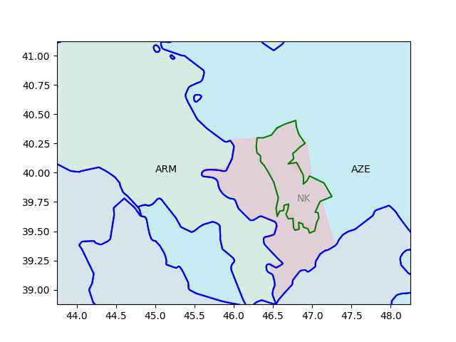

"PowerCell has joined the Newborn project, part of EU’s Clean Aviation
Joint Undertaking, that aims to develop environmentally sustainable
aviation... The EU´s Clean Aviation Joint Undertaking encompasses a
total of 20 projects with a budget exceeding EUR 700 million and aims
to support the EU Green Deal."

---

He's here

 

---

When region geo points are not available, what do we do? Reverse-eng
from images, as in pictures of that area... Custom UI displays img,
captures clicks on it, trace area on that manually, get pixel data, w/
two pixel-geo ref points reverse-eng geo coordinates. Easy as Py.

---

The Azeris had some  help from the poodle, and the poodle's poodle.

---

After the 2020 war they lost all the surrounding areas and some of NK,
now down to the yellow area, Russkie peacekeepers are all around that
region plus guarding the Lachin crossing (red line).

```python
u.sm_plot_azearm3()
```

[[-]](mbl/2023/azearm3.jpg)

---

ARM had areas around NK too (in pink). 

```python
u.sm_plot_azearm1()
```

 

---

2020 AZE-ARM fighting was pretty bad - over Nagarn-Karabakh. NK is
outlined below.

```python
u.sm_plot_azearm1()
```

[[-]](mbl/2023/azearm1.jpg)

---

Have to pick dried vegs carefully; beet root, dried mangold.. Carrots
are good for eyesight, but its high potassium is too relaxing, beets
are perfect. Spinach is fine, but too high on iron.. mangold is bland,
just as rich in vita.

---

Left Voice: "Everything You Need to Know About Sahra Wagenknecht’s
'Left Conservatism'.. Die Linke has a program calling for 'open
borders.'  Wagenknecht became convinced that this — and this alone —
was why her party was losing support in the East, where it was once a
Volkspartei, a mass party.. [Her book] is a 345-page diatribe against
what she calls 'identity politics' [that] 'amounts to focusing on ever
smaller and ever more bizarre minorities, each of which finds an
identity in some quirk which distinguishes it from the majority of
society, and from which it derives the claim to victimhood'"

---

"Die Linke politician [Wagenknecht].. is rumoured to be planning a
breakaway party.. In her bestselling book [.. she] accused Die Linke
of having neglected 'ordinary people' in favour of what she refers to
as a city-dwelling 'academic clientele'. She says its preoccupation
with issues such as 'gender-conscious language and pricey organic
products' rather than bread-and-butter issues such as 'fighting low
pay' has made it a stranger to its grassroots working-class support
base... Polls show her chances of succeeding as head of a new party to
be good... Among [right-wing] AfD voters the interest was a staggering
68%"

---

[Link](2023/02/keiser-unrigged.html)

---

Bloomberg: "[2018] Russia Supports Political Role for Qaddafi's Wanted
Son in Libya"

---

That's a good catch by WION, AK came to power on the back of public
discontent around the earlier 99 earthquake.. They mention the AK era
construction craze too... 

---

TR earthquakes - who is to blame? \#WION

[[-]](https://youtu.be/dA4LIcRpavQ?t=73)

---

## Reference

[Nations and Nationalism, Culture, Narratives](2013/02/nations-and-nationalism.html)

[The Fundamentals of Industrial Ideologies](2011/04/fundamentals-of-industrial-ideologies.html)

[Education, Workplace](2017/09/education-workplace.html)

[Science and Technology](2018/09/science-technology.html)

[Democracy, Parties](2016/11/democracy.html)

[Economy](2018/05/economy.html)

[Globalization](2018/09/globalization.html)

[Rome, The First Wave, Religion](2017/12/rome.html)

[Human Nature & Health](2020/07/human-nature.html)

[Climate Change](2018/12/climate.html)

[Reports](2019/05/reports.html)

[The Middle East](2019/07/middleeast.html)

[TR](../tr)

## Browse

[Members](2022/08/members.html)

[By Year](years.html)

[Search](search.html)

[Microblog Archive](mbl/index.html)

[PDF](https://drive.google.com/uc?export=view&id=1FSi-1MnqXVq_PVTEXzzflwN8-7h92N_R)
