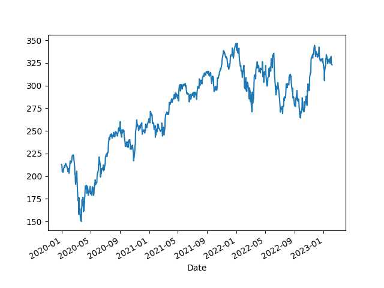
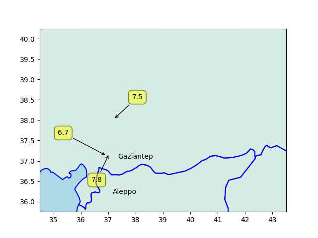

"@carnage4life@mas.to

Did a half empty plot of commercial real estate write this?"

[[-]](https://media.mas.to/masto-public/media_attachments/files/109/810/150/434/890/652/original/9f5d93fa3aec10c5.jpeg)

---

"@eunews@mstodon.eu

Africa is likely to be Europe's most important partner as it looks to
increase its renewable energy supply and switch to green hydrogen, EU
climate chief Frans Timmermans told EURACTIV in an exclusive
interview"

---

:) "The energy in the room felt vaguely like the end of a Zoom meeting"

---

H2 Central: "Mitsubishi Shipbuilding and INPEX Complete Conceptual
Study for Ammonia Bunkering Vessel"

---

```python
u.biz_stock_plot(2020,"LIN")
```

 

---

H2 View: "Linde to supply hydrogen to OCI’s blue ammonia plant in
Texas, investing $1.8bn"

---

"Linde to Increase Green Hydrogen Production in California"

---

"@Hypx@mastodon.social

John Cockerill Records India’s Largest 140MW Electrolysers Order from
Greenko for the First Indian Green Ammonia Plant"

---

CNBC: "[2019] Sen Marco Rubio takes aim at stock buybacks"

[[-]](https://www.cnbc.com/2019/02/12/rubio-backs-new-proposal-to-tackle-stock-buybacks.html)

---

Market Watch: "Biden on Tuesday night will call for quadrupling the
tax on corporate stock buybacks, the White House said Monday"

---

Why ChatGPT won't kill journalism - Media Watch

[[-]](https://youtu.be/--rFxctTLrg?t=549)

---

Euractiv: "Nine EU countries want low-carbon hydrogen included in
bloc's renewables goals"

---

Reuters: "France leads push for EU to boost nuclear-produced hydrogen"

---

Renew Economy: "South Australian government.. intends to build a 250MW
hydrogen electrolyser – 10 times bigger than any other operating plant
in the world – to feed into a 200MW hydrogen power plant, which would
also be the biggest in the world.

The man in charge of this ambitious project is Sam Crafter, the CEO of
the Office of Hydrogen Power in South Australia"

---

I thought Ardern was ok.. had child mid term prob got stressed out due
to work-life, quit to spend time w kid, there is no shame in
that. Served, and now out; but she's young might come back who knows..

---

Prev PM was careful around this issue too

TASS: "New Zealand not to participate in AUKUS partnership, [new] PM
Hipkins reaffirms"

---

*Plane* with G. Butler, M. Colter - great movie.

---

A Richter 7.5 and 7.8 within a day???

---

Earthquake \#TR

```python
df = u.eq_at(lat=38,lon=39,radius=300,ago=10)
df = df[df.mag > 6.0]
u.sm_plot_list1(38, 39, 0.5, np.array(df[['mag','lat','lon']]))
plt.text(37.355759, 37.05983787,'Gaziantep')
plt.text(37.170340, 36.19170861,'Aleppo')
```



---

## Reference

[Nations and Nationalism, Culture, Narratives](2013/02/nations-and-nationalism.html)

[The Fundamentals of Industrial Ideologies](2011/04/fundamentals-of-industrial-ideologies.html)

[Education, Workplace](2017/09/education-workplace.html)

[Science and Technology](2018/09/science-technology.html)

[Democracy, Parties](2016/11/democracy.html)

[Economy](2018/05/economy.html)

[Globalization](2018/09/globalization.html)

[Rome, The First Wave, Religion](2017/12/rome.html)

[Human Nature & Health](2020/07/human-nature.html)

[Climate Change](2018/12/climate.html)

[Reports](2019/05/reports.html)

[The Middle East](2019/07/middleeast.html)

[TR](../tr)

## Browse

[Members](2022/08/members.html)

[By Year](years.html)

[Search](search.html)

[Microblog Archive](mbl/index.html)

[PDF](https://drive.google.com/uc?export=view&id=1FSi-1MnqXVq_PVTEXzzflwN8-7h92N_R)
