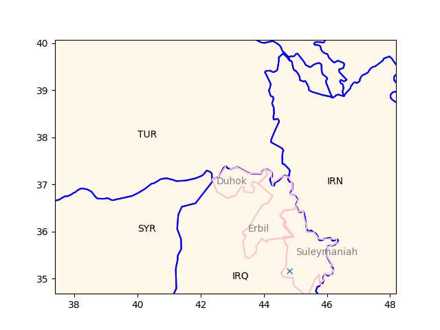

Libertards, goldbugs don't understand economics. Cant construct a
modern economy on top of a limited-supply rare metal. Want to be
thrifty, be thrifty - do not need gold for that.

---

Today's liberterian likes gold, dislikes imperialism, but they do not
realize gold is historically is a vessel for imperialism, not an
imaginary era of thrift. Only a king could have precious metals dug up
and turned into money and ask that money to be paid to him in tax so
his army could be fed. That's how gold became money, it was useful for
kings and opressive, plundering empires.

---

Note he associates gold with expansionist, feudal imperialism.

---

Rereading parts of the great Graber interview; DG hit the nail on the
head on many subjects. That point on religion is right on the money -
all religion, at its core, is left-wing (sadly they get co-opted and
are made to serve the state - see Romanized Christianity, or -Third
Rome- Ottoman Islam).

Graeber: "In the Middle Ages it all shifts back again — the great
religions, which really started as anti-war movements, take over, the
armies are disbanded, cash disappears, people go back to virtual money
(both checks and paper money for instance were Medieval inventions.)
Then, after 1492 it swings the other way, again — we’re back to gold
and silver money, vast empires, slavery comes back"

[[-]](2011/11/debt-religions-money.html)

---

Burying the dead with worldly items is a continuation of 6000+ yr old
agrarian era of ancestor burials, the buried ancestors were later
worshipped since they now represented a connection to (arable) land
vital for survival. See [Morris](2017/10/wtwrfn-foragers-farmers.html#ancestors).

---

Pharaoahs were an outcome of an agrarian civilization, empires built
on the back of the farmer class. Rome, Otto, the Han were not
different civilizations but variations of the same.

---

4-5K years is nothing compared to 300k of human history. Not a big deal.

The Guardian: "Archaeologist hails possibly oldest mummy yet found in
Egypt.. The 4,300-year-old mummy was found at the bottom of a 15-metre
shaft near the Step Pyramid"

---

"@aarnegranlund@mastodon.social

We're above zero degrees C in the middle of the winter once
again. This is abnormal for our latitudes, especially for the third
week"


---

Fuelcellworks: "Seattle-based First Mode and Anglo American have
closed a complicated $1.5 billion transaction that will remake First
Mode as a clean-energy company for heavy industry - and shift its
headquarters to London...

The business combination, which was announced last year, blends First
Mode’s engineering operation with Anglo American’s nuGen effort to
develop a zero-emission system for hauling ore. First Mode created the
hydrogen-fueled hybrid powerplant for Anglo American’s nuGen mining
truck, which made its debut in South Africa last year as the world’s
largest zero-emission vehicle"

---

IMO the problem has more to do with culture, and declining quality
*within* fields, rather than lack of people able to work across
fields. Funding has been flowing to shiny-object-but-fruitless
projects, the culture rewards "getting shit to work".

Nature: "PhD training is no longer fit for purpose.. candidates are
inadequately prepared for the cross-disciplinary working and large
teams that characterize cutting-edge science today"

---

Iran is in deep shit. Israel, Iraq, Pakistan.. The list goes on. 

NYT: " Attack on a Munitions Facility.. The government did not say who
was behind the attempted attack, but some Telegram channels affiliated
with Iran’s Revolutionary Guards pointed the finger at Israel"

---

Some claim TRY wants a piece of that gasfield action, trying to get it
through their poodle KDP. If PUK leaves "Kurdish" KRG joins Iraq, that
would leave the rest empty handed.  Apparently there is already a KDP
ambargo of sorts on Suleymaniah, it might happen.

---

And of course it is being attacked

Kurdpress: "Local media in the Iraqi Kurdistan region have reported
that Khor Mor gas field in the Kurdistan Region’s Chamchamal County in
Sulyamaniyeh was targeted with rockets on Friday morning"

---

Khor Mor 

```python
u.sm_plot_kurd()
plt.plot(44.82053178,35.1638440,'x')
```

 

---

Reuters: "[2022/12] Some [Kurdish] PUK officials say privately that
without compromise on a range of issues, the party might eventually
break away and form its own administration in its Sulaimaniya
stronghold. The antagonism [with KDP] is also complicating a project
to expand one of the biggest gasfields [Khor Mor] in Iraq, which is in
PUK territory, damaging the region’s hopes of starting exports to
Europe and earning much-needed revenue"

---

Reagan-era pro-market tough guy balancing the previous era's
drugged-out hippies \#zeitgeist

---

Pepsi, Coors.. 

---

Holy Product Placement

[[-]](https://drive.google.com/uc?export=view&id=1N2eyGQd7Da6faKOY1zC_E9x2nqjmd-Sy)

---

Nippon.com: "Russia's defeat in the war in Ukraine is 'unthinkable,'
former Japanese Prime Minister Yoshiro Mori said Wednesday"

---

## Reference

[Nations and Nationalism, Culture, Narratives](2013/02/nations-and-nationalism.html)

[The Fundamentals of Industrial Ideologies](2011/04/fundamentals-of-industrial-ideologies.html)

[Education, Workplace](2017/09/education-workplace.html)

[Science and Technology](2018/09/science-technology.html)

[Democracy, Parties](2016/11/democracy.html)

[Economy](2018/05/economy.html)

[Globalization](2018/09/globalization.html)

[Rome, The First Wave, Religion](2017/12/rome.html)

[Human Nature & Health](2020/07/human-nature.html)

[Climate Change](2018/12/climate.html)

[Reports](2019/05/reports.html)

[The Middle East](2019/07/middleeast.html)

[TR](../tr)

## Browse

[Members](2022/08/members.html)

[By Year](years.html)

[Search](search.html)

[Microblog Archive](mbl/index.html)

[PDF](https://drive.google.com/uc?export=view&id=1FSi-1MnqXVq_PVTEXzzflwN8-7h92N_R)
