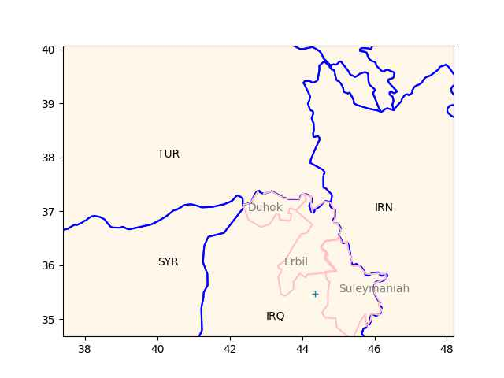

"@TheEuropeanNetwork@mstdn.social

Germany will join the new hydrogen pipeline project between Spain,
Portugal and France. The project, called H2Med, will connect Portugal
and Spain with France and now Germany to supply about two million tons
of hydrogen annually, or about 10% of the European Union's hydrogen
demand, by 2030" via Deutsche Welle

---

TR nemesis Kurdish PKK and sister org YPG are closer to PUK - one
Talabani made a visit to Rojova (YPG stronghold in NE Syria). Barzanis
are seen as too close to Ankara, as their poodle (which makes them the
poodle to poodle's poodle).

---

KRG, Iraqi central gov also have conflicts; after KRG 2017 indep
referandum central gov attacked KRG, took 20% of its land including
Kirkuk - major oil production center.

The loss of Kirkuk then became a PUK-KDP sore spot; PUK reportedly
left the fight, KDP was gung-ho on keeping it, and lost. Major loss of
face for KRG especially KDP. Papa Barzani resigned after that one.

---

Iraq Kurdish map again; two families Barzani / Talabani are feuding,
one is based at Erbil the other at Suleymaniah, + sign is Kirkuk.

```python
u.sm_plot_kurd()
plt.plot(44.36168251,35.469605,'+') 
```



---

Trouble in Kurdish regional gov (KRG) of Iraq. The two major parties
in it, KDP, PUK are not getting along..

---

"@Hy_Economy@mastodon.social

Heating with \#hydrogen: Gerstofen, Germany, plans to blend H₂, that
is available as waste from industrial processes, in their gas grid
(for heating purposes).  90% of the grid are already suitable for the
planned 7% blend"

---

TASS: "The West may be heading for 'a catastrophic stalemate,' at
best, for Ukraine, Sherelle Jacobs, head of the Online Comment at The
Daily Telegraph, wrote on Monday night.

She views a decisive Russian breakthrough in spring as an alternative
scenario. According to her, while Western elites assume that a victory
for the Ukrainians 'must surely be around the corner,' the fact is
that Ukraine is increasingly on the back foot"
 
---

If such a thing *did* happen BTW the Russian state would cease to
exist - and that's not going to happen. 

---

It would be very difficult in the following year, or the one after
that as well..

Newsweek: 'From a military standpoint, I still maintain that for this
year it would be very, very difficult to militarily eject the Russian
forces from...every inch of Russian-occupied Ukraine,' [CJCS] Milley
said"

---

Manchin was on Cuck Todd, says Biden *should* have a lot of regrets
about how he handled classified docs. ROFL. WH got burned.

---

Reuters: "Pipeline operators Gascade (WINT.UL) and Fluxys (FLUX.BR)
are stepping up the pace on plans for a green hydrogen pipeline in the
North Sea by applying to the European Commission to qualify for
fast-track approvals and funding"

---

AU is a good scientist; I agree with his general stance on how
fundamental science needs to be conducted. The Standard Model needs to
go.

---

A. Unzicker is disappointed with America - his new book is called
*Make Physics Great Again*, he is blaming sci culture in US for setting
back fundamental research.

[[-]](https://youtu.be/YpGy5V3fr6o?t=65)

---

Hindustan Times: "Russian oil is getting mixed in Singapore and then
re-exported, sources say"

---

🤣 🤣 

[[-]](mbl/2023/distracted_boyf_1.jpg)

---

Pimps Of Joytime - Take The L Train \#music

[[-]](https://youtu.be/lLqTxuxDSDY)

---

H2 Central: "Alkaline Fuel Cell Power Corp Announces Prototype Launch
of Jupiter 1.0, a Powerful Fuel Cell System for Homes and Small
Buildings..

The planet Jupiter is made up of roughly 90% hydrogen, and similarly,
this PWWR fuel cell converts hydrogen to heat and electricity at
approximately 90% efficiency. Jupiter 1.0 is built to supply power
during peak demand periods and serves as a back-up when required for
homes and small buildings...

Jupiter 1.0, requires fewer components compared to conventional fuel
cells and also eliminates the need for expensive, precious metals"

---

Reuters: "Lula floats shared 'trading currency' during Argentina trip"

---

Reuters: "Brazil’s Lula fires army chief in wake of pro-Bolsonaro
riots.. In the immediate aftermath of the riots, Lula said he
suspected collusion by 'people in the armed forces'"

---

## Reference

[Nations and Nationalism, Culture, Narratives](2013/02/nations-and-nationalism.html)

[The Fundamentals of Industrial Ideologies](2011/04/fundamentals-of-industrial-ideologies.html)

[Education, Workplace](2017/09/education-workplace.html)

[Science and Technology](2018/09/science-technology.html)

[Democracy, Parties](2016/11/democracy.html)

[Economy](2018/05/economy.html)

[Globalization](2018/09/globalization.html)

[Rome, The First Wave, Religion](2017/12/rome.html)

[Human Nature & Health](2020/07/human-nature.html)

[Climate Change](2018/12/climate.html)

[Reports](2019/05/reports.html)

[The Middle East](2019/07/middleeast.html)

[TR](../tr)

## Browse

[Members](2022/08/members.html)

[By Year](years.html)

[Search](search.html)

[Microblog Archive](mbl/index.html)

[PDF](https://drive.google.com/uc?export=view&id=1FSi-1MnqXVq_PVTEXzzflwN8-7h92N_R)
