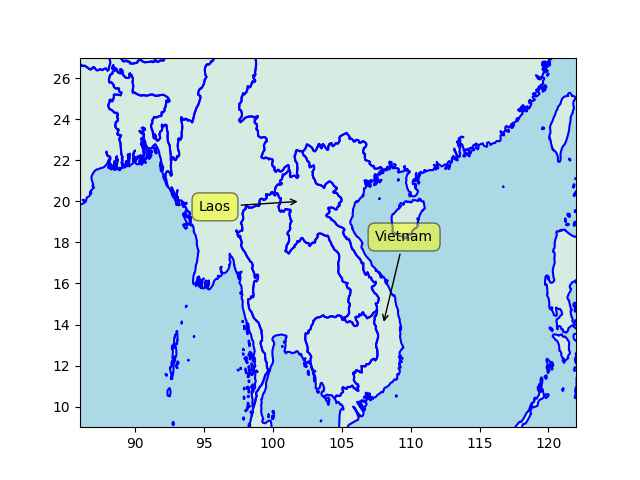

---

Shut up! Say 'Evil Russia"! \#Kirby

[[-]](https://youtu.be/h3HIDTpcM3g?t=24)

---

Politico: "The First Step Act, a criminal-justice reform law, created,
among other things, quicker pathways home for certain nonviolent
federal prisoners and delivered some sentencing reforms... Activists
now estimate that perhaps 20,000 people have been released so far
because of the law, according to Lance Kramer, the producer of the
newly released documentary The First Step. And this happened because a
self-described “law-and-order” president [Trump], who had months
earlier called for the execution of major drug dealers, somehow found
common ground with members of the social-justice left.

---

Major spike in new Masto users - from 300/hr it's now over 1000/hr.

---

Cuck votes up norm votes down

```python
u.rottentomatoes_tv("Star Trek Discovery")
```

```text
Out[1]: {'tomatometer score': '84%', 'audience score': '36%'}
```

---

*Fringe* was good scifi.. The strange thing is Ibrahim, Kurtzman,
Akiva were all part of it... Then they mucked it all up for ST
Discovery, "STD"

---

<iframe width="340" src="https://www.youtube.com/embed/kroU3SfCXE8" title="A Cloud City on Venus: Why Venus is a Better Choice" frameborder="0" allow="accelerometer; autoplay; clipboard-write; encrypted-media; gyroscope; picture-in-picture; web-share" allowfullscreen></iframe>

---

ABC News: "Artisanal cobalt mining swallowing city in Democratic
Republic of the Congo, satellite imagery shows"

[[-]](https://abcnews.go.com/International/cobalt-mining-transforms-city-democratic-republic-congo-satellite/story?id=96795773)

---

There are doctoral degrees awarded for machine learning; was it too
premature to turn this 'eclectic mix of CS/Stat subjects' into a whole
new field? There aren't any major theoretical advances to their name,
all they have is applications that are created by jury rigging ever
larger neural nets, feeding more and more data into them to do it.

---

There is a small chance for the challenger to win, for that Dems have
to campaign like Gore and the Rep have to do extremely well, I'm
talking Dubya, Karl Rove level well.

---

At a potential 2% Q2 GDP growth incumbent is likely to win 2024 reelection. 

```text
Interval: [49.79 53.43] Average: 51.61
```

---

Net approval settled at around -10%. 


```python
u.biden_approval().net.plot()
```

 

---

Maps show who has been historically better at war - looking at Laos
and Vietnam, the latter's landmass starts all the way from South,
circles around, goes North, always in command of the seashore. Laos
cold have had a piece of that for access but has none - completely
landlocked. Clearly Vietnam has been better at war.

```python
u.sm_plot_list1(18, 104, 2, [['Laos',20,102],['Vietnam',14,108]])
```

 

---

Fox News: "Ron DeSantis rips Biden's 'blank-check' Ukraine policy"

---

US probably doesn't care as much about the Kurds of Rojova (NE Syria),
but cares more about Shite Assad does not have an easy connection to
the now-Shite-majority Iraq. Scared of an Iran-Iraq-Syria connectivity
towards the Medi? The Kurdish areas cut them off nicely... There is
some SYR-IRQ connection in the SE, and of course US has a base there
(Al-Tanf) and the area is conveniently infested with the Sunni
extremist Daesh.

[[-]](https://newlinesinstitute.org/wp-content/uploads/20220712-Syria-NA.png)

---

CNBC: "The SEC has a stablecoin firm in its sights — and it could
shake up the whole $137 billion market.. The U.S. Securities and
Exchange Commission (SEC) could be gearing up to take action against
Paxos"

---

## Reference

[Nations and Nationalism, Culture, Narratives](0119/2013/02/nations-and-nationalism.html)

[The Fundamentals of Industrial Ideologies](0119/2011/04/fundamentals-of-industrial-ideologies.html)

[Education, Workplace](0119/2017/09/education-workplace.html)

[Science and Technology](0119/2018/09/science-technology.html)

[Democracy, Parties](0119/2016/11/democracy.html)

[Economy](2021/01/economy.html)

[Globalization](0119/2018/09/globalization.html)

[Rome, The First Wave, Religion](0119/2017/12/rome.html)

[Human Nature & Health](2020/07/human-nature.html)

[Climate Change](2022/01/climate.html)

[Reports](2021/01/reports.html)

[The Middle East](0119/2019/07/middleeast.html)

[TR](../tr)

## Browse

[Members](2022/08/members.html)

[By Year](years.html)

[Search](search.html)

[Microblog Archive](mbl/index.html)

[PDF](https://drive.google.com/uc?export=view&id=1FSi-1MnqXVq_PVTEXzzflwN8-7h92N_R)
