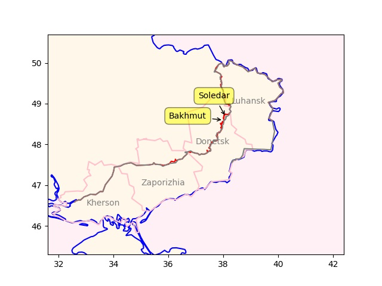

---

H2 Central: "Larsen & Toubro, an Indian multi-national engaged in EPC
Projects, Hi-Tech Manufacturing, and Services, announced the signing
of a Memorandum of Understanding (MoU) with the Norway-based H2Carrier
(H2C) to co-operate towards developing floating green ammonia projects
for industrial-scale applications"

---

Reuters: "India OKs $2 bln incentive plan for green hydrogen industry"

---

H2 Fuel News: "Porsche hydrogen engine prototype outperforms
8-cylinder gasoline engine"

---

Russia was being shelled in Kherson City, they pulled out, UKR moved
in, now they are being shelled by Russian forces \\(ツ)/ eyyy (medi
shrug). The river line proved to be defensible. UA counteroffensive
there stalled.

---

BKM is major strat point; Ukraine sacrificed much to hold on to it..
One could even argue the counteroffensive last year was done partly to
shift the focus elsewhere when the battles there was not going well.

But things are now back to where they were; RU shored up the South, 
and now moving ahead with plans taking the rest of Donetsk.

---

Latest frontline in Ukraine. Gains in Soledar, also south of
Bakhmut. RU will surely attempt to encircle BKM. Some gains in
Zaporizhia too?  The start of something from there perhaps, with plans
of pushing towards the north.

```python
geo = [['Soledar',48.68207521, 38.0896357,(5,20)],
       ['Bakhmut',48.59681687, 37.9957181,(-20,0)]]
u.sm_plot_ukr('ukrdata/fl-0116.csv','ukrdata/fl-221115.csv',geo)
```



---

Al Jazeera: "China reports almost 60,000 COVID-related deaths in past
month"

---

H2 Central: "Masdar Signs Agreement to Explore Exporting Green
Hydrogen from Abu Dhabi to Europe"

---

TASS: "Kazakh companies purchase Russian sovereign bonds worth $1.4
bln — Bloomberg"

---

Automative World: "Cummins: hydrogen ICE to take off from 2024..The
engine specialist shares its outlook for hydrogen-powered internal
combustion engines in heavy trucking... it falls to Jim Nebergall as
General Manager of the Hydrogen Engine Business to steer its global
efforts in commercialising hydrogen-fuelled ICE specifically. 'There
is interest here because the technology is low cost in nature and
represents a zero-carbon option,' he says. 'On the whole, it offers a
significant boost for the decarbonisation of commercial vehicles with
a technology that customers understand.'"

---

Disney's overwhelming slew of cuck repertoire surely is not helping
matters - spending too much gaining too little.

---

2.48 billion in debt payments son.. The shareholder was already
strapped for earnings, that payment killed them. That would piss a man
off

```python
u.yf_cash("DIS")['totalCashFromFinancingActivities'] / 1e9
```

```text
Out[1]: 
2022-01-01   -0.292
2022-04-02   -1.817
2022-07-02   -0.150
2022-10-01   -2.482
```

---

A lot of debt, due to Fox deal likely.

```python
u.yf_balance("DIS")['longTermDebt'] / 1e9 # in billions
```

```text
Out[1]: 
2022-01-01    47.349
2022-04-02    46.624
2022-07-02    46.022
2022-10-01    45.299
Name: longTermDebt, dtype: float64
```

---

He is right DIS earnings went to shit. 0.09? This is a joke.


```python
u.yf_eps("DIS")
```

```text
Out[1]: 
2022-01-01    0.605399
2022-04-02    0.257733
2022-07-02    0.772652
2022-10-01    0.088836
```

---

CNBC: "Disney is facing a proxy fight as Nelson Peltz’s activist firm
Trian Fund Management pushes for a seat on its board... Peltz [made]
his case for the fight his firm has picked with Disney. He raised
issues with Disney’s $71 billion acquisition of Fox in 2019 and how
the company’s shareholder value has eroded in recent years"

---

## Reference

[Nations and Nationalism, Culture, Narratives](2013/02/nations-and-nationalism.html)

[The Fundamentals of Industrial Ideologies](2011/04/fundamentals-of-industrial-ideologies.html)

[Education, Workplace](2017/09/education-workplace.html)

[Science and Technology](2018/09/science-technology.html)

[Democracy, Parties](2016/11/democracy.html)

[Economy](2018/05/economy.html)

[Globalization](2018/09/globalization.html)

[Rome, The First Wave, Religion](2017/12/rome.html)

[Human Nature & Health](2020/07/human-nature.html)

[Climate Change](2018/12/climate.html)

[Reports](2019/05/reports.html)

[The Middle East](2019/07/middleeast.html)

[TR](../tr)

## Browse

[Members](2022/08/members.html)

[By Year](years.html)

[Search](search.html)

[Microblog Archive](mbl/index.html)

[PDF](https://drive.google.com/uc?export=view&id=1FSi-1MnqXVq_PVTEXzzflwN8-7h92N_R)
