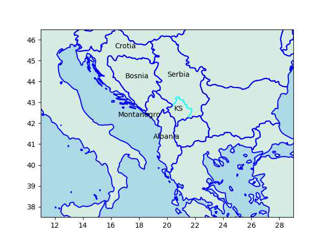

Pinned Post

"@timnitGebru@dair-community.social

Because we were looking for more things to do when these clowns
decided to write 'the letter,' [about so-called 'AI pause'] and cite
our \#StochasticParrots paper while saying the opposite of what we
write, we.. [wrote](https://www.dair-institute.org/blog/letter-statement-March2023)
a statement in response.. It is dangerous to distract ourselves with a fantasized
AI-enabled utopia or apocalypse which promises either a 'flourishing' or
'potentially catastrophic' future. Such language that inflates the capabilities
of automated systems and anthropomorphizes them, as we note in [Stochastic Parrots](https://dl.acm.org/doi/abs/10.1145/3442188.3445922), 
deceives people into thinking that there is a sentient being behind the
synthetic media. This not only lures people into uncritically trusting
the outputs of systems like ChatGPT, but also misattributes agency"

---

 

---

ABC AU: "The story of Elizabeth Holmes is supposed to be a cautionary
tale. A culture of faking it until you make it is endemic in Silicon
Valley. And today the tech bosses in the US will have a clear message
from authorities: 'push the boundaries and you may end up behind
bars'"

---

BBC: "Disgraced Theranos founder Elizabeth Holmes has reported to the
federal prison where she will serve an 11-year sentence"

---

"@Hypx@mastodon.social

Saudi Arabia Will Have Hydrogen Buses Running In 2024"

---

H2 Central: "Dutch shipping company Future Proof Shipping (FPS)
officially launched the first hydrogen-powered zero-emissions inland
container ship, H2 Barge 1, in Rotterdam, the Netherlands. Earlier in
the week, Nike introduced the H2 Barge 1 at its European Logistics
Campus in Laakdal, Belgium"

---

Now they blame Putin of course for doing something they themselves
would have done *ten times over* had the situation been reversed, if
not preemptively. Forget Soviets around Cuba in 1962, how did US
handle the French in Mexico in 1861? That's right - not well, not with
open arms.

---

The Bosnian situation in the 90s was bad no doubt, and at that stage
the sides weren't that clear cut either, Iran sent fighters to fight
in Bosnia against the Serbs. But we don't know how things reached that
stage. Muckers muck it up, we saw how what they did in Ukraine.. CIA
stirs shit up what do we have 10 years later? And that is a country
with only two groups which are ethnically, religiously, culturally
similar. Imagine what they could do in a country that has many groups
with major religious, ethnics differences.

---

Unsurprisingly US is for Kosovo indep, Russia, China against. Just saw
a CH spox talking about "the territorial integrity of Serbia" by which
they mean Kosovo being part of Serbia. Kosovo is mostly ethnically
Albanian, 90%. Serbs 5%.

---

Serbia is a long-time Russia ally. It looks as if the current map was
created to cut off Serbia from the Adriatic. Serbia and Montanegro
were united before, but Montanegro broke up in 2006. Kosovo declared
independence in 2008 (which Serbia doesn't recognize). Pieces of them
got chopped off, year after year. They got cucked.

```python
u.sm_plot_yugo1()
```

 

---

Djokovic is hard-core.. 

Reuters: "Novak Djokovic risked stirring up a political controversy at
the French Open on Monday, after writing a message about Kosovo on a
camera lens following his first-round victory.. 'Kosovo is the heart
of Serbia. Stop the violence,' 22-time Grand Slam champion Djokovic
wrote in Serbian"

---

Barron's: "French President Emmanuel Macron says Kosovo officials bear
'responsibility' for the deterioration of the situation there"

---

"In a statement to the Washington Examiner, Gaetz said he has 'no
plans' to try and remove McCarthy 'barring some dramatic, unexpected
turn of events.' 'You don't remove someone simply because you disagree
with them. By that standard, no speaker would last a single day'"

---

## Reference

[Nations and Nationalism, Culture, Narratives](0119/2013/02/nations-and-nationalism.html)

[The Fundamentals of Industrial Ideologies](0119/2011/04/fundamentals-of-industrial-ideologies.html)

[Education, Workplace](0119/2017/09/education-workplace.html)

[Science and Technology](0119/2018/09/science-technology.html)

[Democracy, Parties](0119/2016/11/democracy.html)

[Economy](2021/01/economy.html)

[Globalization](0119/2018/09/globalization.html)

[Rome, The First Wave, Religion](0119/2017/12/rome.html)

[Human Nature & Health](2020/07/human-nature.html)

[Climate Change](2022/01/climate.html)

[Reports](2021/01/reports.html)

[The Middle East](0119/2019/07/middleeast.html)

[TR](../tr/index.html)

## Browse

[Members, Donations](2022/08/members.html)

[By Year](years.html)

[Search](search.html)

[Microblog Archive](mbl/index.html)

[PDF](https://drive.google.com/uc?export=view&id=1FSi-1MnqXVq_PVTEXzzflwN8-7h92N_R)

Also on 
[Mastodon](https://masto.ai/@muratk3n),
[Codeberg](https://muratk5n.codeberg.page/en/),
[Github Pages](https://muratk5n.github.io/thirdwave/en/)

 


