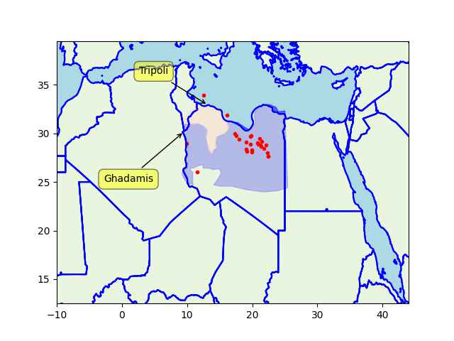

Pinned Post

"@timnitGebru@dair-community.social

Because we were looking for more things to do when these clowns
decided to write 'the letter,' [about so-called 'AI pause'] and cite
our \#StochasticParrots paper while saying the opposite of what we
write, we.. [wrote](https://www.dair-institute.org/blog/letter-statement-March2023)
a statement in response.. It is dangerous to distract ourselves with a fantasized
AI-enabled utopia or apocalypse which promises either a 'flourishing' or
'potentially catastrophic' future. Such language that inflates the capabilities
of automated systems and anthropomorphizes them, as we note in [Stochastic Parrots](https://dl.acm.org/doi/abs/10.1145/3442188.3445922), 
deceives people into thinking that there is a sentient being behind the
synthetic media. This not only lures people into uncritically trusting
the outputs of systems like ChatGPT, but also misattributes agency"

---

"Australia Big Hydrogen Push Could Catalyse Industry, Experts
Say.. Prime Minister Anthony Albanese's Labor government announced a
A$2 billion (1.4 billion dollars) 'Hydrogen Headstart' programme in
its budget with the aim of accelerating the production and export of
the fuel"

---

"South Australia swamped with nearly 30 proposals for world leading
green hydrogen plan.. The state Labor government has committed nearly
$600 million to build a 250MW green hydrogen electrolyser and a 200MW
green hydrogen power plant in the steel city of Whyalla. Both would be
the biggest of their type in the world, at least for a time.

The guarantee of government funds for first of its type projects has
naturally attracted huge interest from Australia and around the
world. The government received around 60 expressions of interest last
year, which have converted into 29 formal proposals under a tender
that closed last week"

---

Isle of Wight beaches suffer from pollution. Sad.

[[-]](https://www.euronews.com/travel/2023/04/07/swimming-in-sewage-here-are-the-beaches-to-avoid-in-this-uk-holiday-hotspot)

---

With the hipster code removed shortest path is working like a
boss. Custom data xform, road network fits into a 200 MB, key/value
db, tiny board RPi runs it. All based on open source data, code.

---

H2 View: "Höegh Autoliners and Norwegian green energy provider North
Ammonia have announced a partnership for the supply, distribution,
delivery, and consumption of green ammonia. The partnership will
enable Höegh Autoliners to meet its commitment to powering at least 5%
of our deep-sea operation with green ammonia by 2030, as part of its
First Movers Coalition pledge, and aim to consumer at least 100,000 MT
of green ammonia within its fleet by that same year"

---

Russia is not the only Haftar supporter. France, Egypt, SA and, more
recently, US are also supporting. On the other side there is gobble
gobble doing the wobble wobble and (of course) the spastic child
Qatar.

---

Haftar's got almost all the oil (the red dots are oil fields)

```python
u.sm_plot_libya2(["Ghadamis","Tripoli"])
```

 

---

Some in the West are playing both sides? Good catch by \#TFIGlobal

FT: "More than $1bn of EU exports targeted by sanctions have
disappeared in transit to Russia’s economic partners, a flow of “ghost
trade” that western officials believe has helped sustain Vladimir
Putin’s wartime economy.

Public data analysed by the Financial Times found that only about half
of a $2bn sample of controlled “dual use” items shipped from the EU
actually reached their stated destinations in Kazakhstan, Kyrgyzstan
and Armenia.

These goods, which are deemed by the EU to have potential uses for
military or intelligence services and are subject to export controls,
may have entered Russia directly from the EU under the pretence that
they were only passing through"

[[-]](https://www.ft.com/content/76fc91b2-3494-4022-83d0-9d6647b38e3d)

---

## Reference

[Nations and Nationalism, Culture, Narratives](0119/2013/02/nations-and-nationalism.html)

[The Fundamentals of Industrial Ideologies](0119/2011/04/fundamentals-of-industrial-ideologies.html)

[Education, Workplace](0119/2017/09/education-workplace.html)

[Science and Technology](0119/2018/09/science-technology.html)

[Democracy, Parties](0119/2016/11/democracy.html)

[Economy](2021/01/economy.html)

[Globalization](0119/2018/09/globalization.html)

[Rome, The First Wave, Religion](0119/2017/12/rome.html)

[Human Nature & Health](2020/07/human-nature.html)

[Climate Change](2022/01/climate.html)

[Reports](2021/01/reports.html)

[The Middle East](0119/2019/07/middleeast.html)

[TR](../tr/index.html)

## Browse

[Members, Donations](2022/08/members.html)

[By Year](years.html)

[Search](search.html)

[Microblog Archive](mbl/index.html)

[PDF](https://drive.google.com/uc?export=view&id=1FSi-1MnqXVq_PVTEXzzflwN8-7h92N_R)

Also on 
[Mastodon](https://masto.ai/@muratk3n),
[Codeberg](https://muratk5n.codeberg.page/en/),
[Github Pages](https://muratk5n.github.io/thirdwave/en/)

 


