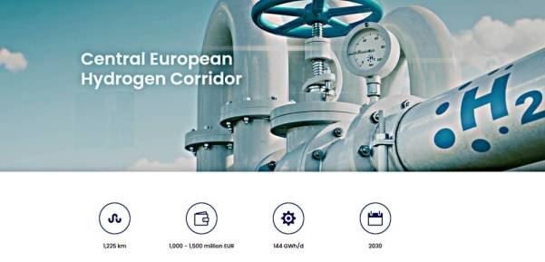

Pinned Post

"@timnitGebru@dair-community.social

Because we were looking for more things to do when these clowns
decided to write 'the letter,' [about so-called 'AI pause'] and cite
our \#StochasticParrots paper while saying the opposite of what we
write, we.. [wrote](https://www.dair-institute.org/blog/letter-statement-March2023)
a statement in response.. It is dangerous to distract ourselves with a fantasized
AI-enabled utopia or apocalypse which promises either a 'flourishing' or
'potentially catastrophic' future. Such language that inflates the capabilities
of automated systems and anthropomorphizes them, as we note in [Stochastic Parrots](https://dl.acm.org/doi/abs/10.1145/3442188.3445922), 
deceives people into thinking that there is a sentient being behind the
synthetic media. This not only lures people into uncritically trusting
the outputs of systems like ChatGPT, but also misattributes agency"

---

CNBC: "Firms are bringing production back home because of the Ukraine
war, China's slowdown — and TikTok"

---

Al-Monitor: "UAE announces over $1.6B in industrial projects including
hydrogen plant"

---

Holy shit! But they nearly succeeded! We need more US involvement in the region!

Jane's: "North Korea fails to launch reconnaissance satellite"

---

Euractiv: "Macron woos Europe’s East but stays vague on Ukraine
security guarantees"

---

"Government should spend less to avert inflation". That is trickery to
deflect attention away from the private sector to the government. Gov
has been spending for decades before covid and there's been no
inflation. Credit for private firms however, is more likely to be the
cause of rises in prices. Right-wing looves credit for businesses,
they don't want it to end. It's their baby milk. They need to be fed
with it constantly.

---

A major divide in US revolves around who to be wary againts; the
government or private sector? Governments can make war, an awesome
power, but their war machine is ultimately tied to the needs of the
private sector, and the needs of private finance. I'd be warier
against the private sector. The government did not pollute the Hudson
River, or derail your trains in Ohio. Through action, and inaction the
private sector did.

---

You don't need regulation to protect against machines that are too
smart, you need it to protect against morons who keep promoting this
shit when it is not ready, and is nowhere near a semblance of an AI.

---

The Jerusalem Post: "Russia's Medvedev says UK is in a 'de-facto war'
with Russia"

---

The Central European Hydrogen Corridor (CEHC) initiative was launched
in 2021..  by the vision to develop a hydrogen 'highway' through
Central Europe. The initiative explores the feasibility of creating a
hydrogen pipeline corridor in Central Europe for transporting hydrogen
from major hydrogen supply areas in Ukraine via Slovakia and the Czech
Republic to hydrogen demand areas in Germany"

 

---

Current strait has too many constraints on it, TR does the gobble
gobble others do the wobble wobble if you know what I mean.. A new
strait could bypass all those troubles, give the host country more
leverage.

---

So how about that Stanpoli Canal project? [This is](mbl/2023/trcanal1.jpg)
the planned path for it, yes? If a new city is built in the area,
could it have more public spaces compared to the rest of the city this time,
or is that too much to ask?

---

"@Gargron@mastodon.social

Mastodon featured on the App Store 🙂"

[[-]](https://apps.apple.com/us/story/id1668483560)

---

Huawei is definitely a-noid

Quora: "[Huawei was] forced to develop Harmony OS because the US
government banned American companies from working with Huawei
(particularly Google). Huawei saw it coming early on and was secretly
working on an operating system of their own called Harmony OS. They
eventually had to switch over from Android to Harmony OS and now it's
being used"

---

"@mikestevens@aus.social

So, I picked up a #Huawei Watch Fit 2 this morning for $150 at
JB.. It's not #Android, bc Huawei was kicked out of [US] so they've
been building out #HarmonyOS (a fork of AOSP..)"

---

"You are a droid, I am a noid" - good one \#TNG

---

Had to remove some defunct soft components.. `diskdict`, sigh pie
`gaussian_filter`, weird document indexer code, gone. `sqlitedict`,
home-cooked 2D smoother, and sqlite3 `fts3` are in.

---

Mmm hmm little `split-window-right` action right there `M-x shell`,
file on the right side, yyiieeaa

---

I'd be damned.. full blown Unix on a Droid tablet, finally worked. Almost
all open source tools are now available. Who da man

[[-]](mbl/2023/termux1.jpg)

---

The Independent: "Brics summit mulls expansion and new currency in bid
to rival dollar and escape sanctions.. Bloc of developing countries
calls for new ‘multipolar’ world order and a shift from Western
balance of power"

---

Al Monitor: "Iran, Saudi Arabia, UAE attend BRICS meeting in South
Africa, as bloc mulls expansion"

---

TASS: "Proponents of peace clear minority in EU — Hungarian prime
minister.. Viktor Orban remains convinced that there can be no winners
in the Ukrainian conflict, but only losers"

---

TASS: "West running out of weapons for Kiev regime — UK defense chief"

---

## Reference

[Nations and Nationalism, Culture, Narratives](0119/2013/02/nations-and-nationalism.html)

[The Fundamentals of Industrial Ideologies](0119/2011/04/fundamentals-of-industrial-ideologies.html)

[Education, Workplace](0119/2017/09/education-workplace.html)

[Science and Technology](0119/2018/09/science-technology.html)

[Democracy, Parties](0119/2016/11/democracy.html)

[Economy](2021/01/economy.html)

[Globalization](0119/2018/09/globalization.html)

[Rome, The First Wave, Religion](0119/2017/12/rome.html)

[Human Nature & Health](2020/07/human-nature.html)

[Climate Change](2022/01/climate.html)

[Reports](2021/01/reports.html)

[The Middle East](0119/2019/07/middleeast.html)

[TR](../tr/index.html)

## Browse

[Members, Donations](2022/08/members.html)

[By Year](years.html)

[Search](search.html)

[Microblog Archive](mbl/index.html)

[PDF](https://drive.google.com/uc?export=view&id=1FSi-1MnqXVq_PVTEXzzflwN8-7h92N_R)

Also on 
[Mastodon](https://masto.ai/@muratk3n),
[Codeberg](https://muratk5n.codeberg.page/en/),
[Github Pages](https://muratk5n.github.io/thirdwave/en/)

 

