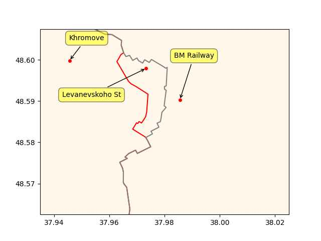

Pinned Post

"@timnitGebru@dair-community.social

Because we were looking for more things to do when these clowns
decided to write 'the letter,' [about so-called 'AI pause'] and cite
our \#StochasticParrots paper while saying the opposite of what we
write, we.. [wrote](https://www.dair-institute.org/blog/letter-statement-March2023)
a statement in response.. It is dangerous to distract ourselves with a fantasized
AI-enabled utopia or apocalypse which promises either a 'flourishing' or
'potentially catastrophic' future. Such language that inflates the capabilities
of automated systems and anthropomorphizes them, as we note in [Stochastic Parrots](https://dl.acm.org/doi/abs/10.1145/3442188.3445922), 
deceives people into thinking that there is a sentient being behind the
synthetic media. This not only lures people into uncritically trusting
the outputs of systems like ChatGPT, but also misattributes agency"

---

H2 View: "Korea sets up first blue hydrogen facility and signs 13
clean energy MOUs with US.. Korea.. seeks to develop stronger hydrogen
links... The agreements, which also covered hi-tech industrial areas,
were signed on the occasion of South Korean President Yoon Suk-yeol’s
state visit to the US"

---

"German Press Commends Moroccan Green Hydrogen Capabilities.. The
strategic partnership between Morocco and Germany brought them to sign
a joint declaration on the development of green hydrogen in 2020,
called Power-to-X, which aims to promote renewable energies...

According to Taggeschau, Morocco should become the leading producer of
green hydrogen in Africa by 2025, while the KfW German Development
Bank is financing the construction of a green hydrogen production
plant for an amount of 300 million euros"

---

The division in US might have had repercussions reaching all the way
to Asia Minor so-called Turkey; in gov some elements were pro-jihadi,
other elements wanted to keep out of Syria - the latter group could
have triggered, or were provoked into a coup attempt in 2016. This
Syria business did a number on everyone.

---

Per the Doran article and what we know about WH wanting better rels
with Iran/Syria/Russia 2008-16, it makes sense admin became divided
between supporting 'moderate rebels' and others who did not want to
knock out Assad. Joint Chiefs would later help Assad according to
Hersh, and some in that circle could've even been responsible for
taking Petreaus out of the picture. Someone dropped that oppo on him,
the affair w biographer, because they did not like what "his side" were
doing. They likely had backing from the WH, as taking out the chief of
CIA is no easy feat.

---

Wiki: "[2012/09/11] Petraeus resigns as Director of the CIA, after
admitting having a sexual relationship with his biographer"

---

Doran: "[In 2012] The director of the CIA, David Petraeus [.. created]
a plan to train and equip Syrian rebels in Jordan and to assist them
once back in Syria. Defense Secretary Leon Panetta, Secretary of State
Hillary Clinton.. all supported the Petraeus plan. But Obama rejected
it"

[[-]](https://www.hudson.org/foreign-policy/obama-s-secret-iran-strategy)

---

The Anglo, jihadis, against Russia ally Assad; the usual cast of
characters, present and accounted for.

Hersh, *The Killing of Osama bin Laden*: "The Obama administration has
never publicly admitted to its role in creating what the CIA calls a
'rat line,' a backchannel highway into Syria. The rat line, authorized
in early 2012, was used to funnel weapons and ammunition from Libya
via southern Turkey and across the Syrian border to the
opposition. Many of those in Syria who ultimately received the weapons
were jihadists, some of them affiliated with al-Qaida...

A highly classified.. report.. described a secret agreement reached in
early 2012 between [.. US, UK, Asia Minor, and some Gulf countries which]
was responsible for getting arms from Gaddafi’s arsenals into Syria. A
number of front companies were set up in Libya, some under the cover
of Australian entities. Retired American soldiers, who didn’t always
know who was really employing them, were hired to manage procurement
and shipping. The operation was run by David Petraeus, the CIA
director"

---

Is there a Boomshakalaka?

---

Dude's lastname is Jamjoom

---

CNBC: "Fed report on SVB collapse faults bank's managers — and central
bank regulators.. The Fed blamed failures on mismanagement and
supervisory missteps, compounded by a dose of social media frenzy"

---

Ibew Local 11: "Coming Green Hydrogen Wave Set to Create Thousands of
New Union Jobs..  Local 11 has been well ahead of the clean-job curve,
making sure new, green hydrogen jobs will be filled by union members –
everything from fitting pipes and building fueling cells and fueling
stations to running electrolyzers and creating the physical hydrogen
transportation infrastructure"

---

:) "Colonel Dan" is a great nick for Lindsay Graham

---

Vegemite? Is that like Marmite? \#Oz

---

I would not rely on the Fortran lang for anything new - would also aim
to replace existing code with newer languages.

[PDF](https://permalink.lanl.gov/object/tr?what=info:lanl-repo/lareport/LA-UR-23-23992)

---

This is how Western companies get to stay in Russia? Little naming
hocus pocus, little ownership change...

[[-]](mbl/2023/russ1.jpg)

---

2013 NK's Un had his uncle Jang Song Thaek executed (by anti-aircraft
fire -yeah-), he was the most pro-China figure in NK gov. Un wants the
Americans as his neighbor, he has a pro-China figure executed, and
constant displays of weaponary is giving neighboring leaders an excuse
to invite more US presence to the region. Put the two and two and two
together, you get six.

---

```python
cs = ['BM Railway','Khromove','Levanevskoho St']
u.sm_plot_ukr('ukrdata/fl-0501.csv','ukrdata/fl-0426.csv',cs,clat=48.585,clon=37.98,zoom=0.005)
```

 

---

## Reference

[Nations and Nationalism, Culture, Narratives](0119/2013/02/nations-and-nationalism.html)

[The Fundamentals of Industrial Ideologies](0119/2011/04/fundamentals-of-industrial-ideologies.html)

[Education, Workplace](0119/2017/09/education-workplace.html)

[Science and Technology](0119/2018/09/science-technology.html)

[Democracy, Parties](0119/2016/11/democracy.html)

[Economy](2021/01/economy.html)

[Globalization](0119/2018/09/globalization.html)

[Rome, The First Wave, Religion](0119/2017/12/rome.html)

[Human Nature & Health](2020/07/human-nature.html)

[Climate Change](2022/01/climate.html)

[Reports](2021/01/reports.html)

[The Middle East](0119/2019/07/middleeast.html)

[TR](../tr/index.html)

## Browse

[Members, Donations](2022/08/members.html)

[By Year](years.html)

[Search](search.html)

[Microblog Archive](mbl/index.html)

[PDF](https://drive.google.com/uc?export=view&id=1FSi-1MnqXVq_PVTEXzzflwN8-7h92N_R)

Also on 
[Mastodon](https://masto.ai/@muratk3n),
[Codeberg](https://muratk5n.codeberg.page/en/),
[Github Pages](https://muratk5n.github.io/thirdwave/en/)

 


