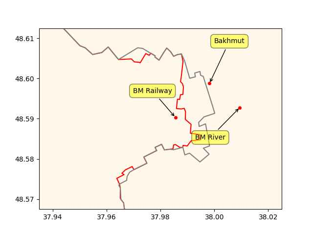

Pinned Post

"@timnitGebru@dair-community.social

Because we were looking for more things to do when these clowns
decided to write 'the letter,' [about so-called 'AI pause'] and cite
our \#StochasticParrots paper while saying the opposite of what we
write, we.. [wrote](https://www.dair-institute.org/blog/letter-statement-March2023)
a statement in response.. It is dangerous to distract ourselves with a fantasized
AI-enabled utopia or apocalypse which promises either a 'flourishing' or
'potentially catastrophic' future. Such language that inflates the capabilities
of automated systems and anthropomorphizes them, as we note in [Stochastic Parrots](https://dl.acm.org/doi/abs/10.1145/3442188.3445922), 
deceives people into thinking that there is a sentient being behind the
synthetic media. This not only lures people into uncritically trusting
the outputs of systems like ChatGPT, but also misattributes agency"

---

The Geopolitica: "The United Arab Emirates, Egypt, and Germany Will
Invest $34 billion In a Green Hydrogen Project in Mauritania.. [A]
German investment company, Conjuncta, along with the United Arab
Emirates renewable energy firm Masdar, and Egypt’s renewable energy
firm Infinity have signed an agreement with the Mauritanian government
to build a 34 billion green hydrogen plant with an electrolyzer
capacity of up to 10 gigawatts near the Mauritanian capital,
Nouakchott. Every year, the green hydrogen plant will produce 8
million tonnes of ammonia or other hydrogen-based products along with
green hydrogen. The plant’s first phase will be going to be completed
by 2028 with a planned capacity of 400 megawatts"

---

"@Hypx@mastodon.social

Strasbourg orders 60 hydrogen buses from CaetanoBus"

---

Modern system is not built for direct democracy. Half-assed attempt to
coexist within the current system will make things worse.  Good
leadership has better chance for improv rather than crowd wisdom (!)
at policy level.

WSJ: "Direct Democracy Dies in California.. Progressives want to stop
voters from challenging state laws via referendum"

---

H2 Fuel News: "BAE Systems to provide Rochester’s first hydrogen buses
with drive systems"

---

Clean fuel hitjob movie got plastered. With a budget of 40 mil, it
lost money. I love it.

---

😂 😂 😂 

```python
u.boxofficemojo("Glass Onion: A Knives Out Mystery")
```

```text
Out[1]: 
{'Domestic Opening': '$9,400,000',
 'Domestic': '$13,280,000',
 'International': '$13,280,000',
 'Worldwide Total': '$13,280,000',
 'Release Date': 'November 23, 2022'}
```

---

Keynes' idea for a world currency [Bancor](0119/2019/06/bancor.html)
did not use gold either.

---

Some news suggest gold the new BRICS currency could be backed by gold;
if true gold would be there to provide convertibility assurance to
non-BRICS currencies. A global, dominant currency does not need gold -
Nixon's petrodollar did not need it, he was like I have my military
and an agreement with the top oil producer to keep it legit.

---

Kubrick apparently used Arthur C. Clarke's story as a front to get
funding, but visually hid / encoded a less rosy picture about the
future in it.

"2001: A Space Odyssey - How Kubrick fooled us all"

[[-]](https://youtu.be/wxiB3qtMRHc?t=418)

---

Story has down days, up days, ends up in the same place.. -10 plus +10
equals zero. But all kinds of drama in between, that surely benefits
some.

NBC News: "The Nashville Metropolitan Council voted Monday to return
Justin Jones to the state Legislature after he was removed last week
by Republicans for protesting gun violence on the House floor"

---

If the abortion issue was so important Dems could've codified Roe in
law with 2009-10 supermajority. They didn't because it was better to
exploit the issue firing up the donor base taking their money rather
than solving the problem. It's still the Dick Morris [plan](2021/10/all-too-human.html#triangulation),
on major issues it is uniparty, for others manufactured heated "debates",
schisms, abt "5G" issues - Guns Gays Gender God Green.

---

Let's not forget about the self-reinforcing effect of inflation,
excess wage increases is not the only culprit.

[[-]](2021/01/inflation.html#autocorr)

---

FONOP (Freedom of Navigation Op) in South China Sea count, 6 by Obama 11 by Trump.

---

RU advance, last 7 days

```python
cs = ["Bakhmut","BM Railway","BM River"]
u.sm_plot_ukr('ukrdata/fl-1104.csv','ukrdata/fl-0404.csv',cs,clat=48.59,clon=37.98,zoom=0.005)
```

 

---

## Reference

[Nations and Nationalism, Culture, Narratives](0119/2013/02/nations-and-nationalism.html)

[The Fundamentals of Industrial Ideologies](0119/2011/04/fundamentals-of-industrial-ideologies.html)

[Education, Workplace](0119/2017/09/education-workplace.html)

[Science and Technology](0119/2018/09/science-technology.html)

[Democracy, Parties](0119/2016/11/democracy.html)

[Economy](2021/01/economy.html)

[Globalization](0119/2018/09/globalization.html)

[Rome, The First Wave, Religion](0119/2017/12/rome.html)

[Human Nature & Health](2020/07/human-nature.html)

[Climate Change](2022/01/climate.html)

[Reports](2021/01/reports.html)

[The Middle East](0119/2019/07/middleeast.html)

[TR](../tr/index.html)

## Browse

[Members, Donations](2022/08/members.html)

[By Year](years.html)

[Search](search.html)

[Microblog Archive](mbl/index.html)

[PDF](https://drive.google.com/uc?export=view&id=1FSi-1MnqXVq_PVTEXzzflwN8-7h92N_R)

Also on 
[Mastodon](https://masto.ai/@muratk3n),
[Codeberg](https://muratk5n.codeberg.page/en/),
[Github Pages](https://muratk5n.github.io/thirdwave/en/)

 

