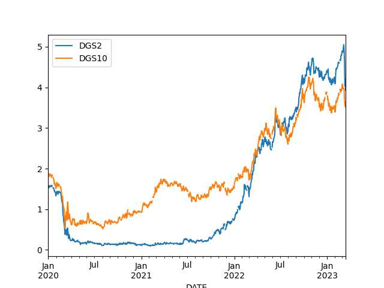

"@TimmermansEU@respublicae.eu

RT @EUClimateAction: Renewable #Hydrogen can help us meet our climate goals.  
 
Today, we have announced the European Hydrogen Bank, which will: 
 
- connect supply and demand across 🇪🇺 

- boost domestic uptake  

- expand production internationally"


---

\#Assange

[[-]](https://youtu.be/WJbotUgx6D8?t=131)

---

Tobi Morare - Starter \#music

[[-]](https://youtu.be/8M3iRaFv7TE)

---

There are other analyses that say otherwise

"French pension reform is necessary, in-depth analyses suggest the
current scheme is unsustainable"

---

Platformer says Twitter is down-ranking the corporate accounts of its
competitors, Snap, Meta, and Instagram, "tweets from these accounts
are not recommended to users who do not follow them, and won't show up
in their For You tab". More oversight needed? Hearings?  Or do we have
to wait for a future "Twitter Files" to reveal the shady shit going on
in there.

---

There he is, the best friend

[[-]](mbl/2022/ejagoffcyber.jpg)

---

Peter Thiel banked there. Did you create a bank run, Focker?

---

SVB was offering up to 4.5% yield on deposits before it collapsed.. Wow

[[-]](https://youtu.be/uvm9qrXhqf8?t=1381)

---

2-Year does look little better than 10-year, but not by much.. if
bought in 2020, SVB would still be in trouble.


```python
df = u.get_fred(2020,['DGS2','DGS10'])
df.tail(4); df.plot()
```

```text
            DGS2  DGS10
DATE                   
2023-03-10  4.60   3.70
2023-03-13  4.03   3.55
2023-03-14  4.20   3.64
2023-03-15  3.93   3.51
```

 

---

All bond yields went up, their prices went down, so if you had to
sell bonds at a hurry had to sell sell them at a loss.

"One refrain we’ve heard lately is that Silicon Valley Bank failed
because it took risks that turned sour. The specific kind of risk in
the limelight right now is what’s known in financial circles as
duration risk... The bank was flooded with deposits after the start of
the pandemic, and it invested a large chunk of them in long-term
government bonds and mortgage-backed securities, which paid a higher
yield than short-term Treasuries. 'Had they invested in two years or
less, they would have taken a much smaller hit,' he said.. Worth
noting, SVB’s losses were only on paper — that is, until the bank
needed to offload those bonds quickly as depositors rushed for the
exits"

[[-]](https://www.marketplace.org/2023/03/16/duration-risk-got-silicon-valley-bank-into-trouble/)

---

## Reference

[Nations and Nationalism, Culture, Narratives](0119/2013/02/nations-and-nationalism.html)

[The Fundamentals of Industrial Ideologies](0119/2011/04/fundamentals-of-industrial-ideologies.html)

[Education, Workplace](0119/2017/09/education-workplace.html)

[Science and Technology](0119/2018/09/science-technology.html)

[Democracy, Parties](0119/2016/11/democracy.html)

[Economy](2021/01/economy.html)

[Globalization](0119/2018/09/globalization.html)

[Rome, The First Wave, Religion](0119/2017/12/rome.html)

[Human Nature & Health](2020/07/human-nature.html)

[Climate Change](2022/01/climate.html)

[Reports](2021/01/reports.html)

[The Middle East](0119/2019/07/middleeast.html)

[TR](../tr/index.html)

## Browse

[Members, Donations](2022/08/members.html)

[By Year](years.html)

[Search](search.html)

[Microblog Archive](mbl/index.html)

[PDF](https://drive.google.com/uc?export=view&id=1FSi-1MnqXVq_PVTEXzzflwN8-7h92N_R)

Also on 
[Mastodon](https://masto.ai/@muratk3n),
[Codeberg](https://muratk5n.codeberg.page/en/),
[Github Pages](https://muratk5n.github.io/thirdwave/en/)

