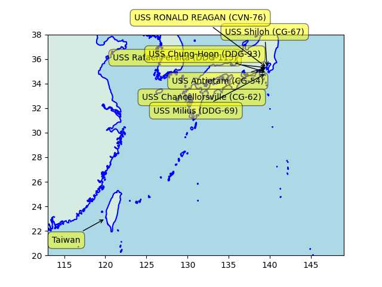

Pinned Post

"@timnitGebru@dair-community.social

Because we were looking for more things to do when these clowns
decided to write 'the letter,' [about so-called 'AI pause'] and cite
our \#StochasticParrots paper while saying the opposite of what we
write, we.. [wrote](https://www.dair-institute.org/blog/letter-statement-March2023)
a statement in response.. It is dangerous to distract ourselves with a fantasized
AI-enabled utopia or apocalypse which promises either a 'flourishing' or
'potentially catastrophic' future. Such language that inflates the capabilities
of automated systems and anthropomorphizes them, as we note in [Stochastic Parrots](https://dl.acm.org/doi/abs/10.1145/3442188.3445922), 
deceives people into thinking that there is a sentient being behind the
synthetic media. This not only lures people into uncritically trusting
the outputs of systems like ChatGPT, but also misattributes agency"

---

That ship was last spotted at a Japanese base; major firepower piled
up over there BTW, occasionally a ship from the base takes a little
trip, does a little moonwalk up and down someone else's backyard, goes
back to port.

```python
sh = np.vstack([np.array(u.usnavy()[['name','lat','lon']]), ['Taiwan',23,120]])
u.sm_plot_list1(29, 131, 2.0, sh)
```

 

---

TASS: "'On April 10, the USS Milius guided-missile destroyer illegally
entered the waters around the Meiji Reef near China’s Nansha islands
without the approval of the Chinese government,' China Central
Television [said]"

---

Chomsky: "[NYT Opinion] The False Promise of ChatGPT.. OpenAI’s
ChatGPT, Google’s Bard and Microsoft’s Sydney..  have been hailed as
the first glimmers on the horizon of artificial general intelligence —
that long-prophesied moment when mechanical minds surpass human
brains.. That day may come, but its dawn is not yet breaking.. [as
long as] machine learning programs like ChatGPT continue to dominate
the field of A.I...

The human mind is not, like ChatGPT and its ilk, a lumbering
statistical engine for pattern matching, gorging on hundreds of
terabytes of data and extrapolating the most likely conversational
response or most probable answer to a scientific question. On the
contrary, the human mind is a surprisingly efficient and even elegant
system that operates with small amounts of information; it seeks not
to infer brute correlations among data points but to create
explanations..

It summarizes the standard arguments in the literature by a kind of
super-autocomplete.. In short, ChatGPT and its brethren are
constitutionally unable to balance creativity with constraint. They
either overgenerate (producing both truths and falsehoods, endorsing
ethical and unethical decisions alike) or undergenerate (exhibiting
noncommitment to any decisions and indifference to
consequences). Given the amorality, faux science and linguistic
incompetence of these systems, we can only laugh or cry at their
popularity"

[[-]](https://www.nytimes.com/2023/03/08/opinion/noam-chomsky-chatgpt-ai.html)

---

Al Monitor: "Saudi delegation in Yemen for peace talks with
rebels.. The delegation's arrival comes roughly a month after China
helped broker a surprise rapprochement between Saudi Arabia and Iran"

---

Bloomberg: "China Energy Investment Corporation signed an agreement
with French state utility Electricite de France SA to construct an
offshore green hydrogen facility for energy storage, according to a
statement posted on the Chinese company’s website"

---

NYT: "French Visit Undercuts U.S. Efforts to Control China"

---

## Reference

[Nations and Nationalism, Culture, Narratives](0119/2013/02/nations-and-nationalism.html)

[The Fundamentals of Industrial Ideologies](0119/2011/04/fundamentals-of-industrial-ideologies.html)

[Education, Workplace](0119/2017/09/education-workplace.html)

[Science and Technology](0119/2018/09/science-technology.html)

[Democracy, Parties](0119/2016/11/democracy.html)

[Economy](2021/01/economy.html)

[Globalization](0119/2018/09/globalization.html)

[Rome, The First Wave, Religion](0119/2017/12/rome.html)

[Human Nature & Health](2020/07/human-nature.html)

[Climate Change](2022/01/climate.html)

[Reports](2021/01/reports.html)

[The Middle East](0119/2019/07/middleeast.html)

[TR](../tr/index.html)

## Browse

[Members, Donations](2022/08/members.html)

[By Year](years.html)

[Search](search.html)

[Microblog Archive](mbl/index.html)

[PDF](https://drive.google.com/uc?export=view&id=1FSi-1MnqXVq_PVTEXzzflwN8-7h92N_R)

Also on 
[Mastodon](https://masto.ai/@muratk3n),
[Codeberg](https://muratk5n.codeberg.page/en/),
[Github Pages](https://muratk5n.github.io/thirdwave/en/)

 

