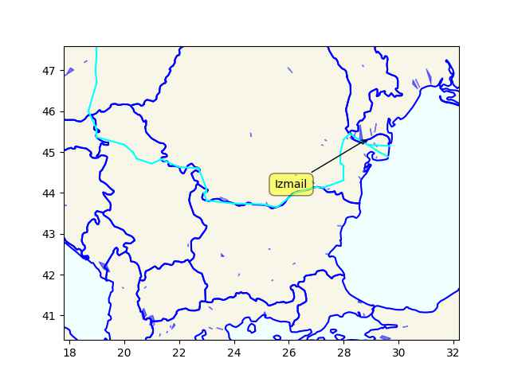

Doctorow: "Tesla is having its own [Dieselgate scandal](https://www.reuters.com/investigates/special-report/tesla-batteries-range/).
A stunning investigation by Steve Stecklow and Norihiko Shirouzu for
Reuters reveals how Tesla was able to create its own demon-haunted
car, which systematically deceived drivers about its driving range,
and the increasingly desperate measures the company turned to as
customers discovered the ruse"

[[-]](https://pluralistic.net/2023/07/28/edison-not-tesla/)

---

"@capntransit@urbanists.social

RT @kevin_degood The allocation of space is a political choice and an
expression of values.

RT @ emmanuelspv Before / After Rue Poulet in the 18th arrondissement
of Paris. Instead of continuous car parking along both sides, larger
sidewalks and trees"

[Before, After](https://cdn.masto.host/urbanistssocial/media_attachments/files/110/821/701/179/996/491/small/c4afa05458b8972e.jpeg)

---

Good idea. They banned cars from a lot of places. 

"The mayor of Paris, Anne Hidalgo, announced earlier this year the
challenging and innovative concept that would make the capital a
fifteen-minute city, 'la Ville des proximités'. The idea is to create
neighbourhoods where every essential residents’ needs are easily
within reach in 15 minutes by bike or walking"

---

TDB: "How is congressional stock trading like the weather? Everyone
complains about it. Yet nobody ever does anything about it. Almost
exactly one year ago.. then-House Minority Leader Kevin McCarthy
suggested he would support this reform, saying, 'What I’ve told
everybody, we will come back, and we will not only investigate this,
we will come back with a proposal to change the current behavior
[stock trading].' We’re still waiting"

---

Barry Adamson - Miles \#music

[[-]](https://youtu.be/R6VOeQVZMFM)

---

"lcamtuf@infosec.exchange

They're versioning fires now"

[[-]](https://media.infosec.exchange/infosecmediaeu/media_attachments/files/110/758/215/782/705/340/original/f25adcf6830dd1c0.png)

---

Zombie apocalypse art form seems mostly about a wish than a future
scare. Think about it, apoc. destroys modern life, no more traffic,
work, busy-busy pace.. People spread out into all corners of the
world, live closer to nature, less density. Zombies represent a
constant threat, kill-or-be-killed situation harks back to a
pre-agriculture hunter-gatherer state, when we had to protect against
predators. The world becomes more public, since the concept of most
private property would lose meaning.

---

Fortune: "Spend enough time with ChatGPT and other ["AI"] chatbots and
it doesn’t take long for them to spout falsehoods. Described as
hallucination, confabulation or just plain making things up, it’s now
a problem for every business, organization.. Some are using it on
tasks with the potential for high-stakes consequences, from
psychotherapy to researching and writing legal briefs"

---

The aim of higher education should not be to prepare students for
"jobs". Such education will be stulted, half-assed ergo not much of an
education.

---

Raptor Persecution UK: "New report by Wild Justice shows protected
areas in England in worse state than previously thought"

---

"@andrewdessler@mastodon.world

we need a new analogy.  

no, we're not 'loading the dice'.

instead, we're playing russian roulette and putting more bullets in the gun"

---

"@Adam_Cadmon1@mastodon.online

Last boost: Totally pushing the idea into the popular consciousness
that all of the concurrent crises can be fought with more personal
responsibility.

Right.

Same thing happened with recycling and all that. It's not that corps
are making a gazillion plastic straws; it's you, personally, using too
many"

---

H2 Central: "Bloom Energy launches advanced CHP Solution for net zero
heating and cooling"

---

Ecowas is worried surely coups spreading means it will come to their
countries one day. Mali and Burkina Faso would be worried if an Ecowas
intervention in Niger succeeded theirs would be rolled back. If Ecowas
intervenes there will be war.

---

If you have the power in the region, can stop shipments. Russia has
the power - have to negotiate with that. Some RU opponents are too
quick to use name-and-shame, procedure, rules of engagement, "rules
based order" arguments to dismiss opponent's position but, in their
case too, the niceties, formalities, rules had basis on actual power -
the military/econ power of the United States. It was US that provided
much of the military presence that allowed for the subsequent niceties
to exist, that we so quickly accuse Russia of breaking today.  But the
power structure is changing; RU was not happy with the status quo, its
warnings were ignored, so it started the latest engagement. And even
though support for Ukraine sounds "unwavering" today they are not
admitted to NATO, no rich country officially committed troops to the
teather, noone said "one for all all for one". The rest is
demagogueric bullshit.

---

Danube flows west from Ukraine, it could be used to transport grain as
an alternative to the Black Sea. Russia wants to block that since its
proposal for a new Black Sea grain deal were rebuffed.

```python
u.sm_plot_ukr6()
```

 

---

BBC: "A Russian drone strike has hit Ukrainian port facilities at
Izmail on the River Danube"

---

Added Eritrea and Niger to RU friendly African countries

[[-]](2022/12/ru-africa.html)

---

H2 Central: "BP Lifts Hydrogen Project Pipeline to 2.8mn T/Yr"

---

H2 Central: "Alberta Government Is Providing $45 Million To Power New
Hydrogen Technologies That Will Reduce Emissions And Create Jobs"

---

## Reference

[Nations and Nationalism, Culture, Narratives](0119/2013/02/nations-and-nationalism.html)

[The Fundamentals of Industrial Ideologies](0119/2011/04/fundamentals-of-industrial-ideologies.html)

[Education, Workplace](0119/2017/09/education-workplace.html)

[Science and Technology](0119/2018/09/science-technology.html)

[Democracy, Parties](0119/2016/11/democracy.html)

[Economy](2021/01/economy.html)

[Globalization](0119/2018/09/globalization.html)

[Rome, The First Wave, Religion](0119/2017/12/rome.html)

[Human Nature & Health](2020/07/human-nature.html)

[Climate Change](2022/01/climate.html)

[Reports](2021/01/reports.html)

[The Middle East](0119/2019/07/middleeast.html)

[TR](../tr/index.html)

## Browse

[Members, Donations](2022/08/members.html)

[By Year](years.html)

[Search](search.html)

[Microblog Archive](mbl/index.html)

[PDF](https://drive.google.com/uc?export=view&id=1FSi-1MnqXVq_PVTEXzzflwN8-7h92N_R)

Also on 
[Mastodon](https://fosstodon.org/@muratk5n),
[Codeberg](https://muratk5n.codeberg.page/en/),
[Github Pages](https://muratk5n.github.io/thirdwave/en/)

 
