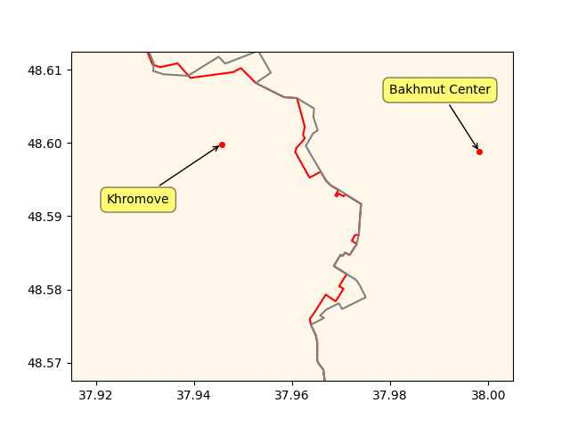

Pinned Post

"@timnitGebru@dair-community.social

Because we were looking for more things to do when these clowns
decided to write 'the letter,' [about so-called 'AI pause'] and cite
our \#StochasticParrots paper while saying the opposite of what we
write, we.. [wrote](https://www.dair-institute.org/blog/letter-statement-March2023)
a statement in response.. It is dangerous to distract ourselves with a fantasized
AI-enabled utopia or apocalypse which promises either a 'flourishing' or
'potentially catastrophic' future. Such language that inflates the capabilities
of automated systems and anthropomorphizes them, as we note in [Stochastic Parrots](https://dl.acm.org/doi/abs/10.1145/3442188.3445922), 
deceives people into thinking that there is a sentient being behind the
synthetic media. This not only lures people into uncritically trusting
the outputs of systems like ChatGPT, but also misattributes agency"

---

Past 10 days

```python
clat=48.59;clon=37.96
u.sm_plot_ukr1('ukrdata/fl-0511.csv','ukrdata/fl-0501.csv',['Khromove','Bakhmut Center'],clat,clon,zoom=0.005)
```

 

---

Am currently near the place where the party will be if Tayyeap falls.

---

It's not an easy name to be sure. Some are even worse. I heard of a
Çeşmecibaşı, four funky letters, that dude gets totally butchered, he
cld have an identity crisis.

---

MSM keeps butchering TR opposition leader Kilicdaroglu's name; I heard
Kilicacoglu, Kilicdadoglu, Kilicaoglu, Kilacaogoglu.. Daam

---

Tigger election nearing..

---

POF: "The Port of Rotterdam, together with the Province of Zuid
Holland and more than 40 partners have launched an ambitious project
for emission-free inland and near-shore shipping on #hydrogen".

---


Al-Monitor: "Syria's Assad receives Saudi invitation to Arab summit"

---

Al-Monitor: "Saudi Arabia, Syria agree to restore diplomatic ties"

---

.. these humans would form the native Americans no doubt - who would
later be wiped out by Westerners. The white man has been killing
Chinese people for centuries then

The Guardian: "Some of the first humans in the Americas came from
China, study finds"

---

Al-Monitor: "Iran increases trade with BRICS including China, as it
eyes to join bloc"

---

Chemistry World: "An artificial photosynthesis system that combines
semiconducting nanoparticles with a non-photosynthetic bacterium could
offer a promising new route for producing sustainable solar-driven
hydrogen fuel"

---

Inflation flatline

```
2023-03-01  4.984974
2023-04-01  4.930320
```

---

H2 View: "'Europe is ready to move the hydrogen industry from niche to
scale,' said Frans Timmermans, Executive Vice-President of the
European Commission at the World Hydrogen Summit in Rotterdam"

---

Motorsport: "Ligier, Bosch join forces on hydrogen car to be revealed
at Le Mans"

---

## Reference

[Nations and Nationalism, Culture, Narratives](0119/2013/02/nations-and-nationalism.html)

[The Fundamentals of Industrial Ideologies](0119/2011/04/fundamentals-of-industrial-ideologies.html)

[Education, Workplace](0119/2017/09/education-workplace.html)

[Science and Technology](0119/2018/09/science-technology.html)

[Democracy, Parties](0119/2016/11/democracy.html)

[Economy](2021/01/economy.html)

[Globalization](0119/2018/09/globalization.html)

[Rome, The First Wave, Religion](0119/2017/12/rome.html)

[Human Nature & Health](2020/07/human-nature.html)

[Climate Change](2022/01/climate.html)

[Reports](2021/01/reports.html)

[The Middle East](0119/2019/07/middleeast.html)

[TR](../tr/index.html)

## Browse

[Members, Donations](2022/08/members.html)

[By Year](years.html)

[Search](search.html)

[Microblog Archive](mbl/index.html)

[PDF](https://drive.google.com/uc?export=view&id=1FSi-1MnqXVq_PVTEXzzflwN8-7h92N_R)

Also on 
[Mastodon](https://masto.ai/@muratk3n),
[Codeberg](https://muratk5n.codeberg.page/en/),
[Github Pages](https://muratk5n.github.io/thirdwave/en/)

 


