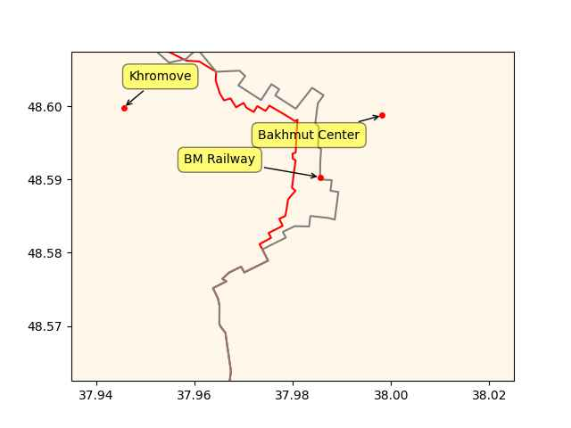

Pinned Post

"@timnitGebru@dair-community.social

Because we were looking for more things to do when these clowns
decided to write 'the letter,' [about so-called 'AI pause'] and cite
our \#StochasticParrots paper while saying the opposite of what we
write, we.. [wrote](https://www.dair-institute.org/blog/letter-statement-March2023)
a statement in response.. It is dangerous to distract ourselves with a fantasized
AI-enabled utopia or apocalypse which promises either a 'flourishing' or
'potentially catastrophic' future. Such language that inflates the capabilities
of automated systems and anthropomorphizes them, as we note in [Stochastic Parrots](https://dl.acm.org/doi/abs/10.1145/3442188.3445922), 
deceives people into thinking that there is a sentient being behind the
synthetic media. This not only lures people into uncritically trusting
the outputs of systems like ChatGPT, but also misattributes agency"

---

*The Precariat*: "In the 1970s, a group of ideologically inspired
economists captured the ears and minds of politicians. The central
plank of their ‘neo-liberal’ model was that growth and development
depended on market competitiveness; everything should be done to
maximise competition and competitiveness, and to allow market
principles to permeate all aspects of life.

One theme was that countries should increase labour market fl
exibility, which came to mean an agenda for transferring risks and
insecurity onto workers and their families. The result has been the
creation of a global ‘precariat’, consisting of many millions around
the world without an anchor of stability. They are becoming a new
dangerous class. They are prone to listen to ugly voices, and to use
their votes and money to give those voices a political platform of
increasing infl uence. The very success of the ‘neo-liberal’ agenda,
embraced to a greater or lesser extent by governments of all
complexions, has created an incipient political monster. Action is
needed before that monster comes to life"

---

<iframe width="340" src="https://www.youtube.com/embed/SraQi_BXsJc?end=1110" title="Will universal basic income become mainstream? | The Stream" frameborder="0" allow="accelerometer; autoplay; clipboard-write; encrypted-media; gyroscope; picture-in-picture; web-share" allowfullscreen></iframe>

---

Wired: "Forget Cars, Green Hydrogen Will Supercharge Crops.. Renewable
generation projects are set to make this future fuel widely
available. And it’s much more versatile than you think"

---

The COVID national emergency was ended in Apr 11, could've been to
stave off \#RK attacks on that issue. Is the Biden worried?

---

\#RFKj is clearly a Trump-inspired Kennedy.

These people come out of the woodwork.. there is a Kennedy for every
kind of political situation, any shape, size; there is a tall Kennedy,
a short Kennedy, I'm sure if the situation called for it there is a
midget Kennedy somewhere. Biden made a mistake building up the
family's image, the myth, hoping to gain legitimacy by displaying a
connection to it, but then the genuine item can show up and gobble up
your shit. Now \#RK says in an interview "Biden has my father's bust
behind him in every WH picture" so you handed a Kennedy an advantage -
why bother with the guy merely standing in front of the bust when
there is the actual son in the running? 

---

Renew Economy: "Fortescue produces its first Australian made hydrogen
electrolyser prototype"

---

@Hypx@mastodon.social

India's Tata Steel begins hydrogen gas injection trial in blast furnace

---

Note the aim of this fraud is to qualify for tax credits in US and
abroad, which essentially means stealing taxpayers' money.

Reuters: "[01/2023] South Korea fines Tesla $2.2 mln for exaggerating
driving range of EVs.. antitrust regulator said it would impose
a.. fine on Tesla for failing to tell its customers about the shorter
driving range of its electric vehicles (EVs) in low temperatures"

---

Hindustan Times: "8-year-old girl dies after mobile phone explodes in
hand.. According to police, overheating of the battery could be the
reason for the explosion"

---

RU frontline changes in the past 6 days

```python
cs = ['Bakhmut Center','BM Railway','Khromove']
u.sm_plot_ukr('ukrdata/fl-0426.csv','ukrdata/fl-0420.csv',cs,clat=48.585,clon=37.98,zoom=0.005)
```

 

---

## Reference

[Nations and Nationalism, Culture, Narratives](0119/2013/02/nations-and-nationalism.html)

[The Fundamentals of Industrial Ideologies](0119/2011/04/fundamentals-of-industrial-ideologies.html)

[Education, Workplace](0119/2017/09/education-workplace.html)

[Science and Technology](0119/2018/09/science-technology.html)

[Democracy, Parties](0119/2016/11/democracy.html)

[Economy](2021/01/economy.html)

[Globalization](0119/2018/09/globalization.html)

[Rome, The First Wave, Religion](0119/2017/12/rome.html)

[Human Nature & Health](2020/07/human-nature.html)

[Climate Change](2022/01/climate.html)

[Reports](2021/01/reports.html)

[The Middle East](0119/2019/07/middleeast.html)

[TR](../tr/index.html)

## Browse

[Members, Donations](2022/08/members.html)

[By Year](years.html)

[Search](search.html)

[Microblog Archive](mbl/index.html)

[PDF](https://drive.google.com/uc?export=view&id=1FSi-1MnqXVq_PVTEXzzflwN8-7h92N_R)

Also on 
[Mastodon](https://masto.ai/@muratk3n),
[Codeberg](https://muratk5n.codeberg.page/en/),
[Github Pages](https://muratk5n.github.io/thirdwave/en/)

 


