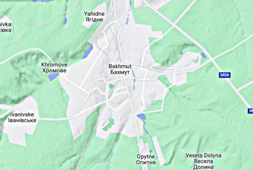

Bakhmut became strategically key, both due to its location (at a
gateway to the rest of Donbas), also bcz Ukraine decided to take a
stand there and *make* it important. Looking at its topo I can see why - 
has two funky mountain systems going into it from South, and another
ranging along its West. Surely UA exploited that structure to set up
staggered defense lines, and delayed RU for as long as they could. But
it looks like the game is nearing its end.

---

A lot of ignorant people commenting on things they do not understand.

"@timnitGebru@dair-community.social

Because we were looking for more things to do when these clowns
decided to write 'the letter,' [about so-called 'AI pause'] and cite
our \#StochasticParrots paper while saying the opposite of what we
write, we.. [wrote](https://www.dair-institute.org/blog/letter-statement-March2023)
a statement in response.. It is dangerous to distract ourselves with a fantasized
AI-enabled utopia or apocalypse which promises either a 'flourishing' or
'potentially catastrophic' future. Such language that inflates the capabilities
of automated systems and anthropomorphizes them, as we note in [Stochastic Parrots](https://dl.acm.org/doi/abs/10.1145/3442188.3445922), 
deceives people into thinking that there is a sentient being behind the
synthetic media. This not only lures people into uncritically trusting
the outputs of systems like ChatGPT, but also misattributes agency"

---

NATO was useful for Turkland when it was but the Western alliance has
not been doing well - it is mostly the instigator of chaos now,
creating much damage offering little in return.

---

[Link](https://drive.google.com/uc?export=view&id=1ZNibTZyjEWqYTS8qeFW3Kw4siw_GOMnA)

---

No worries all will be fine

Reuters: "Finland joins NATO in historic shift"

---

The Sound Stylistics - Soul Dynamite \#music

[[-]](https://youtu.be/l5L2dyMGbUU)

---

At least WH is owning up a good decision to pull out from AFG when it
did. But it is possible WH was way too embarrassed about the situation
earlier, and went cowboy with Ukraine to offset it, to "show strength",
also trying to deter 'certain countries' who might get funky ideas. That
was not good.

PBS: "U.S. report on Afghanistan evacuation blames intelligence
failures, Trump administration"

---

NL could turn into a "seasteading nation" by then, as in most houses
will be floating.

---

Checked flooding levels using tool [here](https://coastal.climatecentral.org/).
Below is the result of simulated 7m rise. Red parts will be regions
under water.

[Map 1](mbl/2023/searise1.jpg),
[Map 2](mbl/2023/searise2.jpg),
[Map 3](mbl/2023/searise3.jpg),
[Map 4](mbl/2023/searise4.jpg),
[Map 5](mbl/2023/searise5.jpg).

NYC, South Florida, Venice, Shangai, Netherlands are in trouble.

---

DK was the Chief Scientific Adviser to the UK Government 2000-07.

David King: "Once the ice on Greenland is gone, global sea levels will
be up to 7.4 metres higher"

---

Informed Comment: "The last Time there was this much CO2, there were
Sabertooth Tigers, California Monsoons and an Undersea Florida"

---

WGRZ: "[University of Buffolo] is part of New York State's team —
along with 6 other Northeast states — to seek $1.6 billion in federal
tax dollars for a 'hydrogen hub'"

---

H2 Fuel News: "Conversions from diesel to hydrogen trucks are drawing
interest.. Researchers from the University of New South Wales have
developed a system that converts up to 90% of diesel operations, with
an efficiency boost of 26%. This system does not require high-purity
hydrogen fuel, as it uses a stratification technique to form pockets
of higher and lower H2 concentrations, reducing nitrous oxide
emissions"

---

## Reference

[Nations and Nationalism, Culture, Narratives](0119/2013/02/nations-and-nationalism.html)

[The Fundamentals of Industrial Ideologies](0119/2011/04/fundamentals-of-industrial-ideologies.html)

[Education, Workplace](0119/2017/09/education-workplace.html)

[Science and Technology](0119/2018/09/science-technology.html)

[Democracy, Parties](0119/2016/11/democracy.html)

[Economy](2021/01/economy.html)

[Globalization](0119/2018/09/globalization.html)

[Rome, The First Wave, Religion](0119/2017/12/rome.html)

[Human Nature & Health](2020/07/human-nature.html)

[Climate Change](2022/01/climate.html)

[Reports](2021/01/reports.html)

[The Middle East](0119/2019/07/middleeast.html)

[TR](../tr/index.html)

## Browse

[Members, Donations](2022/08/members.html)

[By Year](years.html)

[Search](search.html)

[Microblog Archive](mbl/index.html)

[PDF](https://drive.google.com/uc?export=view&id=1FSi-1MnqXVq_PVTEXzzflwN8-7h92N_R)

Also on 
[Mastodon](https://masto.ai/@muratk3n),
[Codeberg](https://muratk5n.codeberg.page/en/),
[Github Pages](https://muratk5n.github.io/thirdwave/en/)

 

