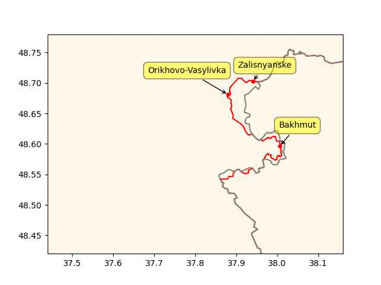

"At par" is the key word, par is the original value of the asset when
it was bought, the market price is the latest price. At par SVB assets
were fine, in "mark to market" sense they were not. BTFP loans assume
original price, the loan still needs to paid back, but it's a way of
shifting around of risk.

FED: "[12/03] The additional funding will be made available through
the creation of a new Bank Term Funding Program (BTFP), offering loans
of up to one year in length to banks, savings associations, credit
unions, and other eligible depository institutions pledging
U.S. Treasuries, agency debt and mortgage-backed securities, and other
qualifying assets as collateral. These assets will be valued at par"

---

H2 Central: "Verde Hydrogen, a new US based Hydrogen Technology
company has announced that the VERDE-1000, a 5MW Single Stack
Containerized Hydrogen Production System has passed a 3rd party test
and certification to validate its best-in-class energy efficiency and
performance"

The fully commercialized VERDE-1000 Hydrogen Electrolyzer, with its
modular and containerized design, is the largest 5MW, single stack,
alkaline type water electrolysis system in the world"

---

RU,CH overseas military bases

[[-]](2023/01/formil.html)

---

John Hawksworth - Flash Barrier \#music

[[-]](https://youtu.be/icC3G0xaCQI)

---

Fox Business: "[Rick Scott said] we pay for 77,000 federal buildings
that are empty every year. Why are we doing that? Would you do that
with your money?  We have almost a half a trillion dollars of programs
– that were never authorized – that the executive branch is spending
money on."

---

"@EUAgri@respublicae.eu

\#HorizonEU call for proposals on hydrogen fuel cell technology for
agricultural machinery. Proposals are expected to increase the
knowledge of \#hydrogen FC technology and demonstrate systems in
specific non-road applications"

---

Focker's [best friend](mbl/2023/ejagoffmaxwell2.jpg)'s family ran an
emerald mine in apartheid SA didn't they? Making money of off
stolen land... It is a sound system - if you are white.

---

JL Haims: "One day I heard a rumor that [Peter Thiel] defended
apartheid (which was then still the law of the land in South Africa),
which I found morally repugnant.. I wanted to give Peter the benefit
of the doubt.. He said, with no facial affect, that apartheid was a
sound economic system working efficiently, and moral issues were
irrelevant"

[[-]](https://medium.com/indian-thoughts/my-conversation-with-peter-thiel-about-apartheid-and-its-aftermath-3fdf4249b08d)

---

"It’s curious to some that the bank run somehow started before SVB’s
public announcements on March 9. It’s almost as if a number of very
lucky folk knew a great deal about what was going on before Joe Public
did. And the same depositors who withdrew their funds had contractual
agreements, which required them to keep their deposits at the bank or
face severe penalties. Somehow, these depositors were so desperate to
yank their deposits that they willingly violated those agreements and
sustained the penalties. I am not sure what information these
depositors learned that caused them to act so hastily without regard
to their agreement and breach consequences. Call me cynical but I am
also guessing that a number of those in the know were probably selling
a boatload of SVB stock between February 28 and the evening of March 9."

[[-]](https://thesecinaction.com/)

---

Green Car Congress: "Hynfra, a Polish company, has signed a framework
cooperation agreement with Amarenco MENA, a major developer of
renewable energy projects in the Middle East and North Africa and part
of Amarenco Group. The strategic partnership is aimed at building
infrastructure for the production of hydrogen and its derivatives,
primarily ammonia, using electrolysis powered by clean energy
resources"

---

H2 Central: "Ports of LA, Long Beach Join State Bid to be Federal
Hydrogen Fuel Hub"

---

RU advances compared to three weeks ago

```python
ps = ["Zalisnyanske","Orikhovo-Vasylivka","Bakhmut"]
u.sm_plot_ukr('ukrdata/fl-2203.csv','ukrdata/fl-0304.csv', ps,clat=48.6,clon=37.8,zoom=0.04)
```

 

---

The show had advanced AI but at that time that could be possible;
science would've moved beyond retarded neural nets by then (which is
the current fashion).

---

*Battlestar Galactica* was good scifi - it brought more realism to the
genre. It did away with "beam weapons", the ships were shooting
physical objects at eachother.. Ships were powered by a fuel,
something substantial, not "charged". The fuel, "tylium", had to be
mined (when they ran low attempting to get more was two-ep long
adventure).

---

## Reference

[Nations and Nationalism, Culture, Narratives](0119/2013/02/nations-and-nationalism.html)

[The Fundamentals of Industrial Ideologies](0119/2011/04/fundamentals-of-industrial-ideologies.html)

[Education, Workplace](0119/2017/09/education-workplace.html)

[Science and Technology](0119/2018/09/science-technology.html)

[Democracy, Parties](0119/2016/11/democracy.html)

[Economy](2021/01/economy.html)

[Globalization](0119/2018/09/globalization.html)

[Rome, The First Wave, Religion](0119/2017/12/rome.html)

[Human Nature & Health](2020/07/human-nature.html)

[Climate Change](2022/01/climate.html)

[Reports](2021/01/reports.html)

[The Middle East](0119/2019/07/middleeast.html)

[TR](../tr/index.html)

## Browse

[Members, Donations](2022/08/members.html)

[By Year](years.html)

[Search](search.html)

[Microblog Archive](mbl/index.html)

[PDF](https://drive.google.com/uc?export=view&id=1FSi-1MnqXVq_PVTEXzzflwN8-7h92N_R)

Also on 
[Mastodon](https://masto.ai/@muratk3n),
[Codeberg](https://muratk5n.codeberg.page/en/),
[Github Pages](https://muratk5n.github.io/thirdwave/en/)

