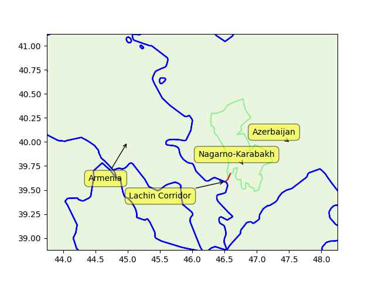

Pinned Post

"@timnitGebru@dair-community.social

Because we were looking for more things to do when these clowns
decided to write 'the letter,' [about so-called 'AI pause'] and cite
our \#StochasticParrots paper while saying the opposite of what we
write, we.. [wrote](https://www.dair-institute.org/blog/letter-statement-March2023)
a statement in response.. It is dangerous to distract ourselves with a fantasized
AI-enabled utopia or apocalypse which promises either a 'flourishing' or
'potentially catastrophic' future. Such language that inflates the capabilities
of automated systems and anthropomorphizes them, as we note in [Stochastic Parrots](https://dl.acm.org/doi/abs/10.1145/3442188.3445922), 
deceives people into thinking that there is a sentient being behind the
synthetic media. This not only lures people into uncritically trusting
the outputs of systems like ChatGPT, but also misattributes agency"

---

Euractiv: "France asks [Azerbaijan] to restore ‘unhindered’ movement on vital corridor"

---

But of course they do

Al-Monitor: "[2023/03] Israel exports arms to Azerbaijan as tensions
soar with Armenia"

---

Where is the good ol' genocide victim symphaty when you need it eh?
Israel gets it, forgiveness in all kinds of world affairs, why not
Armenia?

Aw darn - they have relations with Russia, that's the problem. In that
case your victimization counts less.. Israel's matters more because
they are on the *right side*, the tip of the spear for "Anglo designs"
in the region. We hyperventilate about theirs, not about Armenia bcz
they are not US', Britain's bitch.

---

```python
u.sm_plot_azearm4(['Armenia','Azerbaijan','Lachin Corridor','Nagarno-Karabakh'])
```

 

---

It was at the Lachin Corridor

Reuters: "Azerbaijan said it had established a checkpoint on the road
leading to Karabakh, a step it said was essential due to what it cast
as Armenia's use of the road to transport weapons"

---

A lot of ppl in analytics do not seem to have mastered the dark arts
of incremental processing; Do not bring *da entire* input file in
memory, keep *da entire* output in memory before writing it to file,
read piecemeal, write piecemeal, while keeping only the bare minimum,
bare essentials in RAM. A lot of algorithms can be coded this way.

---

"@yogthos@mas.to

I can't wait till people start crafting clever prompts to get these
things to divulge corporate secrets :)"

---

"@yogthos@mas.to

deploying LLMs to production be like"

[[-]](https://media.mas.to/masto-public/media_attachments/files/110/248/459/433/803/260/original/e5d7d728aa68ed27.png)

---

"@QasimRashid@mastodon.social

A quick history lesson. From 1940-1980:

•Wealthiest paid 70-94% marginal tax

•0 of them went broke from taxation

•0 of them left USA

•All remained exceedingly wealthy

•Manufacturing boomed

•The middle class was 62% of US economy (It's now 40% post 'trickle
 down scamenomics)"

---

## Reference

[Nations and Nationalism, Culture, Narratives](0119/2013/02/nations-and-nationalism.html)

[The Fundamentals of Industrial Ideologies](0119/2011/04/fundamentals-of-industrial-ideologies.html)

[Education, Workplace](0119/2017/09/education-workplace.html)

[Science and Technology](0119/2018/09/science-technology.html)

[Democracy, Parties](0119/2016/11/democracy.html)

[Economy](2021/01/economy.html)

[Globalization](0119/2018/09/globalization.html)

[Rome, The First Wave, Religion](0119/2017/12/rome.html)

[Human Nature & Health](2020/07/human-nature.html)

[Climate Change](2022/01/climate.html)

[Reports](2021/01/reports.html)

[The Middle East](0119/2019/07/middleeast.html)

[TR](../tr/index.html)

## Browse

[Members, Donations](2022/08/members.html)

[By Year](years.html)

[Search](search.html)

[Microblog Archive](mbl/index.html)

[PDF](https://drive.google.com/uc?export=view&id=1FSi-1MnqXVq_PVTEXzzflwN8-7h92N_R)

Also on 
[Mastodon](https://masto.ai/@muratk3n),
[Codeberg](https://muratk5n.codeberg.page/en/),
[Github Pages](https://muratk5n.github.io/thirdwave/en/)

 


