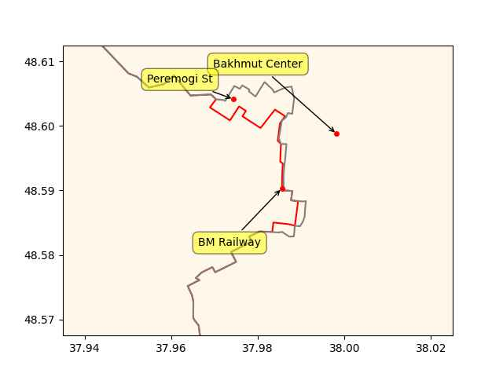

Pinned Post

"@timnitGebru@dair-community.social

Because we were looking for more things to do when these clowns
decided to write 'the letter,' [about so-called 'AI pause'] and cite
our \#StochasticParrots paper while saying the opposite of what we
write, we.. [wrote](https://www.dair-institute.org/blog/letter-statement-March2023)
a statement in response.. It is dangerous to distract ourselves with a fantasized
AI-enabled utopia or apocalypse which promises either a 'flourishing' or
'potentially catastrophic' future. Such language that inflates the capabilities
of automated systems and anthropomorphizes them, as we note in [Stochastic Parrots](https://dl.acm.org/doi/abs/10.1145/3442188.3445922), 
deceives people into thinking that there is a sentient being behind the
synthetic media. This not only lures people into uncritically trusting
the outputs of systems like ChatGPT, but also misattributes agency"

---

"@Hy_Economy@mastodon.social

Rebus, northern Germany, has ordered 52 \#hydrogen buses.  Besides the
higher range, one of the main reasons was that filling infrastructure
was easier to implement than charging infrastructure - they only need
2 hydrogen stations for their fleet"

---

Global Fleet: "China is becoming the grandmaster in hydrogen
power.. China plans to produce up to 200,000 tons of green hydrogen by
2025, produced 100% from renewable energies, and market demand to hit
90 m metric tons by 2060"

---

TASS: "Mexico is open to talks with Russia on the rollout of Mir
payment system cards in the country, Ambassador to Russia [says]"

---

TASS: "Hungary views Russia as partner, US as friend, says government
official"

---

H2 View: "Australia’s Provaris Energy has launched a floating gaseous
hydrogen storage solution, designed to hold 300 to 600 tonnes of
hydrogen at a fraction of the cost of onshore infrastructure.. Dubbed
H2Leo, the solution has already received an Approval in Principle
(AiP) from the American Bureau of Shipping (ABS) and is hoped to
provide the global hydrogen industry with an energy efficient and
cost-effective storage solution. Targeted to cost $0.2-0.3m per tonne
of hydrogen ($200-300/kg hydrogen) Provaris says H2Leo will make the
storage system “significantly cheaper than onshore solutions.”

---

"Azerbaijan well placed to provide green hydrogen to
Europe.. Azerbaijan is uniquely equipped to successfully develop a
green hydrogen industry and may soon supply the EU with the
climate-friendly fuel"

---

Latest RU advances in the western BM

```python
cs = ['Bakhmut Center','BM Railway','Peremogi St']
u.sm_plot_ukr('ukrdata/fl-0420.csv', 'ukrdata/fl-0416.csv',cs,clat=48.59,clon=37.98,zoom=0.005)
```

 

---

China Daily: "Chinese industrial giant CRRC Corp Ltd, in partnership
with Chengdu Rail Transit, introduced a new zero-emissions passenger
train powered by hydrogen in February. The new train offers a travel
range of 600 kilometers and is the fastest to date, with a top speed
of 160 kilometers per hour... As part of the nation's efforts to
achieve the dual carbon goals, China aims to have 1 million hydrogen
fuel cell vehicles and 1,000 hydrogen refueling stations by 2030"

---

First-World Problems 🤨

David Wen: "During lunch my friend mentioned her son had an allergic
reaction, went to the emergency room, luckily he was fine but they
received a bill for 20,000 dollars and then my other friend tells me
about the time he fainted got transported to the ER and was handed a
10,000 dollar bill"

---

## Reference

[Nations and Nationalism, Culture, Narratives](0119/2013/02/nations-and-nationalism.html)

[The Fundamentals of Industrial Ideologies](0119/2011/04/fundamentals-of-industrial-ideologies.html)

[Education, Workplace](0119/2017/09/education-workplace.html)

[Science and Technology](0119/2018/09/science-technology.html)

[Democracy, Parties](0119/2016/11/democracy.html)

[Economy](2021/01/economy.html)

[Globalization](0119/2018/09/globalization.html)

[Rome, The First Wave, Religion](0119/2017/12/rome.html)

[Human Nature & Health](2020/07/human-nature.html)

[Climate Change](2022/01/climate.html)

[Reports](2021/01/reports.html)

[The Middle East](0119/2019/07/middleeast.html)

[TR](../tr/index.html)

## Browse

[Members, Donations](2022/08/members.html)

[By Year](years.html)

[Search](search.html)

[Microblog Archive](mbl/index.html)

[PDF](https://drive.google.com/uc?export=view&id=1FSi-1MnqXVq_PVTEXzzflwN8-7h92N_R)

Also on 
[Mastodon](https://masto.ai/@muratk3n),
[Codeberg](https://muratk5n.codeberg.page/en/),
[Github Pages](https://muratk5n.github.io/thirdwave/en/)

 

