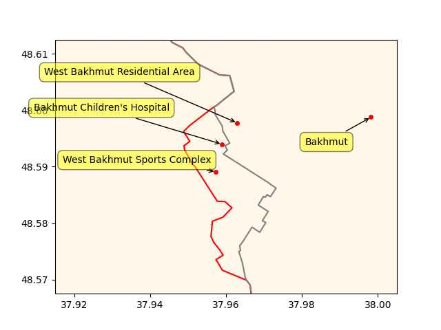

Pinned Post

"@timnitGebru@dair-community.social

Because we were looking for more things to do when these clowns
decided to write 'the letter,' [about so-called 'AI pause'] and cite
our \#StochasticParrots paper while saying the opposite of what we
write, we.. [wrote](https://www.dair-institute.org/blog/letter-statement-March2023)
a statement in response.. It is dangerous to distract ourselves with a fantasized
AI-enabled utopia or apocalypse which promises either a 'flourishing' or
'potentially catastrophic' future. Such language that inflates the capabilities
of automated systems and anthropomorphizes them, as we note in [Stochastic Parrots](https://dl.acm.org/doi/abs/10.1145/3442188.3445922), 
deceives people into thinking that there is a sentient being behind the
synthetic media. This not only lures people into uncritically trusting
the outputs of systems like ChatGPT, but also misattributes agency"

---


Politico: "[Matthew Desmond] makes a refreshing, brutally honest case
that poverty is pervasive in America by design, to enable the
lifestyles of affluent people. U.S. rates of poverty are substantially
higher and more extreme than those found in 25 other developed OECD
countries, including Australia, Canada, France, Germany, Poland,
Portugal and the United Kingdom.

[His] greatest contribution is changing the lens from individual
behavior — the hoary focus of so many books about poverty — to asking
and answering the larger question, “Who benefits from practices that
keep people poor?” Poverty, he argues, results from three
quintessentially American habits: exploitation of the poor;
subsidization of the rich; and the intentional segregation of the
affluent and the poor such that opportunity is hoarded and social
mobility is rare"

---

Prison phone company? Apperently there is a biness for that, they
charge $25 for 15 min call. 

---

End of empire

Politico: "Debt ceiling talks break down and attacks escalate as
deadline approaches"

---

The Japan Times: "China and Russia lash out at G7 'double containment' attempt"

---

F24: "More than 36,000 people displaced by northern Italy floods"

---

Informed Comment: "[Far-right] Smotrich Plans to Send 500k further
Israeli Squatters in to Steal More Palestinian Land in West Bank"

---

WION: "UN chief, Indian PM Modi call for reform of security council to
reflect ‘realities’ of today"

---

Others in the Gulf were involved in Syria conflict too, but Qatar took
to the effort with passion, became wedded to it as a win there would
prove that they had "arrived". It was not meant to be... It was a
major loss of face for them.

Al-Monitor: "Qatar emir skips Assad's Arab League speech in Saudi
Arabia.. The leaders of Saudi Arabia, Jordan and Egypt publicly
praised Syrian President Bashar al-Assad’s participation in the summit
after Syria was readmitted to the Arab League"

---

2030 BMW X5 \#H2

[[-]](https://youtu.be/auvqe-4At9c?t=301)

---

The real world is not a constrained, finite-space Go board. It is
messy. That's why neural net based cars still [cannot drive](https://futurism.com/experts-alarmed-tesla-fsd).

---

AlphaGo Zero was sadly another example of weak AI parroting; AG0
generated its own data, played against itself and learned from that,
meaning it compressed it and "made art" from it, a dataset of over 4
million datapoints. Its programmers did make some legit algorithmic
design improvements in a certain tree search approach (human coded,
not deepfaked by an parrot moron algo), but the rest is... simple
compression. Sample games are compressed into a neural net, for
subsequent games computer can make similar moves "inspired" by that
training data.. That's pretty much it. 

---

H2 Central: "Israel Launches National Plan to Integrate Hydrogen Into Energy
Landscape"

---

H2 Fuel News: "$2 billion Hydrogen Headstart program launches in Australia"

---

Roll Call: "The Wall Street Journal in late 2021 reported on satellite
imagery that showed significant construction at Abu Dhabi’s Khalifa
Port by the Chinese firm Cosco. The report said concerns that the
construction could be a military installation"

---

"Nuttier than squirrel shit"

---

CNBC: "Cryptos have no intrinsic value and trading in them should be
regulated like gambling, UK lawmakers say"

---

"@Hypx@mastodon.social

Drone Flies For Five Hours With Hydrogen Fuel Cell"

---

Al Jazeera: "Putin congratulates Russia troops, Wagner for ‘capturing Bakhmut’"

---

```python
u.sm_plot_ukr1('ukrdata/fl-0521.csv','ukrdata/fl-0516.csv',["West Bakhmut Sports Complex","Bakhmut Children's Hospital","West Bakhmut Residential Area","Bakhmut"],48.59,37.96,zoom=0.005)
```

 

---

## Reference

[Nations and Nationalism, Culture, Narratives](0119/2013/02/nations-and-nationalism.html)

[The Fundamentals of Industrial Ideologies](0119/2011/04/fundamentals-of-industrial-ideologies.html)

[Education, Workplace](0119/2017/09/education-workplace.html)

[Science and Technology](0119/2018/09/science-technology.html)

[Democracy, Parties](0119/2016/11/democracy.html)

[Economy](2021/01/economy.html)

[Globalization](0119/2018/09/globalization.html)

[Rome, The First Wave, Religion](0119/2017/12/rome.html)

[Human Nature & Health](2020/07/human-nature.html)

[Climate Change](2022/01/climate.html)

[Reports](2021/01/reports.html)

[The Middle East](0119/2019/07/middleeast.html)

[TR](../tr/index.html)

## Browse

[Members, Donations](2022/08/members.html)

[By Year](years.html)

[Search](search.html)

[Microblog Archive](mbl/index.html)

[PDF](https://drive.google.com/uc?export=view&id=1FSi-1MnqXVq_PVTEXzzflwN8-7h92N_R)

Also on 
[Mastodon](https://masto.ai/@muratk3n),
[Codeberg](https://muratk5n.codeberg.page/en/),
[Github Pages](https://muratk5n.github.io/thirdwave/en/)

 


