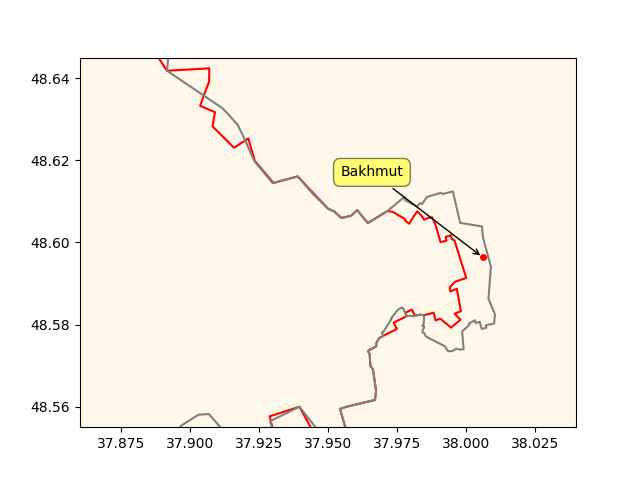

"@Hypx@mastodon.social

Ford Is Getting Serious About Hydrogen Fuel Cell Technology For Super
Duty Trucks"

---

Reuters: "Japan is to revise its hydrogen strategy by the end of May
with an ambitious target to boost annual supply to 12 million tonnes
by 2040, the industry ministry said on Tuesday, as competition
increases in the global market for the fuel"

---

Politico: "[I]n 1792, Congress passed the Post Office Act. Publishers
would be charged 1 cent for most newspapers and 1.5 cents for those
traveling more than 100 miles. This amounted to an enormous
subsidy. Rates for regular letters ranged from 6 cents to 25 cents,
depending on the distance. The postmaster in 1794 estimated that
newspapers constituted 70 percent of the mail while kicking in about 4
percent of the revenue. Postage paid by publishers defrayed no more
than 12-14 percent of costs, concluded Richard Kielbowicz in News in
the Mail. Scholar Robert McChesney has estimated that 'if the
U.S. government subsidized journalism today at the same level of GDP
that it did in the 1840s, the government would have to spend in the
neighborhood of $30-35 billion annually.' That’s about the size of
NASA’s budget"

---

"@shreyan@mstdn.social

[Large Language Models] are not intelligent. They cannot make good
decisions on their own. They are a tool which it is up to you to use
properly"

---

CBC: "[Canada] B.C. to introduce house-flipping tax and expand
secondary suites under new multi-billion dollar housing plan"

---

RU advance in the past two weeks

```python
u.sm_plot_ukr('ukrdata/fl-0404.csv','ukrdata/fl-2203.csv',["Bakhmut"],
              clat=48.6,clon=37.95,zoom=0.01)
```

 

---

## Reference

[Nations and Nationalism, Culture, Narratives](0119/2013/02/nations-and-nationalism.html)

[The Fundamentals of Industrial Ideologies](0119/2011/04/fundamentals-of-industrial-ideologies.html)

[Education, Workplace](0119/2017/09/education-workplace.html)

[Science and Technology](0119/2018/09/science-technology.html)

[Democracy, Parties](0119/2016/11/democracy.html)

[Economy](2021/01/economy.html)

[Globalization](0119/2018/09/globalization.html)

[Rome, The First Wave, Religion](0119/2017/12/rome.html)

[Human Nature & Health](2020/07/human-nature.html)

[Climate Change](2022/01/climate.html)

[Reports](2021/01/reports.html)

[The Middle East](0119/2019/07/middleeast.html)

[TR](../tr/index.html)

## Browse

[Members, Donations](2022/08/members.html)

[By Year](years.html)

[Search](search.html)

[Microblog Archive](mbl/index.html)

[PDF](https://drive.google.com/uc?export=view&id=1FSi-1MnqXVq_PVTEXzzflwN8-7h92N_R)

Also on 
[Mastodon](https://masto.ai/@muratk3n),
[Codeberg](https://muratk5n.codeberg.page/en/),
[Github Pages](https://muratk5n.github.io/thirdwave/en/)

 

