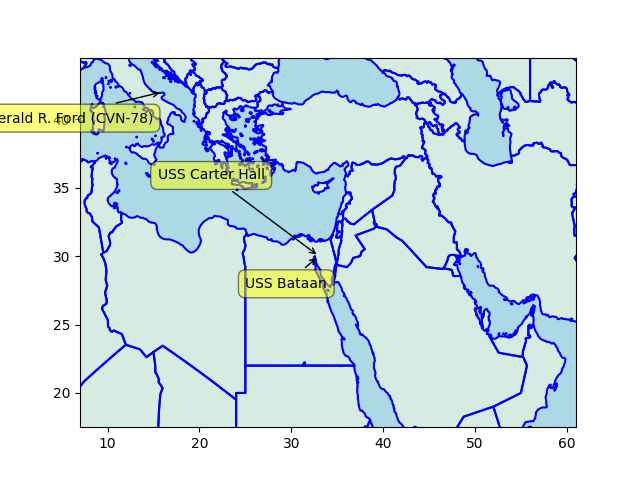

CleanTechnica: "Fuel Cell Trucks Win Big In New $7 Billion US Hydrogen Plan"

 

---

"@wilbr@glitch.social

Racing gas-powered cars on Easter Island is ironic given that the
Islanders allegedly died due to famine due to overallocation of scarce
resources to conflict and superstition"

---

Mother Jones: "EPA opens civil rights probe of Alabama's sewage
failures.. Impoverished Black residents are saddled with.. unsanitary
systems"

---

Reuters: "Biden awards $7 billion for 7 hydrogen hubs in climate fight
plan.. U.S. President Joe Biden traveled to Philadelphia on Friday to
announce the recipients of 7 billion in federal grants across 16
states for the development of seven regional hydrogen hubs"

---

WH: "Biden-⁠Harris Administration Announces Regional Clean Hydrogen
Hubs to Drive Clean Manufacturing.. Today, President Biden and Energy
Secretary Jennifer Granholm are announcing seven regional clean
hydrogen hubs that were selected to receive $7 billion [in funding]"

---

Summary of the i24 report (link below): Qatar bought a power plant and
was buying fuel from Egypt for it for Hamas who collected the resale
money for public servant pay. Oil price rose, resale did not make much
money so Hamas held up another Qatar aid package for more money even
organized some riots to make a point..

Looks like things were getting tense from all directions.. Ultra-religious
zealot admin for Israel, rising oil price, Gulf raproachement with unpredictable
results for Palestine, and the ever-present prison-like conditions in Gaza
and creeping settler expansionism, plus apartheid. Why did the attacks happen
now? The better question is why isn't there an outburst / attack every
day of the week?

[[-]](https://www.i24news.tv/en/news/middle-east/palestinian-territories/1695105006-gaza-border-riots-intended-to-pressure-qatar-for-more-aid-money-report)

---

Arafat was poisoned BTW

---

What a progression of jackasses, one after another... I remember this
era, "get rid of Arafat and all will be fine" phase. 

[[-]](https://youtu.be/KBT7o0piZ8E?t=272)

---

"@onthisday@mastodon.social

Today [Oct 15] in 1994, 29 years ago: Yasser Arafat, Yitzhak Rabin and
Shimon Peres receive the Nobel Peace Prize for their role in the
establishment of the Oslo Accords and the framing of future
Palestinian self government"

---

"@bennomatic@appdot.net

.. I once had a consulting gig with the TSA which required an in-depth
background check that included an hours-long interview.. The final q
was, 'Are you now, or have you ever been a member of an organization
which advocates the use of violence to overthrow governments.'

We had just hung Saddam Hussein three days before. It took all of my
self control not to say, 'Well, I told you I'm an American citizen,
didn't I?', instead of, 'No, sir.'"

---

The data in the tracking system is somehat behind, Ford is reportedly
already in the eastern Medi, along with others.

```python
u.sm_usnavy(clat=31, clon=34, zoom=3.0)
```



---

"@cstross@wandering.shop

@tess The British Empire carved up its territories using the 70/25/5
rule: a 70% majority, taxed and worked for profit, plus a 25% minority
from another ethnic group, armed with whips/clubs/rifles and enlisted
as a middle class and tax collectors, ruled over by a 5% elite of
British colonial administrators and soldiers with Gatling guns and
artillery (in case of a 25% uprising). The empire then left behind new
nations with built-in ethnic strife: a poor 2/3 majority vs. a
less-poor 1/3 minority"

---

"@tess@mastodon.social

If you want to know the root cause of any inter-ethnic strife or
genocide in the modern world, 'the British' is usually a pretty safe
bet"

---

Firstpost: "Gaza death toll rises to 2,450; over 1,400 killed in Hamas
attacks on Israel"

---

## Reference

[Nations and Nationalism, Culture, Narratives](0119/2013/02/nations-and-nationalism.html)

[The Fundamentals of Industrial Ideologies](0119/2011/04/fundamentals-of-industrial-ideologies.html)

[Education, Workplace](0119/2017/09/education-workplace.html)

[Science and Technology](0119/2018/09/science-technology.html)

[Democracy, Parties](0119/2016/11/democracy.html)

[Economy](2021/01/economy.html)

[Globalization](0119/2018/09/globalization.html)

[Rome, The First Wave, Religion](0119/2017/12/rome.html)

[Human Nature & Health](2020/07/human-nature.html)

[Climate Change](2022/01/climate.html)

[Reports](2021/01/reports.html)

[The Middle East](0119/2019/07/middleeast.html)

[TR](../tr/index.html)

## Browse

[Members, Donations](2022/08/members.html)

[By Year](years.html)

[Search](search.html)

[Microblog Archive](mbl/index.html)

[PDF](https://drive.google.com/uc?export=view&id=1FSi-1MnqXVq_PVTEXzzflwN8-7h92N_R)

Also on 
[Mastodon](https://fosstodon.org/@muratk5n),
[Codeberg](https://muratk5n.codeberg.page/en/),
[Github Pages](https://muratk5n.github.io/thirdwave/en/)

 

