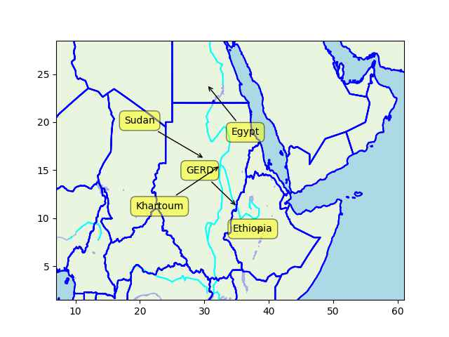

Pinned Post

"@timnitGebru@dair-community.social

Because we were looking for more things to do when these clowns
decided to write 'the letter,' [about so-called 'AI pause'] and cite
our \#StochasticParrots paper while saying the opposite of what we
write, we.. [wrote](https://www.dair-institute.org/blog/letter-statement-March2023)
a statement in response.. It is dangerous to distract ourselves with a fantasized
AI-enabled utopia or apocalypse which promises either a 'flourishing' or
'potentially catastrophic' future. Such language that inflates the capabilities
of automated systems and anthropomorphizes them, as we note in [Stochastic Parrots](https://dl.acm.org/doi/abs/10.1145/3442188.3445922), 
deceives people into thinking that there is a sentient being behind the
synthetic media. This not only lures people into uncritically trusting
the outputs of systems like ChatGPT, but also misattributes agency"

---

Forbes: "In Europe and the U.S., the green hydrogen boom is exploding...

• In January 2023, a Norwegian company announced a $4.3 billion
  investment in a steel plant with an integrated hydrogen production
  facility.

• Construction of Finland’s first green hydrogen plant also began
  early this year, backed by a $76 million private investment.

• In Spain, a Madrid-based company is developing the first green
  hydrogen supply chain between southern and northern Europe,
  anticipated to supply Northwest Europe with 6 million tons of green
  hydrogen by 2030.

• In the U.S., the government is investing heavily in clear hydrogen
  initiatives. And the states are getting into the act, too. New York,
  for instance, has entered into an agreement with nearby states and
  40 hydrogen ecosystem partners to develop a regional hydrogen hub to
  accelerate green hydrogen energy innovation and investments"

---

"@Hypx@mastodon.social

AJR Trucking Announces Order for 50 Nikola Tre FCEVs"

---

[Link](2023/01/the-big-bang-never-happened-lerner.html)

---

Michio Kaku: "The James Webb Telescope is upsetting the apple
cart. All of a sudden we realize that we may have to rewrite all of
the textbooks about the beginning of the universe. It takes many
billions of years to create a galaxy like the Milky Way galaxy with a
hundred billion stars many billions of years old, but the James Webb
Telescope has identified six galaxies that exist half a billion years
after the big bang that are up to 10 times bigger than the Milky Way
galaxy. That shouldn't have happened. There should not be primordial
galaxies that are bigger than the Milky Way galaxy that are only half
a billion years old. Something is wrong, we may have to revise our
theory of the creation of the universe"

---

Note the '78 Sadat comment about a possible dam - "we are not going to
wait to die of thirst in Egypt, we’ll go to Ethiopia and die
there". Everyone from Mobarak to Morsi to now Sisi talked tough on
this project.

Sudan is intertwined into the the story. They are now against GERD, if
Egypt is planning something they would like to deal with Sudan's
official military for it IMO not RSF.

GERD construction was announced two months after Mobarak resignation
and a month before South Sudan break-up.

---

This calls for a timeline. 

[Timeline](2023/05/timeline-eth-som-egy.html)

---

🤔 🤔 🤔 🤔 🤔

---

The Nile is fed by two branches; the White Nile and the Blue Nile. The
BN starts in Ethiopia, and they built a dam, the GERD on their side,
threathening the water supply for Egypt 🤨. Sudanese capital Khartoum
is at the very intersection where the two Nile branches meet 🤔

---

```python
u.sm_plot_nile1()
```

 

---

Grand Ethiopian Renaissance Dam (GERD), Egypt was dead-set against it,
Sudan was first neutral, now against.. What's going on?

---

Are the Qataris angry? Maybe Messi will leave PSG and join Al Nassr.
Last game I heard LM was phoning it in, I dont think he wants to be
there anymore

CBS Sport: "Lionel Messi suspended two weeks by PSG following
unauthorized trip to Saudi Arabia with family. "

---

## Reference

[Nations and Nationalism, Culture, Narratives](0119/2013/02/nations-and-nationalism.html)

[The Fundamentals of Industrial Ideologies](0119/2011/04/fundamentals-of-industrial-ideologies.html)

[Education, Workplace](0119/2017/09/education-workplace.html)

[Science and Technology](0119/2018/09/science-technology.html)

[Democracy, Parties](0119/2016/11/democracy.html)

[Economy](2021/01/economy.html)

[Globalization](0119/2018/09/globalization.html)

[Rome, The First Wave, Religion](0119/2017/12/rome.html)

[Human Nature & Health](2020/07/human-nature.html)

[Climate Change](2022/01/climate.html)

[Reports](2021/01/reports.html)

[The Middle East](0119/2019/07/middleeast.html)

[TR](../tr/index.html)

## Browse

[Members, Donations](2022/08/members.html)

[By Year](years.html)

[Search](search.html)

[Microblog Archive](mbl/index.html)

[PDF](https://drive.google.com/uc?export=view&id=1FSi-1MnqXVq_PVTEXzzflwN8-7h92N_R)

Also on 
[Mastodon](https://masto.ai/@muratk3n),
[Codeberg](https://muratk5n.codeberg.page/en/),
[Github Pages](https://muratk5n.github.io/thirdwave/en/)

 


